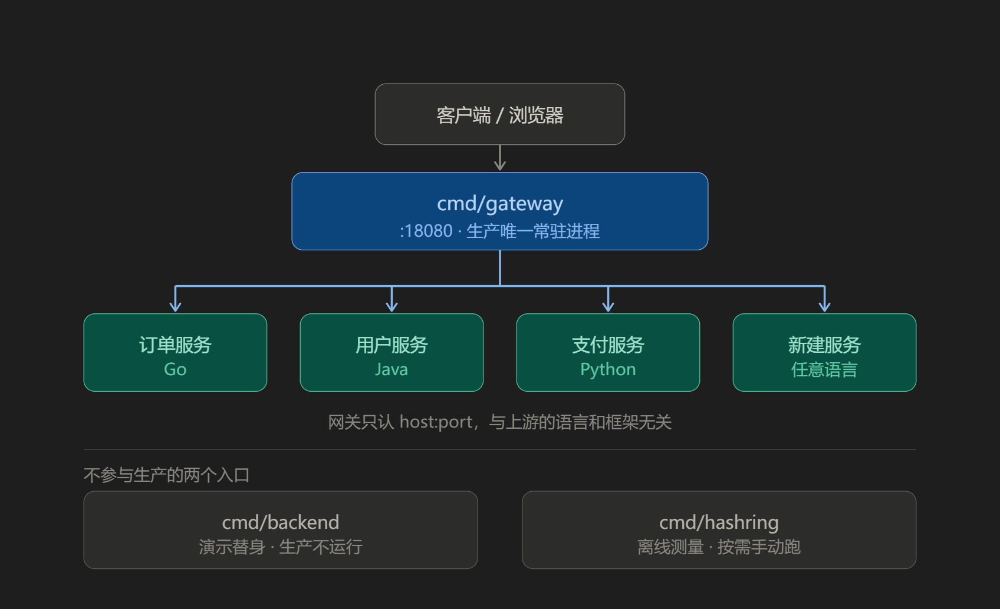

# gateway 生产部署与接入新服务

> 分析日期：2026-09-30
> 配套阅读：`docs/项目分析与执行链路.md`（模块详解与实测记录）、`README.md`（快速开始）
>
> 本文回答两个问题：**生产时 `cmd/` 下的 main 要不要都启动**、**怎么接入一个新的后端服务**。
> 所有结论均基于当前代码（`module gwlab`，直接依赖仅 `google.golang.org/grpc`）。

---

## 1. 生产只跑一个入口：`cmd/gateway`

`cmd/` 下三个入口的身份完全不同，**不是三个都要跑**：

| 入口 | 生产运行 | 身份 | 说明 |
|---|---|---|---|
| `cmd/gateway` | ✅ **唯一常驻** | 产品本体 | 监听 `18080`，承担全部七级流水线 |
| `cmd/backend` | ❌ 不运行 | **演示替身** | 只是「为了让网关有东西可代理」而写的假上游 |
| `cmd/hashring` | ❌ 不运行 | 离线测量工具 | 调一致性哈希参数时手动跑一次，看完即退 |



关键认知：**`cmd/backend` 不是后端服务的一部分**。生产环境里 `19001/19002/19003/19100` 上跑的是你们的真实业务服务，**Go / Java / Python 都行**——网关只认 `host:port`，不关心上游用什么语言、什么框架。`cmd/backend` 存在的意义只有两个：验证网关改头改得对不对（它的 HTTP 侧会回显请求头）、用 `/__control?fail=1` 注入故障来演示熔断闭环。

### 1.1 上线前必须先处理的事（原三件 + 批次 A 新增三件）

1. **密钥是硬编码的** —— `internal/config/config.go:23` 的 `JWTSecret: "demo-secret-do-not-use-in-prod"` 和 `APIKey: "ak_live_9f2c41d7"`。生产必须改为从环境变量注入，且不得进版本库。
2. **删掉 `fallback` 路由** —— ✅ **已实施**：演示配置里那条 `fallback`（`Host: "*"` / `Path: "/"` / `prefix` → `order-svc`）已删除，原位置改为 `slow` 路由（`*` / `/slow` / `exact` → `slow-svc`）。
   为什么必须没有兜底路由：`prefix /` 会吃掉一切请求，导致前端拼错路径时不会 404，而是静默打到 `order-svc`（见 §3.2）。
   **生产接入新服务时不要加回 `prefix /` 的兜底路由**——每个服务都应挂具体路径前缀，否则 404 会再次失效。
3. **`/metrics` 与 `/debug/logs` 必须加访问控制** —— 它们在 `ServeHTTP` 里排在路由与鉴权**之前**（`internal/gateway/gateway.go:181`），任何人可直接访问。生产要么只监听内网，要么前置一层 IP 白名单。

以下三件是本轮**批次 A（5 条 P0）**刚补上的健壮性默认值，虽然代码里已经生效，但上线前必须**确认它们的取值符合业务**：

4. **请求体上限 8MB 已内置**（`internal/gateway/gateway.go:37` 的 `maxBodyBytes = 8 << 20`）——
   位置在**路由匹配之后、鉴权之前**：先按 `Content-Length` 快速拒绝，再用 `http.MaxBytesReader` 兜住
   chunked / 谎报长度；超限返回 **413**（实测 raw socket 伪造 `Content-Length: 9000000` → `HTTP/1.1 413`「请求体超过上限 8388608 字节」）。
   **要做什么**：如果业务有更大的上传（文件、批量导入），必须显式调大这个常量，否则大请求会在网关侧被拒；
   反过来，若上游对请求体另有更小的限制，也要在这里对齐，避免把压力放到后端。
5. **服务端读写超时已设**：`ReadTimeout: 30s`（`cmd/gateway/main.go:48`）、
   `WriteTimeout: cfg.MaxServiceTimeout() + 15s`（`:52`，取所有服务 `Timeout` 的**最大值**再 +15s）。
   ⚠️ **要做什么**：确认最慢服务的事务时长；`WriteTimeout` 是整条响应的写截止时间，会
   **掐断超过该时长的长连接流式响应（SSE）**——有长流需求必须按路由放宽，或在流式过程中用
   `http.ResponseController.SetWriteDeadline` 续期（这也要求包装 `ResponseWriter` 的中间件实现 `Unwrap()`）。
6. **JWT 必须带 `exp` 且寿命 ≤24h**（`internal/auth/auth.go`）：
   `exp` 缺失或为 0 直接 **401 `token_no_expiry`**（修复前这种 token 能通过，实测 200），
   `iat` 存在时 `exp - iat > 24h` 返回 `token_too_long_lived`。
   **要做什么**：签发令牌的服务必须带上 `exp`，且有效期不超过 24 小时；否则网关升级后，
   没有 `exp` 的令牌会立刻变成 401 `token_no_expiry`，寿命超过 24h 的会被判 `token_too_long_lived`。

---

## 2. 接入一个新的后端服务

### 2.1 现状：配置是编译期硬编码

`cmd/gateway/main.go:34` 直接 `cfg := config.Default()`，**没有命令行参数、没有配置文件、没有配置中心**。所以当前加一个服务 = 改代码 + 重新编译 + 重启进程。

这一点 `internal/config/types.go:7` 的包注释自己已经写明：

> 生产中这份配置应从配置文件 / 配置中心（etcd、Nacos）加载并支持热更新；
> 本项目用 Go 字面量硬编码（见 config.go 的 Default），为的是让「网关由哪些声明式规则组成」一眼可见。

### 2.2 三步走

**第一步**：在 `internal/config/config.go` 的 `defaultServices()` 里定义上游服务（一组节点 + 负载均衡算法 + 熔断参数）。

**第二步**：在同文件 `defaultRoutes()` 里定义路由（匹配规则 + 指向哪个服务 + 鉴权/限流）。

**第三步**：`make build` 后重启 `bin/gateway`。

**路由与服务是解耦的**：多条路由可以指向同一个服务（现有配置里 `order-svc` 同时服务 `order-exact`、`order-prefix`、`open-api` 三条），加一个服务不必改动任何网关逻辑代码。改动范围严格限制在 `internal/config/config.go` 一个文件内。

### 2.3 完整示例：接入 `payment-svc`

假设支付服务有两个实例 `10.0.1.21:8080` / `10.0.1.22:8080`，要求 JWT 鉴权、限流 100/s。

**① 加服务** —— 在 `defaultServices()` 的返回 map 里增加一项：

```go
"payment-svc": {
    Name:   "payment-svc",
    Balance: "round_robin",
    Upstreams: []Upstream{
        {Addr: "10.0.1.21:8080", Weight: 1, Backend: 1},
        {Addr: "10.0.1.22:8080", Weight: 1, Backend: 2},
    },
    Timeout: 3 * time.Second,
    Breaker: BreakerConfig{
        WindowSize: 10, FailRatio: 0.5, MinRequests: 4,
        OpenFor: 3 * time.Second, HalfOpenMax: 2,
    },
},
```

**② 加路由** —— 在 `defaultRoutes()` 返回的切片里增加一项：

```go
{
    Name:     "payment",
    Host:     "api.example.com",
    Path:     "/api/payment/",
    PathType: PathPrefix,
    StripPrefix: "/api",                                  // 上游收到 /payment/xxx
    Upstream: "payment-svc",
    Auth:  AuthPolicy{Required: true, Scheme: "jwt"},
    Limit: LimitPolicy{RatePerSec: 100, Burst: 20},
},
```

**③ 重新编译并重启**：

```bash
make build && ./bin/gateway
```

启动横幅会打印新路由，可直接确认是否生效：

```
route payment        host=api.example.com  path=/api/payment/        type=prefix -> payment-svc
```

### 2.4 配置项可选取值速查

**Route（`internal/config/types.go:24`）**

| 字段 | 取值 / 语义 |
|---|---|
| `PathType` | `exact`（完全相等，优先级最高）/ `prefix`（最长前缀优先）/ `regex`（优先级最低） |
| `Host` | 空 = 任意；支持 `*.example.com` 通配 |
| `Methods` / `Headers` | 空 = 任意；`Headers` 要求全部匹配，值支持 `*` 通配 |
| `StripPrefix` | 转发前剥掉的前缀，常用于把 `/api/payment/x` 变成 `/payment/x` |
| `Auth.Scheme` | `jwt` / `apikey`；`Roles` 为空表示不校验角色 |
| `Limit.RatePerSec` | 每秒补充令牌数；**`0` = 不限流**（`Burst` 需 > 0 才有意义） |
| `Transcode` | 非空表示走「HTTP → gRPC」协议转换，需给 `Service`（如 `order.OrderService`）与 `Method` |
| `Upstream` | 特殊值 `self` = 由网关自己应答，不走网络（现有 `/healthz` 即如此） |

**Service（`internal/config/types.go:66`）**

| 字段 | 取值 / 语义 |
|---|---|
| `Balance` | `round_robin`（默认，未匹配时走此分支）/ `weighted` / `least_conn` / `consistent_hash`。`least_conn` 的现成例子见 `internal/config/config.go` 的 `slow-svc`（配 `/slow` 路由 + 后端 `?ms=` 延时） |
| `Upstreams[].Weight` | `weighted` 时是加权轮询权重；`consistent_hash` 时是**虚拟节点倍数** |
| `Upstreams[].GRPC` | 该节点是否说 gRPC（配 `Transcode` 的路由必须为 `true`） |
| `Upstreams[].Backend` | **仅演示用**自报名，网关只把它透传给上游用于观测分布；生产可随意填 |
| `HashKeyFrom` | `consistent_hash` 的 key 来源（header 名，如 `X-User-Id`）；空则回落客户端 IP |
| `Timeout` | 单次上游调用的上下文超时（如 `3 * time.Second`）。**它同时决定 `http.Server.WriteTimeout`**——网关取所有服务 `Timeout` 的**最大值再加 15s**（`config.MaxServiceTimeout()`，`internal/config/config.go:19`），所以把某个服务的超时调得很大，会整体抬高写超时上界；反过来，长流式响应（SSE）要放宽就得用 `http.ResponseController.SetWriteDeadline` 续期（见 §1.1 第 5 条） |
| `Breaker` | 见下方零值陷阱 |

> **⚠️ `BreakerConfig` 零值陷阱**：`FailRatio` 为 `0` 意味着「任何失败率都达阈值」，记录到 **1 次失败就会熔断**；`MinRequests` 为 `0` 表示不做样本量保护。`breaker.New` 只兜底 `WindowSize` / `OpenFor` / `HalfOpenMax`，所以**不希望立刻熔断的服务必须显式给出这两个值**。现有配置里 `services["self"]` 正是零值，只因 `/healthz` 在熔断检查之前就返回了才没暴露。

> **⚠️ 上游地址写错的表现**：`Route.Upstream` 指向了 `Services` 里不存在的名字时，网关返回 **500 `bad_config`**（`internal/gateway/gateway.go:226`），并在消息里带上未定义的服务名——排查配置笔误看这个错就够。但注意这是**运行期**才发现，加配置时建议自查一遍服务名拼写。

---

## 3. 生产化改造清单

按「改造收益 / 工作量」排序。前三项是上生产的最低门槛。

| # | 缺口 | 现状 | 生产需要 |
|---|---|---|---|
| 1 | **配置来源** | 硬编码 `config.Default()` | 读 YAML / JSON 文件，或接 Nacos / etcd |
| 2 | **404 兜底** | 演示配置里 `fallback` 已删除（**已实施**，见 §3.2）；其它环境若仍留着，`fallback` 会吃掉一切、`route_not_found` 分支**不可达** | 删除 fallback，让 404 真正生效 |
| 3 | **密钥** | `JWTSecret` / `APIKey` 明文写在源码里 | 环境变量或密钥管理服务注入 |
| 4 | **热更新** | 无，改一条路由要重启网关 | watch 配置 + 原子替换路由表 |
| 5 | **服务发现** | 上游是静态地址数组，扩容要改配置重启 | 接 K8s Endpoints / Nacos / Consul |
| 6 | **主动健康检查** | 无，熔断是**被动**探测（等真实请求失败） | 定期探活 + 提前摘除节点 |
| 7 | **状态外置** | 限流桶 / 熔断器 / 指标全在单进程内存 | 多副本需把限流桶换 Redis |

### 3.1 配置外置 + 热更新（最小改造）

零依赖做法是先落 JSON（标准库自带），要 YAML 则需引入 `gopkg.in/yaml.v3`。

```go
// internal/config/load.go
func Load(path string) (*Config, error) {
    b, err := os.ReadFile(path)
    if err != nil {
        return nil, err
    }
    var c Config
    if err := json.Unmarshal(b, &c); err != nil {
        return nil, err
    }
    return &c, c.Validate()
}

// Validate 把现在只能靠运行期 500 bad_config 暴露的笔误提前到加载期。
func (c *Config) Validate() error {
    for _, rt := range c.Routes {
        if rt.Upstream != "self" && c.Service(rt.Upstream) == nil {
            return fmt.Errorf("路由 %s 引用了未定义的服务 %s", rt.Name, rt.Upstream)
        }
    }
    for name, svc := range c.Services {
        if len(svc.Upstreams) == 0 {
            return fmt.Errorf("服务 %s 没有任何上游节点", name)
        }
    }
    return nil
}
```

热更新有**两个必须注意的实现细节**（都源于 `internal/gateway/gateway.go` 的当前结构）：

- **缓存的 key 只含服务名**。`breakers` / `balancers` 以 `svc.Name` 为 key，`proxies` 以 `name|addr|strip` 为 key（`gateway.go:101`）。所以**同名服务改上游地址不会复用旧代理**（key 里含 addr），而旧 `proxy.Proxy` 会永久留在 map 里 —— 频繁热重载会持续泄漏。重载时应显式清理 `proxies` 中失效的 key。
- **状态保不保留取决于你的选择**。路由表可以整个原子替换，但限流桶与熔断状态如果一起重建，等于「熔断提前恢复 + 限流多发一批令牌」。对熔断，重建是**危险**的：刚打开的熔断器会被重置回 closed，直接又把流量送给还没恢复的上游。建议只替换路由与后端列表，按 key 保留已有 `breaker` / `limiter` 实例。

另外，`Gateway.Close()` 只关 gRPC 连接池（`gateway.go:76`）。如果热重载是把整个 `Gateway` 换掉，**必须调用旧实例的 `Close()`**，否则 gRPC 连接会泄漏。

### 3.2 删除 `fallback` 让 404 生效（已实施）

演示配置里原本最后一条路由：

```go
{
    // 演示 ① 兜底：任意 Host、任意路径。
    // ⚠️ 因为它能吃掉一切请求，404 route_not_found 分支在当前配置下不可达。
    Name: "fallback", Host: "*", Path: "/", PathType: PathPrefix,
    Upstream: "order-svc",
},
```

→ ✅ **已实施**：该路由已从演示配置删除（原位置改为 `slow` 路由：`*` / `/slow` / `exact` → `slow-svc`），
`internal/gateway/gateway.go:191` 的 `route_not_found` 分支才真正生效，返回标准 404。实测：

| 请求 | 结果 |
|---|---|
| `GET /nope/nothing` | **404** `{"error":"route_not_found","message":"没有匹配的路由"}` |
| `GET /admin/whatever` | **404** |
| `GET /api/order/list`（不带 `Host: api.example.com`） | **404**（删除 fallback 之前被静默吃掉，返回 200） |
| `GET /api/order/list`（带 `Host: api.example.com`） | **200**（backend A） |

生产环境**必须删掉它**。留着它的后果不是「多一层兜底」，而是「前端拼错任何路径都会静默打到订单服务」，把 404 变成难以排查的业务脏数据。

**若其它环境仍留着兜底路由，按此删除**：在 `defaultRoutes()` 里找到 `Host: "*"` + `Path: "/"` + `PathType: PathPrefix` 的那一条（即 `fallback`），
整条删掉 → `make build` → 重启，再用 `GET /nope/nothing` 确认拿到 404 而不是 200。

### 3.3 服务发现与主动健康检查

现状是静态地址数组，扩容必须改配置重启。要动态化，需要把「上游列表」从配置项变成**运行期可读的注册表**：

- **K8s 环境**：watch `Endpoints` / `EndpointSlice`，节点变化时重建 `balancer`；
- **Nacos / etcd**：订阅服务实例列表，变更时替换对应 `Service.Upstreams`；
- **不做服务发现的最低成本方案**：上游挂 K8s Service 或 Nginx，网关只配一个固定域名 `payment-svc:8080`，把节点编排交给下层。

主动健康检查同样缺失——当前**只有被动熔断**，意味着节点挂掉要等真实用户请求失败到阈值才会被摘除。加一个定期探活协程（探 `GET /healthz`，失败 N 次后从 `Upstreams` 里摘除）能显著缩短故障窗口。

### 3.4 多副本部署注意

网关本身**基本无状态**（只有配置和日志缓冲在内存），前面挂 L4 负载均衡即可水平扩。但有两个状态不跨实例共享：

- **限流桶**：多实例时限流阈值实际变成 `实例数 × 配置值`，要精确限流须把桶换成 Redis（`ratelimit.Limiter` 的接口不变，只换存储）；
- **熔断器**：每个实例独立判定，A 实例熔断不代表 B 实例也熔断。通常可接受，但要清楚这一点。

另外 `hashring` 用于 `consistent_hash` 的场景（如 `user-svc` 按 `X-User-Id` 分片）在多副本时**不受影响**——只要各实例的节点列表一致，哈希结果就一致，这正是它优于普通轮询的地方。

---

## 4. 上线检查清单

- [ ] `JWTSecret` / `APIKey` 已从环境变量注入，源码中无明文
- [x] 已删除 `fallback` 路由（演示配置已删，见 §1.1 / §3.2），404 行为已实测确认（`GET /nope/nothing` → 404 `route_not_found`）
- [ ] `/metrics` 与 `/debug/logs` 已限制为内网访问或加白名单
- [ ] 所有 Service 显式配置了 `Breaker.FailRatio` 与 `MinRequests`（避免零值即熔断）
- [ ] 每条 Route 的 `Upstream` 都能在 `Services` 里找到（否则运行期 500 `bad_config`）
- [ ] `Timeout` 已按上游实际 SLA 设置，未依赖默认值
- [ ] 请求体上限符合业务需要（`maxBodyBytes` = 8MB，超限 413 `body_too_large`；有大文件上传需调大该常量，见 §1.1）
- [ ] `ReadTimeout`（30s）/ `WriteTimeout`（最大 `Service.Timeout` + 15s）已确认；有长流式响应（SSE）时不会被写超时掐断
- [ ] 签发的 JWT 全部带 `exp` 且寿命 ≤ 24h（缺失 → 401 `token_no_expiry`；超长 → `token_too_long_lived`），否则升级网关后存量令牌会立刻失效
- [ ] 配置已外置为文件或配置中心，重启不需重新编译
- [ ] 多副本场景下已确认限流阈值口径（每实例 or 全局）
- [ ] 已用 `make vet` + 真实请求回归验证过配置变更

---

## 5. 一句话总结

**生产只跑 `cmd/gateway`**——`cmd/backend` 是演示替身、`cmd/hashring` 是离线工具，都不进生产。**接入新服务只改 `internal/config/config.go` 一个文件**（加一个 `Service` + 一条 `Route`）然后重编译重启，路由与服务解耦、不涉及任何网关逻辑改动。但这套配置能力停在演示级：要真正接管生产流量，最小改造是「配置读文件 + 按 key 保留状态的热重载」，并且 **`fallback` 已删（演示配置）；生产接入时不要再加兜底路由**。健壮性方面，网关已具备**请求体上限 8MB（超限 413）、`ReadTimeout` / `WriteTimeout`、panic 兜底（`gw_panics_total` 计数）与 JWT `exp` 强制校验（寿命 ≤24h）**——但前三项的取值都要按业务确认，第四项要求签发侧配合带上 `exp`（见 §1.1）。
