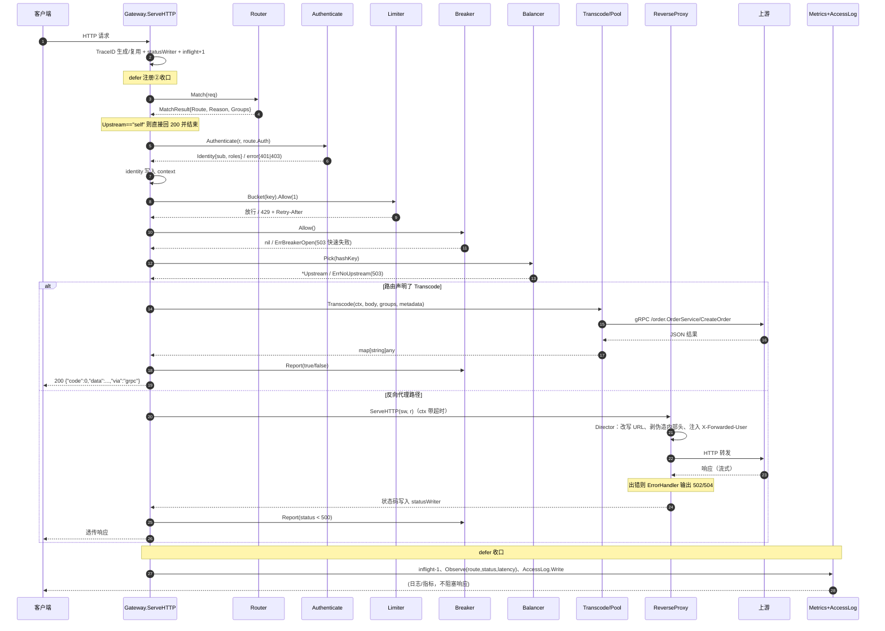
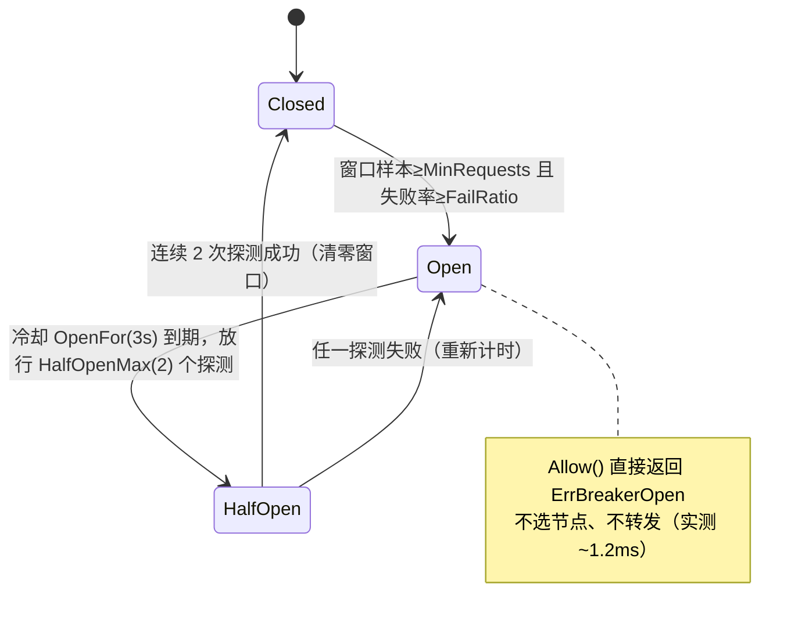

# gw-go 项目分析与执行链路

> 分析对象：`D:\www\gw-go`（Go module `gwlab`，go 1.26.5）
> 分析方式：**全量源码阅读 + 本机真实运行验证**。文中所有输出均为实测结果，非推演。
> 分析日期：2026-09-30
> 布局说明：本文档已对应**重构后的标准 Go 工程布局**（`cmd/` 入口 + `internal/` 私有包）。重构前的根目录单包 `main` 布局已废弃。

---

## 0. 结论速览

| 项 | 结论 |
|---|---|
| 项目定位 | 一台 **教学 / 实验性质的自研 API 网关**，不是业务系统，也不是框架封装 |
| 模块名 | `gwlab`（gateway lab，网关实验台） |
| 技术栈 | 100% Go 标准库 + **唯一第三方依赖 `google.golang.org/grpc`** |
| 代码结构 | 标准 Go 布局：`cmd/`（3 个入口）+ `internal/`（10 个包）；14 个 `.go` 文件，**2294 行**（含注释） |
| 可执行体 | 3 个：`cmd/gateway`（网关本体）、`cmd/backend`（演示上游）、`cmd/hashring`（哈希测量程序） |
| 监听端口 | 网关 `127.0.0.1:18080`；后端 HTTP `19001/19002/19003`；后端 gRPC `19100` |
| 核心价值 | 把「一台网关必备的 7 个机制」各写一份最小可运行实现，并在注释中固化踩坑点与实测数据 |
| 是否可直接生产用 | **否**。配置硬编码、无 TLS、状态全在单进程内存，详见第 8 节 |

**一句话**：这是一个把路由、鉴权、限流、熔断、负载均衡、协议转换、可观测性七件事**从零手写一遍**的网关实验项目，每个模块都配了可复现的验证场景，用来把「网关内部到底发生了什么」变成可观测、可复现的事实。

---

## 1. 这个项目是做什么的

### 1.1 判断依据

| 证据 | 出处 |
|---|---|
| `module gwlab`，依赖表只有 grpc 一个直接依赖 | `go.mod` |
| 配置用 Go 字面量硬编码，注释写明理由：「为的是让『网关由哪些声明式规则组成』一眼可见，生产中应从配置文件/配置中心加载并支持热更新」 | `internal/config/types.go` |
| 每个包顶部都有一段 `// Package xxx 实现 ① …` 的说明注释，直接写「这为什么值得做」「三条容易做错的地方」 | 全部 `internal/` 包 |
| 出现「本机实测踩过」「本机实测」等字样，并给出具体百分比 | `internal/router/route.go`、`internal/proxy/proxy.go`、`internal/balancer/balancer.go` |
| 演示用后端提供 `/__control?fail=1` 故障注入开关，注释写「这样才能演示熔断→恢复完整闭环」 | `cmd/backend/main.go`、`internal/config/config.go` |
| 原缺 README / Makefile（重构时已补齐）、仍无 CI 与测试文件（`go test ./...` 无测试用例） | 全仓扫描 |
| 原为根目录单包 `main`（12 个 `.go` 平铺），且遗留 `gw.exe` / `gw.exe~` / `probe.verified.exe` / `*.log` 等实验产物 —— 已重构并清理 | 目录对比 |

### 1.2 三个可执行体的分工

```
  cmd/backend A            cmd/backend B        cmd/backend C
  :19001（HTTP + gRPC:19100） :19002（HTTP）        :19003（HTTP）
        ▲                        ▲                    ▲
        │                        │                    │
        └───────────┬────────────┴────────────────────┘
                    │  反向代理 / gRPC 调用
            ┌───────┴────────────────────────┐
  客户端 ──►│  cmd/gateway   127.0.0.1:18080  │
            └────────────────────────────────┘

  cmd/hashring   ← 独立的纯计算程序，不参与请求链路，只测量一致性哈希
```

1. **`cmd/gateway`** —— 网关入口。只做装配与生命周期管理（读配置、建 Gateway、起 HTTP Server、优雅退出）；七级流水线本身在 `internal/gateway`。
2. **`cmd/backend`** —— 演示用上游。一个进程同时给出 HTTP 与 gRPC 两种接口，HTTP 侧回显关键请求头（用来验证网关改头改得对不对），并带 `/__control?fail=1` 故障注入开关。**它是被观测对象，不是项目主体。**
3. **`cmd/hashring`** —— 一次性测量程序。用同一份代码对比 FNV-1a 与 MD5 的雪崩性、虚拟节点数量对分布的影响、扩容迁移率。


---

## 2. 目录结构

```
D:\www\gw-go\
├── go.mod / go.sum              # module gwlab，依赖仅 grpc v1.84.0
├── Makefile / README.md / .gitignore
├── cmd\                         # 三个可执行入口
│   ├── gateway\main.go          # ★ 网关入口：装配 + HTTP Server + 优雅退出
│   ├── backend\main.go          # 演示上游：HTTP + gRPC + /__control 故障注入
│   └── hashring\main.go         # 一致性哈希测量实验（不参与请求链路）
├── internal\                    # 仅本模块可见的实现（外部无法 import）
│   ├── config\                  # ★ 声明式配置模型 + 演示配置
│   │   ├── types.go             #   Route / Service / AuthPolicy / LimitPolicy / BreakerConfig
│   │   └── config.go            #   Config 结构 + Default()（9 条路由 / 5 个上游）
│   ├── router\route.go          # ① 路由匹配（exact / prefix / regex + Host/Method/Header）
│   ├── auth\auth.go             # ② 鉴权（JWT HS256 手写实现 + API Key）
│   ├── ratelimit\limit.go       # ③ 限流（令牌桶 + 空闲桶回收）
│   ├── breaker\breaker.go       # ③ 熔断（closed/open/half-open 三态机 + 滑动窗口）
│   ├── balancer\balancer.go     # ④ 负载均衡（轮询/加权/最少连接/一致性哈希）
│   ├── transcode\transcode.go   # ⑤ 协议转换（REST/JSON → gRPC，含连接池）
│   ├── proxy\proxy.go           # ⑥ 反向代理（httputil.ReverseProxy 定制）
│   ├── observability\observ.go  # ⑦ 可观测性（TraceID / 访问日志 / Prometheus 指标）
│   └── gateway\gateway.go       # ★ 装配层：把七个模块接成一条请求流水线
├── bin\                         # 编译产物（已 gitignore）
├── docs\                        # ← 本文档所在目录
└── .idea\                       # GoLand 工程配置（已 gitignore）
```

**依赖方向是单向的**，不存在循环引用：

```
config（叶子，无内部依赖）
   ▲
   ├── router / auth / ratelimit / breaker / balancer / transcode
   │                                   ▲
   │                       auth ◄──────┤（proxy 需要取身份写 X-Forwarded-User）
   │                observability ◄────┤（proxy 需要 TraceID 头名）
   │                                   │
   └────────────────────► gateway ◄────┘（装配层，只被 cmd/gateway 引用）
```

### 2.1 文件职责与规模

| 文件 | 行数 | 职责 | 关键符号 |
|---|---:|---|---|
| `cmd/gateway/main.go` | 78 | 网关入口：装配 + HTTP Server + 优雅退出 | `main`、`printBanner` |
| `cmd/backend/main.go` | 159 | 演示上游 | `handler`、`orderImpl.CreateOrder`、`startGRPC` |
| `cmd/hashring/main.go` | 142 | 哈希实验 | `buildRing`、`spread`、`h64fnv`、`h64md5` |
| `internal/gateway/gateway.go` | 288 | 装配 + 七级流水线 | `Gateway`、`ServeHTTP`、`statusWriter`、`fail()` |
| `internal/config/types.go` | 86 | 配置类型定义 | `Route`、`Service`、`BreakerConfig` |
| `internal/config/config.go` | 136 | 演示配置 | `Default`、`Config.Service` |
| `internal/router/route.go` | 155 | 路由匹配与优先级打分 | `Router.Match`、`MatchResult`、`hostMatch`、`headersMatch` |
| `internal/auth/auth.go` | 202 | JWT / API Key 鉴权 | `Authenticator.Authenticate`、`VerifyJWT`、`WithIdentity` |
| `internal/ratelimit/limit.go` | 118 | 令牌桶限流 | `TokenBucket.Allow`、`Limiter.Bucket`、`Key` |
| `internal/breaker/breaker.go` | 181 | 熔断三态机 | `Breaker.Allow/Report`、`State` |
| `internal/balancer/balancer.go` | 248 | 四种负载均衡 | `Balancer` 接口、`roundRobin`、`weightedRR`、`leastConn`、`hashRing` |
| `internal/transcode/transcode.go` | 122 | HTTP→gRPC 转换 | `Transcode`、`Pool`、`jsonCodec` |
| `internal/proxy/proxy.go` | 136 | 反向代理与请求头治理 | `Proxy`、`InternalHeaders`、`ErrFrom` |
| `internal/observability/observ.go` | 243 | 可观测性 | `EnsureTraceID`、`AccessLog`、`Metrics.Render` |
| **合计** | **2294** | | |


---

## 3. 七个功能模块详解

### ① 路由匹配（`internal/router/route.go`）

**做什么**：把「一次请求」映射成「一条路由规则」，规则由 `Host + Path + Method + Header` 四要素共同决定。

**匹配优先级（刻意与 Nginx 同构）**：

```
精确(exact, 得分 3) > 正则(regex, 得分 2) > 前缀(prefix, 得分 1)
同为正则/精确：先声明者胜
同前缀：最长前缀胜
```

| 能力 | 实现 | 位置 |
|---|---|---|
| Host 通配 `*.example.com` | `hostMatch` 后缀比较，并先剥掉端口 | `internal/router/route.go` |
| 精确匹配 | `path == c.Path` | `internal/router/route.go` |
| 正则匹配 | 启动时 `regexp.Compile`，匹配时取子捕获组 | `internal/router/route.go`、`internal/router/route.go` |
| 前缀匹配 | `strings.HasPrefix` + 最长优先 | `internal/router/route.go` |
| Header 匹配（值支持 `*`） | 把 `*` 转成 `.*` 后走正则 | `internal/router/route.go` |

**设计亮点**：`MatchResult` 不只返回命中规则，还返回 `Reason`（如 `exact /healthz`、`prefix /open/`、`regex ^/api/users/\d+$`），这个字符串会直接落进访问日志的 `via=` 字段——**路由问题基本不用猜**。

**注释里固化的坑**：正则必须排在普通前缀之前，否则 `^/api/users/\d+$` 会被兜底的 `location /`（此处是 `fallback` 路由）抢走。

### ② 鉴权（`internal/auth/auth.go`）

**做什么**：按路由声明决定是否需要身份、用哪种凭据、需要什么角色。

| 方式 | 载体 | 实现要点 |
|---|---|---|
| JWT | `Authorization: Bearer <token>` | **不引库**，手写 HS256。签名对象=前两段的**原始字面量拼接**；验签用 `hmac.Equal` 恒定时间比较；签名通过后再校验 `exp`/`nbf` |
| API Key | `X-API-Key` 头或 `?api_key=` | 同样是 `hmac.Equal` 恒定时间比较 |

**状态码语义被明确区分**（这是很多手写网关的疏漏）：

- 无凭证 / 格式错 / 签名非法 / 已过期 → **401**（"你可以再试"）
- 有身份但角色不足 → **403**（"别再试了"）
- 映射逻辑集中在 `authStatus()`（`internal/auth/auth.go`）

**身份落地**：鉴权成功后产出 `Identity{Subject, Roles, Scheme}`，写入 `context`（key `gw.identity`），供下游取节点（限流维度）、代理（写 `X-Forwarded-User`）和日志（`who=` 字段）复用。

**演示用密钥**（硬编码，注释已标明不可用于生产）：`internal/config/config.go`

```go
const jwtSecret = "demo-secret-do-not-use-in-prod"
const apiKeyValue = "ak_live_9f2c41d7"
```

### ③ 限流（`internal/ratelimit/limit.go`）

**做什么**：令牌桶限流，保护网关自己不被压垮。

- **惰性补充**：不做定时任务，记录 `last` 时刻的令牌数，下次请求按经过时间补（`internal/ratelimit/limit.go`）。空闲连接不占资源。
- **拒绝时算出等待时间**，换算成 `Retry-After` 响应头返回（`internal/ratelimit/limit.go`）。
- **空闲桶回收**：`ttl = 3 分钟`，每分钟扫一遍并删除，`internal/ratelimit/limit.go`。注释点明这是"限流器最常见的泄漏点"。
- **限流维度**（`limitKey`，`internal/ratelimit/limit.go`）：

```
已登录：route:<路由名>|user:<sub>
未登录：route:<路由名>|ip:<客户端IP>
```

**为什么限流必须挂在鉴权之后**（`internal/gateway/gateway.go` 的硬约束之一）：放前面只能按 IP 计数，NAT 后面一栋楼共用一个桶。

### ③ 熔断（`internal/breaker/breaker.go`）

**做什么**：保护网关不被故障上游拖死。三态机 `closed → open → half-open → closed|open`。

| 参数 | 含义 | 默认/示例值（order-svc） |
|---|---|---|
| `WindowSize` | 滑动窗口长度 | 10 |
| `FailRatio` | 失败率阈值 | 0.5 |
| `MinRequests` | 样本不足时不判定 | 4 |
| `OpenFor` | 打开后多久进入半开 | 3s |
| `HalfOpenMax` | 半开放行的探测请求数 | 2 |

**三条被固化的正确做法**：

1. `open` 状态**快速失败**，不再发起真实调用（`internal/breaker/breaker.go`）；
2. 必须经 `half-open` 探测再恢复，不能超时后直接回 `closed`（否则未恢复的上游会被瞬间打满，反复雪崩）；
3. 失败样本用**环形滑动窗口**而非累计计数（`internal/breaker/breaker.go`）。

**熔断粒度是「服务」（`svc.Name`）而非「节点」**：`Gateway.breakers` 是 `map[string]*Breaker`（`internal/gateway/gateway.go`），所以 `flaky-svc`（指向 19003）与 `order-svc`（也包含 19003）互不影响——这是有意为之的正确设计。

### ④ 负载均衡（`internal/balancer/balancer.go`）

统一接口 `Balancer{ Pick(key) (*Upstream, error); Done(addr); Name() }`，四种实现：

| 算法 | 适用场景 | 实现要点 |
|---|---|---|
| `round_robin` | 节点同质、无状态 | `atomic.Uint64` 自增取模 |
| `weighted`（平滑加权轮询） | 节点能力不同 | Nginx 同款：每次选当前权重最大者，选中者减总权重、其余加自身权重。3:1 的序列是 `A A B A` 而非 `A A A B` |
| `least_conn` | 请求耗时差异大 | 在途计数最小者优先，计数用 `atomic` |
| `consistent_hash` | 需要会话粘性 | 哈希环 + **每节点 150 个虚拟节点** |

**一致性哈希的两个关键认知**（注释与 `cmd/hashring` 实测互证）：

1. **关键不是"哈希"，是雪崩性**。作者实测拒绝了 `hash/fnv`：`A#0…A#9` 这种只差末尾一字符的串，FNV-1a 的哈希值几乎连成一片，虚拟节点全挤在环的一小段，等于白加。最终用 **MD5 截前 8 字节**（避免引依赖）。
2. **虚拟节点必须有**。3 个真实节点直接上环时分布极不均（实测最大偏差 90.7%），每节点 150 个虚拟节点后降到 3.9%。

`user-svc` 的哈希 key 来源是请求头 `X-User-Id`（`HashKeyFrom`），未取到则回落客户端 IP（`internal/gateway/gateway.go`）。

### ⑤ 协议转换（`internal/transcode/transcode.go`）

**做什么**：外部 REST/JSON → 内部 gRPC，让"客户端只会说 JSON、服务端只会说 protobuf"这件事只在网关发生一次，而不是散落到每个服务里。

- **连接复用**：`GRPCPool` 按地址缓存 `*grpc.ClientConn`（`internal/transcode/transcode.go`）。注释点明"每请求新建会吃掉全部收益"。
- **免 stub 调用**：方法名就是字符串 `"/order.OrderService/CreateOrder"`，直接用 `conn.Invoke`，不需要 protoc 生成代码。
- **本机妥协**：没有 protoc，于是注册了一个 **JSON codec** 代替 protobuf。传输层仍是真 gRPC（HTTP/2 + 帧 + 多路复用 + 超时传播），只是编解码换成 JSON；生产换回 protobuf 只需去掉 codec 注册。
- **映射规则**：请求体 JSON → gRPC 消息；正则捕获组 → `param1/param2…` 字段；请求头 → gRPC metadata（**白名单**，只透传 `X-Trace-Id` 与 `x-user-id`，避免把 Cookie/UA 塞进 metadata）。
- 请求体读取上限 1MB（`internal/gateway/gateway.go`）。

### ⑥ 反向代理（`internal/proxy/proxy.go`）

基于标准库 `httputil.ReverseProxy`（逐跳头剔除、流式转发、WebSocket 升级它已做对），自己只补三件事：

1. **`Director` 改写目标 URL**：含 `StripPrefix` 剥前缀；补 `X-Real-IP` / `X-Forwarded-Host` / `X-Forwarded-Proto`；
   ⚠️ **刻意不手写 `X-Forwarded-For`** —— ReverseProxy 在 Director 之后会自己把 `RemoteAddr` 追加到 XFF，两边都做会出现 `127.0.0.1, 127.0.0.1`（注释注明本机实测踩过）。**实测确认：单跳请求的 XFF 只有一个 IP。**
2. **剥离客户端伪造的内部头**（多租户系统的必修项）：

```go
var internalHeaders = []string{
    "X-Company-Id", "X-Tenant-Id", "X-User-Id", "X-Internal-Call", "X-Forwarded-User",
}
```

   剥完之后，再由网关注入**可信的** `X-Forwarded-User`（来自鉴权结果）。
3. **`ErrorHandler` 把上游错误翻译成可读状态码并区分类型**：

| 上游情况 | 返回 |
|---|---|
| 超时（`context.DeadlineExceeded` / `os.IsTimeout`） | **504** `upstream timeout` |
| 连不上（connection refused） | **502** `upstream refused` |
| 其他 | **502** `upstream error` |

**连接池调优**：`MaxIdleConnsPerHost: 50`（默认只有 2，网关场景必须调大）、`FlushInterval: 100ms`（SSE 更平滑）、`Proxy: nil`（**明确不走环境变量里的代理**——本机存在 `http_proxy`，这一行很关键）。

### ⑦ 可观测性（`internal/observability/observ.go`）

三个切面：**TraceID（这次请求经过了哪些环节）→ 日志（这次请求发生了什么）→ 指标（一万次请求整体怎么样）**。全部零 SDK 手写。

| 能力 | 实现 |
|---|---|
| TraceID | 复用上游传入的 `X-Trace-Id`（网关可能是链路中间一环），没有才生成 16 字节随机 hex；并**写回请求头**，随转发传给上游 |
| 访问日志 | 结构化 `key=value` 单行，字段：`ts trace method host path route via who upstream status latency bytes [limit=hit] [breaker=状态] [err=...]`；进程内保留最近 200 条 + 打 stdout |
| 指标 | 输出 Prometheus 文本格式 |

指标清单：

| 指标名 | 类型 | 标签 |
|---|---|---|
| `gw_requests_total` | counter | `route`, `status` |
| `gw_request_duration_ms` | gauge | `route`, `quantile`(p50/p95/p99) |
| `gw_limit_rejected_total` | counter | `route` |
| `gw_breaker_trips_total` | counter | `service` |
| `gw_inflight_requests` | gauge | — |

延迟用「最近 512 个样本排序取分位」实现，注释已说明生产应换 `client_golang` + 直方图桶。

**两个网关自带的调试端点（不经过路由与鉴权）**：

| 端点 | 说明 |
|---|---|
| `GET /metrics` | Prometheus 文本指标 |
| `GET /debug/logs` | 最近 50 条访问日志（JSON） |

### 附：演示上游（`cmd/backend/main.go`）与哈希实验（`cmd/hashring/main.go`）

- **backend**：`-http` / `-grpc` / `-name` 三个 flag。HTTP 侧回显 `method/path/query/headers/ts`，其中 `echoHeaders` 精选了"网关最容易改错的几个头"（`X-Forwarded-*`、`X-Real-IP`、`X-Trace-Id`，以及**应该被剥掉的** `X-Company-Id`/`X-Tenant-Id`）。`GET /__control?fail=1|0` 运行时切换返回 500，用于演示熔断闭环。gRPC 侧用 `grpc.ServiceDesc` 手写注册 `order.OrderService/CreateOrder`，从 metadata 里取回 trace。
- **cmd/hashring**：四组实验（见第 6.5 节实测数据）。

---

## 4. 配置模型

### 4.1 类型定义（`internal/config/config.go`）

```
Route（一条路由）
├── Name/Host/Path/PathType/Methods/Headers   匹配条件
├── Upstream/StripPrefix                      去哪、剥什么
├── Auth     AuthPolicy    { Required, Scheme(jwt|apikey), Roles }
├── Limit    LimitPolicy   { RatePerSec, Burst }
└── Transcode *TranscodePolicy  { Service, Method }  非空 = 走 HTTP→gRPC

Service（一个上游服务）
├── Name / Balance(算法) / Upstreams[] / Timeout / HashKeyFrom
└── Breaker BreakerConfig { WindowSize, FailRatio, MinRequests, OpenFor, HalfOpenMax }

Upstream（一个节点）
└── Addr / Weight / GRPC / Backend(仅用于观测负载分布)
```

### 4.2 九条路由（`internal/config/config.go`）

| # | 路由名 | Host | Path | 类型 | Method | 上游 | 鉴权 | 限流 | 演示意图 |
|---|---|---|---|---|---|---|---|---|---|
| 1 | `public-health` | `*` | `/healthz` | exact | — | `self` | — | — | 网关自答，不鉴权 |
| 2 | `order-exact` | `api.example.com` | `/api/order/list` | exact | GET | `order-svc` | — | 50/s burst10 | 精确匹配优先于前缀 |
| 3 | `order-prefix` | `api.example.com` | `/api/order/` | prefix | — | `order-svc` | JWT | 20/s burst5 | 最长前缀优先 + 剥 `/api` |
| 4 | `user-regex` | `*` | `^/api/users/\d+$` | regex | GET | `user-svc` | JWT | 10/s burst3 | 正则匹配 |
| 5 | `user-mobile` | `*` | `/api/users/me` | exact | — | `user-svc` | JWT | — | Header 参与匹配（`X-Client: mobile`） |
| 6 | `open-api` | `*` | `/open/` | prefix | — | `order-svc` | API Key | 5/s burst2 | API Key 鉴权 |
| 7 | `flaky` | `*` | `/flaky` | exact | — | `flaky-svc` | — | — | 熔断演示专用窄路由 |
| 8 | `order-create` | `*` | `/api/orders` | exact | POST | `grpc-order-svc` | JWT（admin\|user） | 10/s burst3 | **HTTP→gRPC 协议转换** |
| 9 | `fallback` | `*` | `/` | prefix | — | `order-svc` | — | — | 兜底，任意 Host 任意路径 |

### 4.3 五个上游服务（`internal/config/config.go`）

| 服务名 | 算法 | 节点 | 超时 | 特殊配置 |
|---|---|---|---|---|
| `self` | round_robin | —（网关自答） | 1s | 无 |
| `order-svc` | round_robin | 19001(w3) / 19002(w1) / 19003(w1) | 2s | 权重已配但**当前算法下不生效**（见 8.2） |
| `user-svc` | **consistent_hash** | 19001 / 19002 / 19003 | 2s | `HashKeyFrom: X-User-Id` |
| `flaky-svc` | round_robin | 19003（单节点） | 1s | 配合 `/__control` 演示熔断 |
| `grpc-order-svc` | round_robin | 19100（`GRPC: true`） | 3s | 走协议转换 |

熔断参数统一为 `{WindowSize:10, FailRatio:0.5, MinRequests:4, OpenFor:3s, HalfOpenMax:2}`；监听地址 `listenAddr = "127.0.0.1:18080"`。

---

## 5. 执行链路

### 5.1 进程与端口拓扑

```
bin/backend -http 127.0.0.1:19001 -grpc 127.0.0.1:19100 -name A   ← 唯一下启 gRPC 的实例
bin/backend -http 127.0.0.1:19002 -name B
bin/backend -http 127.0.0.1:19003 -name C                          ← 熔断演示靶机
bin/gateway                                                        ← 127.0.0.1:18080
```

> 等价于 `go run ./cmd/backend -http ...` 与 `go run ./cmd/gateway`；`bin/` 下是 `make build` 的产物。

> 实测启动横幅（`bin/gateway` 输出）：
> ```
> gateway listening on http://127.0.0.1:18080  (routes=9 services=5)
>   /metrics      指标    /debug/logs  最近访问日志
>   route public-health  host=*                path=/healthz               type=exact  -> self
>   route order-exact    host=api.example.com  path=/api/order/list        type=exact  -> order-svc
>   route order-prefix   host=api.example.com  path=/api/order/            type=prefix -> order-svc
>   route user-regex     host=*                path=^/api/users/\d+$       type=regex  -> user-svc
>   route user-mobile    host=*                path=/api/users/me          type=exact  -> user-svc
>   route open-api       host=*                path=/open/                 type=prefix -> order-svc
>   route flaky          host=*                path=/flaky                 type=exact  -> flaky-svc
>   route order-create   host=*                path=/api/orders            type=exact  -> grpc-order-svc
>   route fallback       host=*                path=/                  type=prefix -> order-svc
> ```

### 5.2 单请求主链路（逐步对应代码）

入口：`Gateway.ServeHTTP`（`internal/gateway/gateway.go`）。`Gateway` 自身实现 `http.Handler`，在 `main()` 中被直接装进 `http.Server.Handler`。

| 步 | 动作 | 代码位置 | 失败结局 |
|---|---|---|---|
| 0 | 生成/复用 TraceID，包裹 `statusWriter`（捕获状态码与字节数），`inflight +1`，注册 `defer` 收口 | `internal/gateway/gateway.go` | — |
| 〇 | **网关自带端点短路**：`/metrics`、`/debug/logs` | `internal/gateway/gateway.go` | — |
| ① | **路由匹配**：`Router.Match` 四要素打分，记录命中路由名与 `via` 原因 | `internal/gateway/gateway.go` | 404 `route_not_found` |
| ①′ | **`self` 短路**：上游为 `self` 直接回 `{"status":"ok","trace":...}` | `internal/gateway/gateway.go` | — |
| ② | **鉴权**：`Authenticate` 解析 JWT/API Key，产出 `Identity` 写入 context | `internal/gateway/gateway.go` | 401 `unauthorized` / 403 `forbidden` |
| ③ | **限流**：取桶（key 维度见 3.3），`Allow(1)` | `internal/gateway/gateway.go` | 429 `rate_limited` + `Retry-After` + `X-RateLimit-Policy` |
| ③′ | **熔断检查**：`cb.Allow()` | `internal/gateway/gateway.go` | 503 `circuit_open`（快速失败） |
| ④ | **选节点**：`balancerFor(svc).Pick(hashKey)` | `internal/gateway/gateway.go` | 503 `no_upstream` |
| ⑤/⑥ | **分叉**：有 `Transcode` → 协议转换；否则 → 反向代理 | `internal/gateway/gateway.go` | 502 `grpc_error` / 502/504 由 ErrorHandler 决定 |
| ⑦ | **收口**（`defer` 执行）：`inflight -1`、状态/耗时/字节数、`metrics.Observe`、`AccessLog.Write` | `internal/gateway/gateway.go` | 任何分支都会执行 |
| — | 代理/转换结果**回报熔断器**：`cb.Report(status < 500)`，若状态由 closed 变 open 则计一次 trip | `internal/gateway/gateway.go`、`internal/gateway/gateway.go` | — |

**关键的上下文传递**：

```
r.WithContext(context.WithValue(ctx, identityKey, identity))   // ② 后写入身份
        ↓
r = r.WithContext(ctx)   // ctx 带 svc.Timeout 超时
        ↓
Proxy.ServeHTTP → Director 里 identityFrom(req.Context()) 取出身份 → 写 X-Forwarded-User
```

注意 `internal/gateway/gateway.go`：`ctx`（含超时）被放回 `r` 之后才交给 ReverseProxy，因此**上游超时是上下文级别的**，`ErrorHandler` 才能把 `DeadlineExceeded` 识别成 504。

### 5.3 时序图



### 5.4 分支链路与结局全集

| 触发条件 | 出口 | 状态码 | 响应体特征 |
|---|---|---|---|
| `/metrics` / `/debug/logs` | 网关自答 | 200 | 指标文本 / JSON 日志 |
| 命中 `Upstream == "self"` | 网关自答 | 200 | `{"status":"ok","trace":...}` |
| 无路由命中 | `route_not_found` | 404 | **当前配置下不可达**（见 8.4） |
| 需要凭证但没给/格式错/签名非法 | `unauthorized` | 401 | `{"error":"unauthorized","message":"...","trace":"..."}` |
| `exp` 过期 | `unauthorized` | 401 | `message: "凭证已过期"` |
| 有身份但角色不匹配 | `forbidden` | 403 | `message: "权限不足"` |
| 令牌桶不足 | `rate_limited` | 429 | + `Retry-After`、`X-RateLimit-Policy` |
| 熔断器打开 | `circuit_open` | 503 | 无 `upstream=`（未选节点，快速失败） |
| 上游列表为空 | `no_upstream` | 503 | `message: "上游没有可用节点"` |
| 路由指向未定义服务 | `bad_config` | 500 | `message: "上游 X 未定义"` |
| gRPC 调用失败 | `grpc_error` | 502 | `entry.Err` 记为 `grpc:<err>` |
| 上游连不上 | ErrorHandler | 502 | `{"error":"upstream refused","trace":"..."}`，`upstream=` 有值 |
| 上游超时 | ErrorHandler | 504 | `{"error":"upstream timeout",...}` |
| 上游返回 5xx | 透传 | 上游原码 | 同时 `cb.Report(false)`，5xx 视为"上游不健康" |

**统一错误体格式**（`fail()`，`internal/gateway/gateway.go`）：

```json
{"error": "<机器可读码>", "message": "<人可读说明>", "trace": "<TraceID>"}
```

### 5.5 熔断状态机



### 5.6 令牌桶状态机

```
初始 tokens = burst
每次请求：
  ① 惰性补充  tokens += (now - last) * rate;  tokens = min(tokens, burst)
  ② tokens >= 1 ? 扣减并放行 : 拒绝并返回 wait = (1 - tokens)/rate
回收：每分钟扫描，seen 早于 now-3min 的桶被删除
```

### 5.7 请求头改写链路（逐跳明细）

| 请求头 | 客户端传入 | 网关动作 | 上游最终看到 |
|---|---|---|---|
| `X-Company-Id` / `X-Tenant-Id` / `X-User-Id` / `X-Internal-Call` | 任意伪造 | **一律删除** | 不存在 |
| `X-Forwarded-User` | 伪造 | 先删除，再用**鉴权结果**重写 | 真实身份（如 `u-2`、`apikey:ak_live_`、`anonymous`） |
| `X-Forwarded-For` | 传入 | **不手写**，由 ReverseProxy 追加 `RemoteAddr` | `客户端值, 网关IP`（客户端可伪造，见 8.5） |
| `X-Real-IP` | — | 由网关写入真实客户端 IP | 真实 IP（**可信**） |
| `X-Forwarded-Host` | — | 网关写入原始 Host | 原始 Host（如 `api.example.com`） |
| `X-Forwarded-Proto` | — | 按 `r.TLS` 判断 | `http` / `https` |
| `X-Trace-Id` | 可传入 | 复用或生成，并保证透传 | 同一个 TraceID |
| `Host` | `api.example.com` | 改成上游 `host:port` | 上游地址 |

---

## 6. 实测验证记录

> 环境：Windows + `bin/gateway` + 三个 `bin/backend` 同时运行；JWT 由 `demo-secret-do-not-use-in-prod` 真实签名生成。
> `go build ./...` ✅ OK，`go vet ./...` ✅ OK。

### 6.1 路由匹配与鉴权

| 用例 | 请求 | 结果 | 日志 `route=` / `via=` |
|---|---|---|---|
| 网关自答 | `GET /healthz` | 200 `{"status":"ok","trace":"b7b88332..."}` | `public-health` / `exact /healthz` |
| 精确匹配 | `GET /api/order/list`（Host: api.example.com） | 200，backend **A**，`who=anonymous` | `order-exact` / `exact /api/order/list` |
| 前缀 + 剥前缀 | `GET /api/order/123`（JWT） | 200，backend **B**，上游收到 `path="/order/123"` | `order-prefix` / `prefix /api/order/` |
| 正则匹配 | `GET /api/users/42`（JWT） | 200，backend **C**，`who=u-2` | `user-regex` / `regex ^/api/users/\d+$` |
| Header 参与匹配 | `GET /api/users/me` + `X-Client: mobile` | 200，`X-Client` 被透传 | `user-mobile` / `exact /api/users/me` |
| 兜底 | `GET /anything` | 200，backend **C** | `fallback` / `prefix /` |
| API Key | `GET /open/ping` + `X-API-Key` | 200，`who=apikey:ak_live_` | `open-api` / `prefix /open/` |

**逐跳头实测**（backend A 的回显，`GET /api/order/list`）：

```json
{"backend":"A","headers":{
  "X-Forwarded-For":"127.0.0.1",
  "X-Forwarded-Host":"api.example.com",
  "X-Forwarded-Proto":"http",
  "X-Forwarded-User":"anonymous",
  "X-Real-IP":"127.0.0.1",
  "X-Trace-Id":"8ac2a6da2445b0475a15c376ad322eb0"},
 "method":"GET","path":"/api/order/list","query":"","ts":"19:10:03.292"}
```

→ `X-Forwarded-For` **只有一个 IP**，验证了"不在 Director 里手写 XFF"这一决策的正确性。

**伪造内部头剥离实测**（`GET /order/echo`，附带 `X-Company-Id: 999`、`X-Tenant-Id: evil`、`X-User-Id: u-999`）：

```json
{"backend":"C","headers":{
  "X-Forwarded-For":"1.2.3.4, 127.0.0.1",
  "X-Forwarded-Host":"127.0.0.1:18080",
  "X-Forwarded-Proto":"http",
  "X-Forwarded-User":"anonymous",
  "X-Real-IP":"127.0.0.1",
  "X-Trace-Id":"13e63dec4e78e0a9a457e99f8970863d"}}
```

→ 三个伪造的内部头**全部消失**；`X-Forwarded-User` 被重写为可信值；但伪造的 `X-Forwarded-For` 被保留并追加（见 8.5）。

### 6.2 鉴权拒绝

| 用例 | 结果 |
|---|---|
| 空 Bearer | `401 {"error":"unauthorized","message":"凭证格式错误"}` |
| 非 Bearer（`Authorization: Token abc`） | `401 "凭证格式错误"` |
| 签名被篡改（追加 `.xxx`） | `401 "凭证格式错误"` |
| 已过期 token（`exp` 设为 10 秒前） | `401 "凭证已过期"` |
| API Key 错误 | `401 "签名不合法"` |
| **角色不足**（`viewer` 打 `POST /api/orders`，需 `admin|user`） | **`403 {"error":"forbidden","message":"权限不足"}`** |

### 6.3 限流（令牌桶 10/s burst=3）

串行连打 8 次 `GET /api/users/42`（同一用户 `u-2`）：

```
#1 HTTP 200    28.8ms  Retry-After=None
#2 HTTP 200     1.7ms  Retry-After=None
#3 HTTP 200    26.6ms  Retry-After=None
#4 HTTP 429     2.2ms  Retry-After=1 X-RateLimit-Policy=10/s burst=3
#5 HTTP 429     1.6ms  Retry-After=1 X-RateLimit-Policy=10/s burst=3
#6 HTTP 429     1.4ms  Retry-After=1 X-RateLimit-Policy=10/s burst=3
#7 HTTP 429     1.6ms  Retry-After=1 X-RateLimit-Policy=10/s burst=3
#8 HTTP 429     1.6ms  Retry-After=1 X-RateLimit-Policy=10/s burst=3

并发 20 个请求，耗时 24ms，结果：{429: 20}
```

→ 行为与设计完全一致：桶容量 3 个令牌先放行 3 个，之后按 10/s 速率补，期间请求全部 429，并附带 `Retry-After: 1`。

### 6.4 熔断闭环（`flaky-svc` → 19003，注入 500）

```
=== 基准：上游健康 ===
  #1 HTTP 200    2.0ms  {"backend":"C",...}
  #2 HTTP 200    1.5ms  {"backend":"C",...}

=== 注入故障 /__control?fail=1，连打 8 次 ===
  #1 HTTP 500    2.2ms  {"backend":"C","error":"upstream injected failure"}
  #2 HTTP 500    2.0ms  {"backend":"C","error":"upstream injected failure"}
  #3 HTTP 503    1.4ms  {"error":"circuit_open","message":"上游熔断中，请稍后重试"}
  #4 HTTP 503    2.0ms  ...
  ... （#5~#8 均为 503，耗时 1.1~1.3ms）

=== 等 3s 冷却后恢复上游，探测 ===
  探测#1 HTTP 200    4.1ms
  探测#2 HTTP 200   27.4ms
  探测#3 HTTP 200    3.8ms     ← 第 3 次日志 breaker=closed，完成恢复
```

网关日志中的状态迁移（真实输出，节选）：

```
... path=/flaky ... status=500 ... breaker=closed
... path=/flaky ... status=500 ... breaker=open      ← 第 2 次失败时失败率触阈值
... path=/flaky ... status=503 ... upstream=- ... breaker=open   ← 此后全部快速失败，未选节点
... path=/flaky ... status=200 ... breaker=half-open  ← 冷却 3s 后放行探测
... path=/flaky ... status=200 ... breaker=closed     ← 2 次探测成功后闭合
```

**上游不可达路径**（杀掉 19003 进程后打 `/flaky`）：

```
#1 HTTP 502  {"error":"upstream refused","trace":"ca7675c00d0b8471291d54d2e37b9bcb"}
#2 HTTP 502  {"error":"upstream refused",...}
#3 HTTP 502  ...（日志中 breaker 已变 open）
```

→ 连不上与超时被正确区分成 502 / 504。

### 6.5 一致性哈希（`user-svc`，key 来自 `X-User-Id`）

| key | 落到的后端 | key | 落到的后端 |
|---|---|---|---|
| `u-100` | B | `u-105` | B |
| `u-101` | C | `u-106` | B |
| `u-102` | C | `u-107` | C |
| `u-103` | A | `u-108` | B |
| `u-104` | B | | |

粘性复验（同一 key 连续 4 次）：

```
u-100: ['B', 'B', 'B', 'B']  一致=True
u-101: ['C', 'C', 'C', 'C']  一致=True
```

**`cmd/hashring` 四组实验真实输出**：

```
=== ① 哈希函数的雪崩性：同一节点的连续虚拟节点落在环的哪里？===
  FNV-1a         A#0..A#9 落在 [18059311470525726540, 18059323565153636861]
                 跨度占整环 0.000066%          ← 10 个虚拟节点挤在环的一根线上
  MD5(前8字节)      A#0..A#9 落在 [3826117742805930969, 17906019882190577578]
                 跨度占整环 76.327302%         ← 均匀散开

=== ② 哈希函数对分布的影响（每节点 150 个虚拟节点，10 万个 key）===
  FNV-1a                A=17310  B=39560  C=43130   最大偏差 48.1%   ✗
  MD5(前8字节)             A=33344  B=34625  C=32031   最大偏差 3.9%    ✓

=== ③ 虚拟节点数的影响（哈希固定为 MD5）===
  每节点 1 个               A=3101   B=56668  C=40231   最大偏差 90.7%
  每节点 10 个              A=24801  B=45855  C=29344   最大偏差 37.6%
  每节点 50 个              A=28105  B=34314  C=37581   最大偏差 15.7%
  每节点 150 个             A=33344  B=34625  C=32031   最大偏差 3.9%
  每节点 500 个             A=33447  B=34068  C=32485   最大偏差 2.5%
  每节点 2000 个            A=33997  B=32362  C=33641   最大偏差 2.9%

=== ④ 扩容迁移率（MD5，每节点 150 个虚拟节点，10 万 key）===
  哈希环  3 → 4 节点：迁移  22.8%（理想 1/4 = 25.0%）
  取模    3 → 4 节点：迁移  74.8%（理想 3/4 = 75.0%）—— 几乎全量重排
```

→ 三组数据共同支撑了 `internal/balancer/balancer.go` 中的两个决策：**弃用 FNV-1a**、**每节点 150 个虚拟节点**。

### 6.6 HTTP → gRPC 协议转换

```
POST /api/orders   Authorization: Bearer <admin>   {"sku":"A100","qty":2,"amount":398}

HTTP 200
{"code":0,
 "data":{"accepted_by":"A",
         "order_id":"SO-20260930-0300",
         "protocol":"gRPC over HTTP/2 (json codec)",
         "received":{"amount":398,"qty":2,"sku":"A100"},
         "trace":"13e4467c5ac7765819c4d52a226c429f"},
 "trace":"13e4467c5ac7765819c4d52a226c429f",
 "via":"grpc"}
```

→ 三件事同时验证通过：JSON 请求体被正确映射成 gRPC 消息（`received` 原样回显）、**TraceID 通过 metadata 传到了 gRPC 侧**（两侧 trace 相同）、`via:grpc` 标记了走的是转换路径。

### 6.7 指标与日志端点

```
GET /metrics  →
gw_requests_total{route="flaky",status="200"} 11
gw_requests_total{route="flaky",status="502"} 5
gw_requests_total{route="flaky",status="503"} 7
gw_requests_total{route="user-regex",status="429"} 25
gw_request_duration_ms{route="order-prefix",quantile="p95"} 13
gw_limit_rejected_total{route="user-regex"} 25
gw_breaker_trips_total{service="flaky-svc"} 2
gw_inflight_requests 1

GET /debug/logs  →
{"lines":[
 "ts=19:10:30.795 trace=d54d488a method=GET host=127.0.0.1:18080 path=/api/users/42 \
  route=user-regex via=regex ^/api/users/\d+$ who=u-2 upstream=- status=429 \
  latency=0.0ms bytes=93 limit=hit",
 ...]}
```

→ 429 行没有 `upstream=`（限流发生在选节点之前），并带 `limit=hit` 标记；指标里能直接看到各状态码的分布与熔断触发次数。

---

## 7. 设计决策与硬约束（为什么必须这么排）

### 7.1 流水线顺序的两条硬约束

源码 `internal/gateway/gateway.go` 明确写出：

1. **鉴权必须在限流之前** —— 否则限流只能按 IP 计数，NAT 后面一栋楼共用一个桶；
2. **熔断必须在选节点之前** —— 熔断打开时要直接快速失败，不能再走一遍选节点与转发。

实测印证：`circuit_open` 的日志行里 `upstream=-`（根本没有选节点），耗时 ~1.2ms，是纯粹的快速失败。

### 7.2 其他刻意的设计取舍

| 决策 | 理由 |
|---|---|
| 用标准库 `ReverseProxy` 而非自己写转发 | 逐跳头剔除、流式转发、WebSocket 升级它已经做对，重写等于重犯它的坑 |
| 不引 JWT 库，手写 HS256 | 把"签名对象是原始字面量而非解析后 JSON""必须用 `hmac.Equal`"这两件事显式化 |
| 一致性哈希不用 `hash/fnv` | 雪崩差，虚拟节点失效（实测 48.1% 偏差） |
| 不在 Director 里写 `X-Forwarded-For` | 会与 ReverseProxy 自身行为叠加成 `127.0.0.1, 127.0.0.1` |
| 明写 `Proxy: nil` 的 Transport | 本机存在 `http_proxy` 环境变量，必须显式绕开 |
| 熔断粒度按服务而非节点 | 服务级故障隔离；同一物理节点被多个服务共享时互不干扰 |
| 限流器启动 GC goroutine | 每个 IP 一个桶且不回收是限流器最常见的泄漏点 |
| 转换走 JSON codec 而非 protobuf | 本机无 protoc；传输层仍是真 gRPC，换回 protobuf 只需去掉 codec 注册 |

---

## 8. 缺口与风险清单

> 以下均为源码/实测确认的问题，不是猜测。用于后续改进参考。

### 8.1 `least_conn` 是"半成品"

- 实现存在（`internal/balancer/balancer.go`），但 `internal/config/config.go` 中**没有任何服务使用它**；
- 更关键：**主流水线从未调用 `lb.Done(addr)`**（`internal/gateway/gateway.go` 全套代码中无此调用）。在途计数只增不减，一旦启用会退化成"偏向最早被选的节点"；
- 另外 `leastConn.Pick` 返回的 `Upstream{Addr: best}` 丢失了 `Weight`/`GRPC`/`Backend` 字段。

### 8.2 `weighted` 算法与已配置的权重不生效

`order-svc` 配了权重 `3:1:1`，但 `Balance: "round_robin"`，权重被完全忽略（实测 A/B/C 均匀轮转）。要演示加权轮询需把 `Balance` 改成 `"weighted"`。

### 8.3 代理错误无法落进访问日志（`err=` 恒为空）

`internal/proxy/proxy.go` 注释认为「ErrorHandler 拿到的 `r` 就是原始请求对象」，因此可以 `r.Header.Set(proxyErrHeader, err.Error())` 让主流程读到。**实测不成立**：

- 触发上游连不上（502）时，日志行为
  `... status=502 latency=0.5ms bytes=71 breaker=closed` —— **没有 `err=` 字段**；
- 源码确认根因：`net/http/httputil/reverseproxy.go:435` 是 `outreq := req.Clone(ctx)`，而 `Request.Clone` 执行 `r2.Header = r.Header.Clone()`（**深拷贝**），`ErrorHandler` 在第 569 行收到的是 `outreq`。对 `outreq.Header` 的写入不会反映到主流程持有的原始 `r` 上。

**后果**：`entry.Err` 只对鉴权/限流/熔断/gRPC 分支有效，**反向代理链路的错误信息丢失**。
**修法建议**：把错误通过 `context` 或独立的 `map[traceID]error` 传递，或在主流程用 `Proxy` 自己的包装记录。

### 8.4 `route_not_found` 分支当前不可达

`fallback` 路由是 `Host:"*" + Path:"/" + prefix`，能吃掉任意 Host、任意路径的请求（实测 `GET /nope/nothing` 返回 200 而非 404）。因此 `internal/gateway/gateway.go` 的 404 分支在当前配置下是死代码——这本身是"兜底路由该不该存在"的设计权衡，但文档/演示若声称"能返回 404"会与事实不符。

### 8.5 `X-Forwarded-For` 可被客户端伪造

网关只补 `X-Real-IP`，不清理入站 XFF。实测伪造 `X-Forwarded-For: 1.2.3.4` 后上游看到 `1.2.3.4, 127.0.0.1`。**取真实客户端 IP 必须用 `X-Real-IP`，不可用 XFF 的第一段。**

### 8.6 `BreakerConfig` 零值是个陷阱

`NewBreaker` 只兜底 `WindowSize`/`OpenFor`/`HalfOpenMax`，**不兜底 `FailRatio` 与 `MinRequests`**。而 `FailRatio: 0` 会让 `ratio >= 0` 恒真——只要记录到 1 次失败就熔断。目前 `services["self"]` 正是零值配置，仅因为 `/healthz` 在熔断检查之前就提前返回而未暴露。

### 8.7 其他

| 项 | 说明 |
|---|---|
| 状态不共享 | 限流桶、熔断器、指标全在单进程内存。多副本部署需外部化（Redis 等） |
| 管理端点无保护 | `/metrics` 与 `/debug/logs` 不经鉴权，生产必须加访问控制或只监听内网 |
| 无 TLS / 无入站 HTTP/2 | 纯 HTTP 明文监听 |
| 无节点级健康检查 | 单节点故障只能靠服务级熔断整体拦截，不会把故障节点摘除 |
| TraceID 可被注入 | 客户端可自带 `X-Trace-Id`（设计上是为了链路透传），但意味着它可以污染结构化日志 |
| 日志不落盘 | 仅内存 200 条 + stdout，`gateway.log` 目前为空（stdout 未重定向） |
| 无测试 | `go build` / `go vet` 通过，但仓库内没有任何 `_test.go` |
| 编号小瑕疵 | `internal/gateway/gateway.go` 注释里限流与熔断都标了「③」 |
| 算法只有备注 | `internal/config/types.go` 声明支持四种算法，实际仅用 `round_robin` 与 `consistent_hash` 两种 |

---

## 9. 如何运行与复现

### 9.1 启动

```bash
# 方式一：直接 go run（开发调试）
go run ./cmd/backend -http 127.0.0.1:19001 -grpc 127.0.0.1:19100 -name A
go run ./cmd/backend -http 127.0.0.1:19002 -name B
go run ./cmd/backend -http 127.0.0.1:19003 -name C
go run ./cmd/gateway

# 方式二：编译到 bin/ 再运行
make build            # 等价于逐条 go build -o bin/<name> ./cmd/<name>
./bin/backend -http 127.0.0.1:19001 -grpc 127.0.0.1:19100 -name A
./bin/backend -http 127.0.0.1:19002 -name B
./bin/backend -http 127.0.0.1:19003 -name C
./bin/gateway

# 一致性哈希实验（不参与请求链路）
go run ./cmd/hashring        # 或 ./bin/hashring

# 静态检查
go build ./... && go vet ./... && gofmt -l .
```

> `go build -o bin/gateway` 产出的文件名就是 `bin/gateway`（`-o` 指定什么就是什么，不会自动补 `.exe`）。

### 9.2 生成测试用 JWT

密钥为 `demo-secret-do-not-use-in-prod`（`internal/config/config.go`）。等价 Python 实现：

```python
import hmac, hashlib, base64, json, time
def b64(b): return base64.urlsafe_b64encode(b).rstrip(b'=')
def sign(payload, secret="demo-secret-do-not-use-in-prod"):
    h = b64(json.dumps({"alg":"HS256","typ":"JWT"}, separators=(',',':')).encode())
    p = b64(json.dumps(payload, separators=(',',':')).encode())
    si = h + b'.' + p
    return (si + b'.' + b64(hmac.new(secret.encode(), si, hashlib.sha256).digest())).decode()

sign({"sub":"u-1","role":["admin","user"],"exp":int(time.time())+3600})  # 可访问 order-create
sign({"sub":"u-4","role":["viewer"],"exp":int(time.time())+3600})        # 403
```

### 9.3 全链路验证命令清单

```bash
B=http://127.0.0.1:18080
JWT=<token>
AK=ak_live_9f2c41d7

curl -s $B/healthz                                                  # 网关自答
curl -s -H "Host: api.example.com" $B/api/order/list                # 精确匹配
curl -s -H "Host: api.example.com" -H "Authorization: Bearer $JWT" $B/api/order/123   # 前缀 + 剥前缀
curl -s -H "Authorization: Bearer $JWT" $B/api/users/42             # 正则匹配
curl -s -H "Authorization: Bearer $JWT" -H "X-Client: mobile" $B/api/users/me         # Header 匹配
curl -s -H "X-API-Key: $AK" $B/open/ping                            # API Key
curl -s -X POST -H "Authorization: Bearer $JWT" -d '{"sku":"A100"}' $B/api/orders     # HTTP→gRPC
curl -s -H "X-Company-Id: 999" $B/order/echo                        # 验证伪造头被剥

# 熔断闭环
curl -s "http://127.0.0.1:19003/__control?fail=1"
for i in $(seq 1 5); do curl -s -o /dev/null -w "%{http_code} " $B/flaky; done
sleep 3.3
curl -s "http://127.0.0.1:19003/__control?fail=0"
for i in $(seq 1 3); do curl -s -o /dev/null -w "%{http_code} " $B/flaky; done

curl -s $B/metrics
curl -s $B/debug/logs
```

> ⚠️ 限流验证不要用 `for curl` 循环：Windows 下每次 curl 进程启动约 200ms，实际速率会低于阈值而打不出 429。用 Python 多线程或 `urllib` 才测得出（见 6.3）。

---

## 10. 一句话总结

`gw-go` 是一台**用 2000 行手写出来的七级 API 网关实验台**：它把「请求进来之后到底经过了什么」拆成 `路由 → 鉴权 → 限流 → 熔断 → 选节点 → 转换/转发 → 可观测` 七个可独立验证的环节，每个环节都配了声明式配置、可复现的验证场景和真实跑出来的数据，并用一部可注入故障的演示后端把熔断三态、令牌桶突发、一致性哈希粘性这些"纸面上讲不清"的行为变成了可观测事实。
