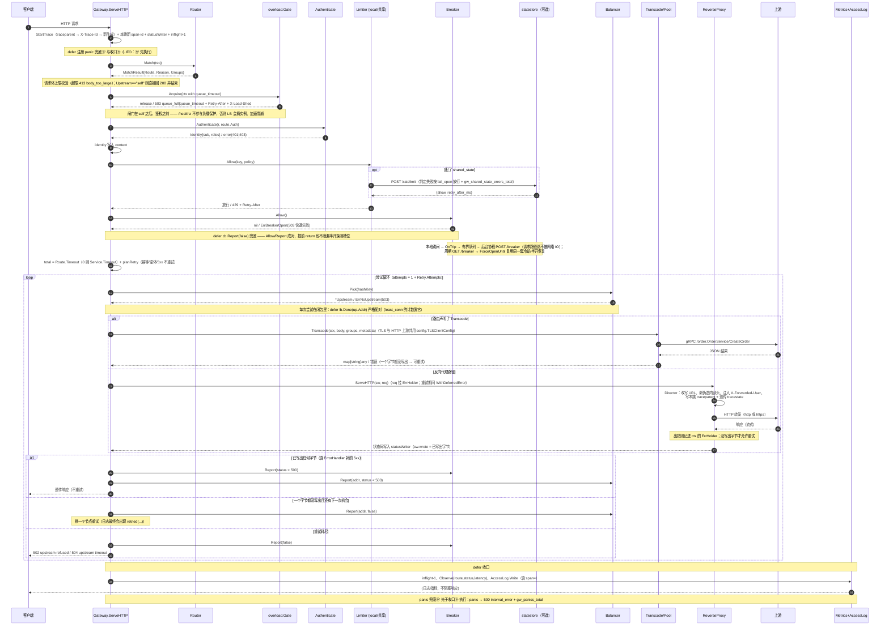
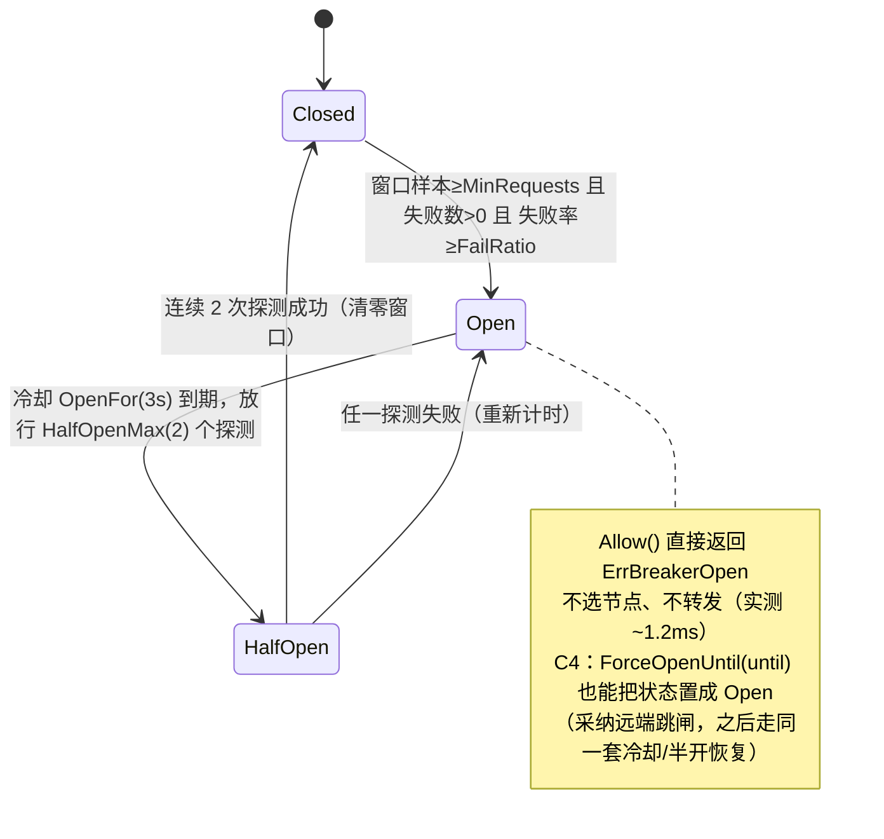

# gateway 项目分析与执行链路

> 分析对象：`D:\www\gateway`（Go module `gwlab`，go 1.26.5）
> 分析方式：**全量源码阅读 + 本机真实运行验证**。文中所有输出均为实测结果，非推演。
> 分析日期：2026-09-30
> 布局说明：本文档已对应**重构后的标准 Go 工程布局**（`cmd/` 入口 + `internal/` 私有包）。重构前的根目录单包 `main` 布局已废弃。

---

## 0. 结论速览

```text
main()
 └── run()
      ├── config.Load()              ← 默认 → JSON → 环境变量 → 校验
      ├── gateway.New(cfg)           ← 快照 + 限流后端 + 负载闸门 + 共享状态
      ├── http.Server{Handler: gw}   ← 业务端口
      ├── http.Server{Handler: AdminHandler}  ← 管理端口（可选）
      ├── printBanner()
      ├── watchConfig()              ← 热重载（可选）
      ├── signal.Notify()            ← 优雅退出
      └── srv.ListenAndServe()       ← 阻塞
           │
           │  （每个请求）
           ▼
      gw.ServeHTTP(w, r)
       ├── 0. 准备：trace、statusWriter、快照、clientIP
       ├── 0.5. defer：panic 兜底 + 收口
       ├── 1. 管理端点（如果没独立端口）
       ├── 2. ① 路由匹配
       ├── 3. 请求体上限
       ├── 4. self 路由短路
       ├── 5. 负载保护（Acquire/release）
       ├── 6. ② 鉴权
       ├── 7. ③ 限流
       ├── 8. 查找上游服务
       ├── 9. ③ 熔断检查
       ├── 10. ④ 选节点 → ⑤ 转换/⑥ 转发（可重试）
       └── 11. 收口：指标 + 日志
```

| 项 | 结论 |
|---|---|
| 项目定位 | 一台 **教学 / 实验性质的自研 API 网关**，不是业务系统，也不是框架封装 |
| 模块名 | `gwlab`（gateway lab，网关实验台） |
| 技术栈 | 100% Go 标准库 + **唯一第三方依赖 `google.golang.org/grpc`** |
| 代码结构 | 标准 Go 布局：`cmd/` **4 个入口** + `internal/` **12 个包**；**52 个 `.go` 文件 / 10062 行**（测试 24 文件 / 4397 行，生产代码 28 文件 / 5665 行），**12 个包全部有用例** |
| 可执行体 | 4 个：`cmd/gateway`（网关本体）、`cmd/backend`（演示上游）、`cmd/hashring`（哈希测量程序）、`cmd/statestore`（共享限流/熔断状态的参考实现，**只在多副本时才部署**） |
| 监听端口 | 网关业务 `127.0.0.1:18080`、网关管理 `127.0.0.1:18081`（默认，独立监听）；后端 HTTP `19001/19002/19003`；后端 gRPC `19100` |
| 核心价值 | 把「一台网关必备的 7 个机制」各写一份最小可运行实现，并在注释中固化踩坑点与实测数据 |
| 已具备的能力 | 配置外置 + 热重载、上游 TLS、每路由超时 / 安全重试、跨副本共享限流与熔断、可聚合直方图与 W3C 链路、负载保护、启动期校验、节点级摘除、管理面独立监听 |
| 容量（本机） | `/healthz` **2077 RPS**、`/slow?ms=5` **1359 RPS**、并发拐点 **c≈20**（`overload.max_inflight` 取拐点的 ~70%）—— 数据与踩坑见 `docs/性能压测报告.md` |
| 是否可直接生产用 | **接近**（但仍有缺口）：主动健康探活、真实集群验证、出站 XFF 清理、配置中心 等都还没有，逐条见 §8 |

**一句话**：这是一个把路由、鉴权、限流、熔断、负载均衡、协议转换、可观测性七件事**从零手写一遍**的网关实验项目，每个模块都配了可复现的验证场景，用来把「网关内部到底发生了什么」变成可观测、可复现的事实。

---

## 1. 这个项目是做什么的

### 1.1 判断依据

| 证据 | 出处 |
|---|---|
| `module gwlab`，依赖表只有 grpc 一个直接依赖 | `go.mod` |
| 配置用 Go 字面量硬编码，注释写明理由：「为的是让『网关由哪些声明式规则组成』一眼可见，生产中应从配置文件/配置中心加载并支持热更新」 | `internal/config/types.go` |
| 每个包顶部都有一段 `// Package xxx 实现 ① …` 的说明注释，直接写「这为什么值得做」「三条容易做错的地方」 | 全部 `internal/` 包 |
| 出现「本机实测踩过」「本机实测」等字样，并给出具体百分比 | `internal/router/route.go`、`internal/proxy/proxy.go`、`internal/balancer/balancer.go` |
| 演示用后端提供 `/__control?fail=1` 故障注入开关，注释写「这样才能演示熔断→恢复完整闭环」 | `cmd/backend/main.go`、`internal/config/config.go` |
| 原缺 README / Makefile（重构时已补齐）；分析时无 CI、无任何测试文件（`go test ./...` 无用例）—— 现已有 **24 个测试文件 / 4397 行**，`auth / balancer / breaker / clientip / config / gateway / observability / overload / proxy / ratelimit / router / transcode` **12 个包有用例**（已修），并已补 CI（`.github/workflows/ci.yml`：gofmt 卡口 / `go vet` / 四入口构建 / 基准记录；`-race` 步骤只在 Linux 生效 —— 本机 `CGO_ENABLED=0` 且无 gcc，跑不了） | 全仓扫描 |
| 原为根目录单包 `main`（12 个 `.go` 平铺），且遗留 `gw.exe` / `gw.exe~` / `probe.verified.exe` / `*.log` 等实验产物 —— 已重构并清理 | 目录对比 |

### 1.2 四个可执行体的分工

```
  cmd/backend A            cmd/backend B        cmd/backend C
  :19001（HTTP + gRPC:19100） :19002（HTTP）        :19003（HTTP）
        ▲                        ▲                    ▲
        │                        │                    │
        └───────────┬────────────┴────────────────────┘
                    │  反向代理 / gRPC 调用
            ┌───────┴────────────────────────┐
  客户端 ──►│  cmd/gateway   127.0.0.1:18080  │
            └───────┬────────────────────────┘
                    │ 配了 shared_state 时：限流判定 / 熔断状态
            ┌───────┴────────────────────────┐
            │  cmd/statestore  :18090        │  ← 只在多副本时才需要（单副本用进程内状态）
            └────────────────────────────────┘

  cmd/hashring   ← 独立的纯计算程序，不参与请求链路，只测量一致性哈希
```

1. **`cmd/gateway`** —— 网关入口。只做装配与生命周期管理（三层读配置、建 Gateway、起业务/管理两个 HTTP Server、轮询热重载、优雅退出）；七级流水线本身在 `internal/gateway`。
2. **`cmd/backend`** —— 演示用上游。一个进程同时给出 HTTP 与 gRPC 两种接口，HTTP 侧回显关键请求头（用来验证网关改头改得对不对），并带 `/__control?fail=1` 故障注入开关。**它是被观测对象，不是项目主体。**
3. **`cmd/hashring`** —— 一次性测量程序。用同一份代码对比 FNV-1a 与 MD5 的雪崩性、虚拟节点数量对分布的影响、扩容迁移率。
4. **`cmd/statestore`**（C4）—— **共享状态服务的参考实现**（`POST /ratelimit`、`POST+GET /breaker`、`GET /healthz`）。
   存在的唯一理由是：限流桶与熔断器默认在**进程内**，多副本时限流会变成"阈值 × 副本数"、熔断各算各的。
   它**不是网关的必选组件**（单副本演示不需要），而且**无鉴权**（只应开在内网 / 回环），
   自身也是**新的单点** —— 生产可换成自己的实现（协议就三个端点）。


---

## 2. 目录结构

```
D:\www\gateway\
├── go.mod / go.sum              # module gwlab，直接依赖只有 grpc v1.84.0
├── Makefile / README.md / Dockerfile / .dockerignore / .github\workflows\ci.yml
├── scripts\                     # loadtest.py 压测、demo_faults.py 故障演练、demo_reload.py 热重载验收
├── deploy\                      # docker-compose.yml、config.example.json 模板 + config.compose.json 演示配置、
│                                #   .env.example（compose 插值模板，真实 .env 不进仓库）、
│                                #   k8s\{gateway,backend,statestore}.yaml、observability\
├── cmd\                         # 4 个入口：gateway（网关本体）、statestore（共享状态参考实现）、
│                                #   backend（演示上游：HTTP + gRPC + /__control 故障注入 + ?ms= 延时）、hashring（离线哈希实验）
├── internal\                    # 12 个包按机制分包（下表）；装配层 gateway 只被 cmd/gateway 引用
├── docs\                        # ← 本文档所在目录（另有 项目地图.md / 性能压测报告.md / 网关缺陷审计与优化路线.md / 生产部署与接入新服务.md）
└── bin\ .idea\                  # 编译产物与 IDE 配置（均已 gitignore）
```

★ = 生产化改造期间新增的包或文件；每个文件的行数、职责与关键符号在 `docs/项目地图.md` §1。

| 包 | 在流水线里的位置 | 文件与要点 |
|---|---|---|
| `config` | 声明式配置模型（叶子包） | `types.go` 类型、`config.go` 演示配置 + `MaxServiceTimeout`、`file.go` ★ 三层加载（覆盖语义 / 未知字段报错 / BOM / 下划线注释）、`tls.go` ★ 上游 TLS（代理与转码共用）、`validate.go` ★ 启动期校验 30+ 类 |
| `router` | ① 路由匹配 | `route.go`：exact / prefix / regex + Host / Method / Header 打分，通配头值正则**预编译**；测试含 `BenchmarkMatch` 与 `FuzzMatch` |
| `auth` | ② 鉴权 | `auth.go`：JWT（HS256 手写）+ API Key，`exp` 必填、寿命 ≤24h、恒定时间比较、`Bearer` 大小写不敏感；测试含 `FuzzVerifyJWT` |
| `ratelimit` | ③ 限流 | `limit.go` 令牌桶 + 空闲桶回收；`backend.go` ★ 可插拔 `Backend`（`LocalBackend` / `HTTPBackend`，fail-open + `OnError` 打点） |
| `breaker` | ③ 熔断 | `breaker.go` 三态机 + 滑动窗口（`OnTrip` / `ForceOpenUntil`）；`store.go` ★ 跨副本只共享「打开到 T」 |
| `balancer` | ④ 选节点 | `balancer.go` 四种算法 + `Pick`/`Done`/`Report`/`Stats`；`health.go` ★ 节点级被动摘除（阈值 / 冷却 / 单探测 / 租约自愈 / 全摘 fail-open） |
| `clientip` | 入口真实 IP（叶子包） | `clientip.go` ★ `Resolve` / `ParseTrusted`：直连对端不可信就**一个字节都不读** XFF |
| `transcode` | ⑤ 协议转换 | `transcode.go`：REST/JSON → gRPC，per-address 拨号锁 + 非阻塞 `grpc.NewClient` + JSON codec + metadata 白名单 + TLS |
| `proxy` | ⑥ 反向代理 | `proxy.go`：内部头剥离、`StripPrefix` 段边界、https 上游、本跳 `traceparent`、`ErrHolder`（用 context 传上游错误） |
| `observability` | ⑦ 可观测 | `observ.go` 访问日志与指标渲染、`histogram.go` ★ 秒级固定桶直方图 + 运行时指标 + `sortedKeys()`、`trace.go` ★ W3C traceparent |
| `overload` | 负载保护闸门（叶子包） | `gate.go` ★ 并发槽位 + 有界队列 + 排队超时 + `sync.Once` 幂等 release |
| `gateway` | 唯一装配层 | `gateway.go` `ServeHTTP`（七级流水线 + 管理 Handler）、`reload.go` ★ 热重载、`retry.go` ★ `planRetry`、`sharedstate.go` ★ 共享熔断发布/采纳；另有 5 个集成测试文件 |

**依赖方向是单向的**，不存在循环引用：

```
config（叶子，无内部依赖）   clientip（叶子，无内部依赖）   overload（叶子，无内部依赖）
   ▲                                          ▲                    ▲
   ├── router / auth / ratelimit / breaker / balancer / transcode   │
   │                                   ▲      │                     │
   │                       auth ◄──────┤      │（gateway 用 clientip.Resolve 取真实客户端 IP）
   │                observability ◄────┤      │
   │                                   │      │
   └────────────────────► gateway ◄────┴──────┴─────────────────────┘（装配层，只被 cmd/gateway 引用）
```

### 2.1 规模与逐文件职责

**52 个 `.go` 文件 / 10062 行**：生产代码 28 文件 / 5665 行，测试 24 文件 / 4397 行；**12 个包全部有用例**。

逐文件的行数、职责与关键符号见 `docs/项目地图.md` §1（按 `cmd/` + `internal/` 分层列出），
「改哪一处要动哪些文件」的地图在同文档 §5。两份文档的分工：**本文回答"为什么这么设计"，地图回答"东西在哪"**。

---

## 3. 七个功能模块详解

### ① 路由匹配（`internal/router/route.go`）

**做什么**：把「一次请求」映射成「一条路由规则」，规则由 `Host + Path + Method + Header` 四要素共同决定。

**匹配优先级（刻意与 Nginx 同构）**：

```
精确(exact, 得分 3) > 正则(regex, 得分 2) > 前缀(prefix, 得分 1)
同为正则/精确：先声明者胜
同前缀：最长前缀胜
```

| 能力 | 实现 | 位置 |
|---|---|---|
| Host 通配 `*.example.com` | `hostMatch` 后缀比较，并先剥掉端口 | `internal/router/route.go` |
| 精确匹配 | `path == c.Path` | `internal/router/route.go` |
| 正则匹配 | 启动时 `regexp.Compile`，匹配时取子捕获组 | `internal/router/route.go`、`internal/router/route.go` |
| 前缀匹配 | `strings.HasPrefix` + 最长优先 | `internal/router/route.go` |
| Header 匹配（值支持 `*`） | 把 `*` 转成 `.*` 后走正则 | `internal/router/route.go` |

**设计亮点**：`MatchResult` 不只返回命中规则，还返回 `Reason`（如 `exact /healthz`、`prefix /open/`、`regex ^/api/users/\d+$`），这个字符串会直接落进访问日志的 `via=` 字段——**路由问题基本不用猜**。

**注释里固化的坑**：正则必须排在普通前缀之前，否则 `^/api/users/\d+$` 会被最宽的 `location /` 抢走。

⚠️ 但要区分「规则」与「配置」：**这条规则依然成立**（`internal/router/route.go` 里正则的得分高于前缀），
而**当前配置里已经没有那条兜底路由**了 —— `fallback`（`Host:"*" + Path:"/" + prefix`）已删，见 4.2。
所以现在这条规则是**防御性**的：它防的是将来有人再加一条 `prefix /`；只要不加，未命中的路径就会如期落到
404 `route_not_found`（实测见 6.8）。

### ② 鉴权（`internal/auth/auth.go`）

**做什么**：按路由声明决定是否需要身份、用哪种凭据、需要什么角色。

| 方式 | 载体 | 实现要点 |
|---|---|---|
| JWT | `Authorization: Bearer <token>` | **不引库**，手写 HS256。签名对象=前两段的**原始字面量拼接**；验签用 `hmac.Equal` 恒定时间比较；签名通过后再校验 `exp`/`nbf` |
| API Key | `X-API-Key` 头或 `?api_key=` | 同样是 `hmac.Equal` 恒定时间比较 |

**`Bearer` 前缀大小写不敏感（P2-1 加固）**：RFC 7235 §2.1 规定 auth-scheme **大小写不敏感**，
而原实现是 `strings.CutPrefix(raw, "Bearer ")` —— 只认这一种拼写。现在改为按第一个空格切出 scheme 后
`strings.EqualFold(scheme, "Bearer")`（`internal/auth/auth.go:79-84`）：`bearer` / `BEARER` / `BeArEr` 都能鉴权成功。
**容易做错的地方**：放宽的只是 scheme 的**字母大小写**，分隔符仍**只接受空格** —— `Bearer<Tab>token` 依旧 401
（有专门用例钉住这一点，`internal/auth/auth_test.go`），别把「大小写不敏感」误实现成「分隔符随意」。

**`exp` 策略（P0-5 加固）**：

- **`exp` 必填**：`exp == 0`（缺失或为 0）**直接拒绝**，错误码 `token_no_expiry`
  （校验在 `internal/auth/auth.go:143-144`，哨兵错误 `ErrNoExpiry` 在 `:32`）。
  为什么必须拒：「永不过期」的令牌一旦泄漏就无法自然失效，而**很多 JWT 库默认不校验缺失的 `exp`**。
  **实测：这种 token 修复前返回 200，修复后是 401 `{"error":"token_no_expiry",...}`**（见 6.9）。
- **寿命上限 24h**：`maxTokenLifetime = 24h`（`internal/auth/auth.go:39`）；`iat` 存在时校验
  `exp - iat ≤ 24h`，超限返回 `token_too_long_lived`；`SignJWT` 在未给 `iat` 时**自动补当前时间**，
  保证这条约束始终有参照点（否则可以发一个没有 `iat` 的百年令牌绕过上限）。
- 两个错误码由 `Code()` 统一映射（`internal/auth/auth.go:184-190`）。

**仍然成立的正面结论**：验签**不看 header 里的 `alg`**，而是按硬编码 HS256 重新计算前两段的签名再
`hmac.Equal` 比对 —— 所以 `alg=none` / 空签名 / 两段式 / 改 payload / 错密钥这五类签名类攻击
**现在也是 401**（见 6.2 与 6.9 的探针纪律说明）。

**状态码语义被明确区分**（这是很多手写网关的疏漏）：

- 无凭证 / 格式错 / 签名非法 / 已过期 → **401**（"你可以再试"）
- 有身份但角色不足 → **403**（"别再试了"）
- 映射逻辑集中在 `authStatus()`（`internal/auth/auth.go`）

**身份落地**：鉴权成功后产出 `Identity{Subject, Roles, Scheme}`，写入 `context`（key `gw.identity`），供下游取节点（限流维度）、代理（写 `X-Forwarded-User`）和日志（`who=` 字段）复用。

**演示用密钥**（硬编码，注释已标明不可用于生产）：`internal/config/config.go`

```go
const jwtSecret = "demo-secret-do-not-use-in-prod"
const apiKeyValue = "ak_live_9f2c41d7"
```

### ③ 限流（`internal/ratelimit/limit.go`）

**做什么**：令牌桶限流，保护网关自己不被压垮。

- **惰性补充**：不做定时任务，记录 `last` 时刻的令牌数，下次请求按经过时间补（`internal/ratelimit/limit.go`）。空闲连接不占资源。
- **拒绝时算出等待时间**，换算成 `Retry-After` 响应头返回（`internal/ratelimit/limit.go`）。
- **空闲桶回收**：`ttl = 3 分钟`，每分钟扫一遍并删除，`internal/ratelimit/limit.go`。注释点明这是"限流器最常见的泄漏点"。
- **限流维度**（`limitKey`，`internal/ratelimit/limit.go`）：

```
已登录：route:<路由名>|user:<sub>
未登录：route:<路由名>|ip:<客户端IP>
```

- **`ip:` 里的「客户端 IP」现在来自 `clientip.Resolve`（P1-3），不再直接取 `RemoteAddr`**：
  只有**直连对端本身是可信代理**（`Config.TrustedProxies`）时才采信 `X-Forwarded-For` / `X-Real-IP`，
  否则**完全不读**这些头。为什么必须这样分：LB 后面所有请求的 `RemoteAddr` 都是 LB 的地址，
  按它限流等于全局共享一个桶；而**无条件**采信 XFF 又等于把限流维度交给客户端伪造。
  演示配置 `TrustedProxies: nil` = 谁都不信，行为与「只认 `RemoteAddr`」等价，但不可伪造（出站方向仍未清理，见 §8 #1）。

**为什么限流必须挂在鉴权之后**（`internal/gateway/gateway.go` 的硬约束之一）：放前面只能按 IP 计数，NAT 后面一栋楼共用一个桶。

**可插拔后端：本地桶 or 共享判定（C4，`internal/ratelimit/backend.go`）**

单副本时令牌桶在进程内够用；多副本时每个副本各有一份桶，**实际放行量 = 副本数 × 阈值**（压测通过、扩容出事）。
所以把「谁来判断放行」抽成 `Backend` 接口（`LocalBackend` 默认 / `HTTPBackend` 走共享状态服务）：

```go
type Backend interface {
    Allow(key string, p config.LimitPolicy) (allow bool, retryAfter time.Duration)
    Name() string
}
```

| 设计点 | 做法 | 为什么（容易做错的地方） |
|---|---|---|
| 接口形状 | **一次判定**（`Allow(key, policy)`），不是「取桶」 | 分布式实现里根本没有「本地桶对象」；任何 `GetBucket(key).Allow()` 的抽象都**无法远程实现** —— 要么把桶缓存到本地（又变成各算各的），要么每请求往返两次 |
| 失败策略 | `fail_open` 可配，**默认 true**（放行） | fail-closed 会让状态服务一次抖动把自己的网关打成全量 503，比被刷更糟；但**静默放行等于把限流失效藏起来**，所以必须配合 `OnError` 打点 |
| 打点 | 判定失败 → `gw_shared_state_errors_total{backend="ratelimit"}` | 这是「限流到底还在不在生效」的唯一信号 |
| 传输 | JSON over HTTP（`POST /ratelimit`） | 项目定位「除 grpc 外只用标准库」，引 Redis 客户端会破坏它；HTTP 还能让状态服务用**任何语言**写 |

> 共享判定每次都多一次网络往返（本地是纯内存操作），所以**只在确实需要跨副本一致时打开**；
> 参考实现是 `cmd/statestore`（复用网关自己的令牌桶实现，保证切到共享限流不是一次语义变更）。

### ③ 熔断（`internal/breaker/breaker.go`）

**做什么**：保护网关不被故障上游拖死。三态机 `closed → open → half-open → closed|open`。

| 参数 | 含义 | 默认/示例值（order-svc） |
|---|---|---|
| `WindowSize` | 滑动窗口长度 | 10 |
| `FailRatio` | 失败率阈值 | 0.5 |
| `MinRequests` | 样本不足时不判定 | 4 |
| `OpenFor` | 打开后多久进入半开 | 3s |
| `HalfOpenMax` | 半开放行的探测请求数 | 2 |

**三条被固化的正确做法**：

1. `open` 状态**快速失败**，不再发起真实调用（`internal/breaker/breaker.go`）；
2. 必须经 `half-open` 探测再恢复，不能超时后直接回 `closed`（否则未恢复的上游会被瞬间打满，反复雪崩）；
3. 失败样本用**环形滑动窗口**而非累计计数（`internal/breaker/breaker.go`）。

**熔断粒度是「服务」（`svc.Name`）而非「节点」**：`Gateway.breakers` 是 `map[string]*Breaker`（`internal/gateway/gateway.go`），所以 `flaky-svc`（指向 19003）与 `order-svc`（也包含 19003）互不影响——这是有意为之的正确设计。

**共享熔断状态：只共享「打开到 T」（C4，`internal/breaker/store.go` + `internal/gateway/sharedstate.go`）**

多副本时熔断器各学各的：**A 副本已熔断的服务，B 副本还在打流量**，上游实际承受的压力是阈值的副本数倍。
共享的粒度刻意做得很小 —— **只共享「打开到什么时候」**（滑动窗口的原始计数不适合、也不需要跨副本共享：
各副本的样本本来就是不同的流量）。

| 环节 | 实现 | 为什么这么做 |
|---|---|---|
| 发布 | 本地跳闸 → `OnTrip(until)` → **有界队列**（64）+ 后台协程 `POST /breaker` | 跳闸恰好发生在请求路径里，**绝不能在热路径做网络 IO**；队列满就丢弃并打点 `gw_shared_state_errors_total{backend="breaker-publish-dropped"}`（丢一次发布只让别的副本晚一个周期知道） |
| 采纳 | 周期（`sync_interval` 默认 1s）`GET /breaker` → 对本地熔断器调 `ForceOpenUntil(until)` | 熔断在热路径上，每请求远程问一遍既慢又把状态服务变成瓶颈；代价是副本间生效有一个时间窗 |
| `ForceOpenUntil` | 把 `openedAt` 往回拨，**复用同一套冷却/半开恢复流程** | 不新增一条"远端打开"的状态路径 —— 远端状态最终还是要走本地同一套恢复逻辑，两条路径必然会漂移 |
| 回调纪律 | `OnTrip` **只在本地跳闸时回调**，且**在释放锁之后**触发 | ①采纳远端状态不回调，否则副本之间会互相转发形成**发布风暴**；②持锁做网络 IO 会卡住该服务的**所有**请求 |
| 降级 | 读不到/发不出共享状态 → 熔断器**照常按本地状态机工作**（退回单副本语义） | 宁可退化成单副本，也不要因为状态服务抖动让所有请求失败；降级计入 `gw_shared_state_errors_total{backend="breaker"}` |

**零值 `FailRatio` 的 bug 已修**：开闸条件原来是 `ratio >= FailRatio`，
`FailRatio = 0` 时**零失败也满足 `0 >= 0`** —— 实测表现为**成功请求（`status=200`）的日志里带着 `breaker=open`**，几次之后开始 503。
修法是加 `failures > 0` 前置（`internal/breaker/breaker.go`），并补 6 个 breaker 用例（该包此前**没有任何测试**），
回归用例 `TestZeroFailRatioDoesNotTripOnSuccess`。
⚠️ **零值语义「一次失败即熔断」如实保留**（这是文档化的取舍，不是 bug）：不希望立刻熔断的服务必须显式给 `FailRatio` 与 `MinRequests`（见 §8 #7）。

### ④ 负载均衡（`internal/balancer/balancer.go`）

统一接口 `Balancer{ Pick(key) (*Upstream, error); Done(addr); Report(addr, success); Stats() []NodeStat; Name() }`，
接口里的 `Report` / `Stats` 服务于**节点级摘除**（见下），四种实现：

| 算法 | 适用场景 | 实现要点 |
|---|---|---|
| `round_robin` | 节点同质、无状态 | `atomic.Uint64` 自增取模 |
| `weighted`（平滑加权轮询） | 节点能力不同 | Nginx 同款：每次选当前权重最大者，选中者减总权重、其余加自身权重。3:1 的序列是 `A A B A` 而非 `A A A B` |
| `least_conn` | 请求耗时差异大 | 在途计数最小者优先，计数用 `atomic`；**平局按下标轮转**（见下），`slow-svc` 已在用 |
| `consistent_hash` | 需要会话粘性 | 哈希环 + **每节点 150 个虚拟节点** |

**节点级被动摘除（P1-2，`internal/balancer/health.go`）**

以前只有「服务级熔断」这一层健康判定：一个节点坏掉，要么整条服务被熔断（同服务的健康节点一起陪葬），
要么什么都不做。`health.go` 让**四种算法共用同一份节点状态**，接口因此多了 `Report(addr, success)`（主流水线回报结果）
与 `Stats() []NodeStat`（供 `/metrics`、`/readyz` 读）两个方法。

| 规则 | 行为 | 为什么这么做 |
|---|---|---|
| 连续失败 ≥ `FailThreshold` | 摘除该地址，冷却 `Cooldown` | 只认**连续**失败（成功一次即清零），避免抖动误摘健康节点 |
| 成功一次 | **立即回列** | 恢复越快越好，不必等冷却走完 |
| 冷却到期 | 只放行**一个**探测请求（并发下也只有一个） | 服务级半开探测的同款思路：同时放多个探测 = 把未恢复的节点又打一遍 |
| 探测**租约**超时 | 自动自愈，重新允许探测 | 探测中途 panic / 提前 return 时，节点不会永久卡在「探测中」 |
| 全部节点被摘除 | **fail-open**，退回全量节点 | 宁可把请求送给可疑节点，也不能让网关自己造出 503 |
| `FailThreshold = 0` | 永不摘除 | 显式关掉该机制（`flaky-svc` 只有单节点，演示的是服务级熔断，故意不配） |

主流水线在 `defer lb.Done(up.Addr)` 之外**新增** `lb.Report(up.Addr, upstreamOK)`
（`internal/gateway/gateway.go` 的尝试循环里，成功与失败**都**上报 —— 只报失败，「成功清零」这条规则就失效了）。

**容易做错的地方**：①阈值必须是「连续」失败，否则随机抖动就会摘节点；
②全摘之后必须 fail-open，否则集体抖动会把网关变成 503 制造机；
③`Ejection{FailThreshold>0, Cooldown<=0}` 会让被摘的节点**再也回不来** —— 这一条**启动期校验会直接拦住**
（`internal/config/validate.go` 的 `Ejection` 检查），不必等到线上才发现。

**一致性哈希的两个关键认知**（注释与 `cmd/hashring` 实测互证）：

1. **关键不是"哈希"，是雪崩性**。作者实测拒绝了 `hash/fnv`：`A#0…A#9` 这种只差末尾一字符的串，FNV-1a 的哈希值几乎连成一片，虚拟节点全挤在环的一小段，等于白加。最终用 **MD5 截前 8 字节**（避免引依赖）。
2. **虚拟节点必须有**。3 个真实节点直接上环时分布极不均（实测最大偏差 90.7%），每节点 150 个虚拟节点后降到 3.9%。

`user-svc` 的哈希 key 来源是请求头 `X-User-Id`（`HashKeyFrom`），未取到则回落客户端 IP（`internal/gateway/gateway.go`）。

**`least_conn` 到 `slow-svc` 出现才真正跑起来**：它原先是"写了但没有任何服务使用"，现在由 `slow-svc`（`/slow`，见 4.2 / 4.3）驱动。
要让它在实测里成立，必须同时补齐两件事 —— 这也是它此前"看着能用、其实不能用"的原因：

1. **`Pick` 与 `Done` 必须成对**：主流水线选完节点后立即 `defer lb.Done(up.Addr)`（`internal/gateway/gateway.go`；C3 起它在**尝试循环的闭包**里，这样每次尝试都能配上对）。
   在此之前主流水线只 `Pick` 不 `Done`，在途计数只增不减，`least_conn` 会退化成"偏向历史上被选中次数少的节点"
   （≈ 轮询）。A/B 对照实测：去掉这一行的二进制，被 `?ms=4000` 占住的节点仍被选中 **6/20**；修复版是 **0/20**（见 6.8）。
2. **平局必须轮转**：低并发 / 串行流量下三个节点的在途数**全是 0，平局才是常态**。原实现按 map 迭代顺序取第一个最小值，
   实测 1000 次全 0 平局的分布是 `a:1=777 / b:1=116 / c:1=107` —— **78% 砸在列表第一个节点**上，此时 least_conn 名存实亡；
   现在改为按下标从轮转起点 `next` 开始遍历取最小，平局自然轮流：999 次 = **333/333/333**。

> 结论：**串行请求测不出 `least_conn`**（每次进来在途都是 0，结果完全由平局策略决定），
> 必须让请求同时在途（并发 + 后端 `?ms=` 占住连接）才看得到"避开忙节点"。回归测试见 `internal/balancer/balancer_test.go`。

### ⑤ 协议转换（`internal/transcode/transcode.go`）

**做什么**：外部 REST/JSON → 内部 gRPC，让"客户端只会说 JSON、服务端只会说 protobuf"这件事只在网关发生一次，而不是散落到每个服务里。

- **连接复用**：`GRPCPool` 按地址缓存 `*grpc.ClientConn`（`internal/transcode/transcode.go`）。注释点明"每请求新建会吃掉全部收益"。
- **拨号不阻塞其它地址（P1-4）**：原实现是「持有 pool 大锁 → 带 `WithBlock` 拨号」，
  任何一个黑洞地址都会把**所有**地址的取连接请求一起卡满其拨号预算。现在拆成 **per-address 拨号锁** +
  `grpc.NewClient`（去掉 `WithBlock`）：拿到 `*grpc.ClientConn` 就返回，真正的连接在首次 `Invoke` 时才建立。
  **实测：黑洞上游的 `Conn` 544µs 返回**（旧实现会把 300ms 预算打满，见 6.9）。
  ⚠️ **语义变化（必须写清）**：上游不可达现在由该次 `Invoke` 在**请求自己的 ctx** 上报错 ——
  失败边界从「固定 3s」变成「该请求的超时」。
- **免 stub 调用**：方法名就是字符串 `"/order.OrderService/CreateOrder"`，直接用 `conn.Invoke`，不需要 protoc 生成代码。
- **本机妥协**：没有 protoc，于是注册了一个 **JSON codec** 代替 protobuf。传输层仍是真 gRPC（HTTP/2 + 帧 + 多路复用 + 超时传播），只是编解码换成 JSON；生产换回 protobuf 只需去掉 codec 注册。
- **映射规则**：请求体 JSON → gRPC 消息；正则捕获组 → `param1/param2…` 字段；请求头 → gRPC metadata（**白名单**，只透传 `X-Trace-Id` 与 `x-user-id`，避免把 Cookie/UA 塞进 metadata）。
- **请求体读取上限 1MB**（`internal/gateway/gateway.go`）。
- **上游 TLS 与 HTTP 代理共用同一份配置（C2）**：转码不会自己读证书文件，而是调
  `Upstream.TLSClientConfig()`（`internal/config/tls.go`）拿到 `*tls.Config` 再交给 gRPC 作传输凭据。
  为什么必须共用：HTTP 代理（`internal/proxy`）与 gRPC 转码对同一个上游的两套 TLS 语义一旦各写一份，
  迟早漂移（一边记得填 SNI、另一边忘了，表现为「同一个域名 HTTP 通、gRPC 不通」）。
  ⚠️ **容易做错的地方**：证书读取失败时**绝不静默降级成明文或跳过校验** —— 启动期已经拦住绝大多数情况，
  运行期真出错就让握手报明确的 x509 错。

### ⑥ 反向代理（`internal/proxy/proxy.go`）

基于标准库 `httputil.ReverseProxy`（逐跳头剔除、流式转发它已做对；**协议升级不是"白送"的**，见下），自己只补三件事：

1. **`Director` 改写目标 URL**：含 `StripPrefix` 剥前缀（**按路径段边界**，见下）；补 `X-Real-IP` / `X-Forwarded-Host` / `X-Forwarded-Proto`；
   ⚠️ **刻意不手写 `X-Forwarded-For`** —— ReverseProxy 在 Director 之后会自己把 `RemoteAddr` 追加到 XFF，两边都做会出现 `127.0.0.1, 127.0.0.1`（注释注明本机实测踩过）。**实测确认：单跳请求的 XFF 只有一个 IP。**
2. **剥离客户端伪造的内部头**（多租户系统的必修项）：

```go
var internalHeaders = []string{
    "X-Company-Id", "X-Tenant-Id", "X-User-Id", "X-Internal-Call", "X-Forwarded-User",
    "Forwarded", "X-Original-URL", "X-Rewrite-URL",   // P2 加固补的三个
}
```

   剥完之后，再由网关注入**可信的** `X-Forwarded-User`（来自鉴权结果）。

   **新增剥离的三个头，为什么都在列表里**：

   - `Forwarded`（RFC 7239）是 `X-Forwarded-For` 的标准化写法，携带的是**客户端同样能伪造**的客户端 IP / 协议信息。
     网关自己重写的是 `X-Real-IP` / `X-Forwarded-Host` / `X-Forwarded-Proto`，所以 `Forwarded` 只剥不生成 ——
     留着它等于给伪造的客户端 IP 开第二条通道。
   - `X-Original-URL` / `X-Rewrite-URL` 是 nginx / IIS 系的**路径重写头**，部分后端框架（或前端反代）
     会照着它改写路由。把「请求到底打到哪里」的决定权交给客户端，是典型的越权注入面。

   **`StripPrefix` 按路径段边界判定（P2-7 加固）**：`StripPrefix: "/api"` 会把 `/api/order` 剥成 `/order`，
   但 `/apifoo` **不剥**（保持原样）。**容易做错的地方**：直接用 `strings.HasPrefix` 会把 `/apifoo` 剥成 `foo`，
   静默把请求送到一个完全不相干的路径上 —— 这类错误只会在某个「前缀恰好相同的兄弟服务」上才暴露。
3. **`ErrorHandler` 把上游错误翻译成可读状态码并区分类型**：

| 上游情况 | 返回 |
|---|---|
| 超时（`context.DeadlineExceeded` / `os.IsTimeout`） | **504** `upstream timeout` |
| 连不上（connection refused） | **502** `upstream refused` |
| 其他 | **502** `upstream error` |

**连接池调优**：`MaxIdleConnsPerHost: 50`（默认只有 2，网关场景必须调大）、`FlushInterval: 100ms`（SSE 更平滑）、`Proxy: nil`（**明确不走环境变量里的代理**——本机存在 `http_proxy`，这一行很关键）。

**https 上游（C2）**：目标 URL 的 scheme 取 `Upstream.SchemeOrDefault()`（空 = `http`），
`https` 时把 `Upstream.TLSClientConfig()` 的结果装进 `Transport.TLSClientConfig` ——
与 gRPC 转码**同一份实现**（见 3.⑤）。**容易做错的地方**：`insecure_skip_verify` 关掉的是证书链与主机名校验
（等于给中间人开门，只应临时调试）；用 IP 直连而证书签的是域名时**必须**显式给 `server_name`（SNI），
否则「本地通、线上不通」。

**每路由超时 + 安全重试（C3）**

原来超时只有服务级、且没有重试。现在 `Route.Timeout` 覆盖 `Service.Timeout`；`Route.Retry{Attempts, PerTryTimeout, AllowNonIdempotent}` 控制重试。
**重试是流量放大器**（上游已经过载时无脑重试会把压力放大 (Attempts+1) 倍），所以只做最安全的那一类：

| 闸门 | 规则 | 为什么 |
|---|---|---|
| 只重试「未写出任何字节」的失败 | 连接被拒/重置、拨号超时、TLS 握手失败可重试；一旦上游开始回响应就**绝不换节点重来** | 重放已开始的响应需要把响应缓冲起来（内存代价，还会破坏流式/SSE/协议升级），而且可能把已经产生副作用的操作做两次 |
| **5xx 不重试** | 上游已明确答 500，说明请求到达并被处理过 | 「上游 5xx 就换节点」应当在上游侧解决，而不是让网关把写请求再发一遍 |
| 默认只幂等方法 | GET/HEAD/PUT/DELETE/OPTIONS/TRACE（RFC 7231 §4.2.2）；要重试写操作必须显式开 `allow_non_idempotent` 并自行保证幂等键 | 重试 POST 可能重复下单/重复扣款 |
| 请求体必须为空 | `ContentLength == 0`（顺带排除 chunked 的 -1） | 重放请求要靠缓冲 body，本实现**刻意不做** |
| 时间上界 | 最坏耗时 ≈ 单次超时 × (Attempts+1)；`config.MaxServiceTimeout()` 已把它算进 `http.Server.WriteTimeout` | 否则 `WriteTimeout` 会把**还在重试**的请求拦腰掐断，客户端看到连接被重置而不是网关的错误响应 |
| 次数上限 | `Attempts ≤ 5`（启动期校验拦住过大的值） | 重试次数的收益是递减的，代价是线性的 |

实现上，`ServeHTTP` 的 ④⑤⑥ 变成一个**尝试循环**，每次尝试放在闭包里跑（`Pick` / `Done` 严格配对，
`least_conn` 的在途计数才不会因为循环里的 `defer` 失效）；重试期间让 `proxy` **推迟**写错误响应
（`proxy.WithDeferredError`），还有下一次机会时才不写 502。

**代理上游错误进访问日志 `err=`（C3）**

根因是 `ErrorHandler` 改的是 `ReverseProxy` `Clone` 出去的出站请求头（深拷贝，改不回来）。
现在改用 **context** 承载（`proxy.ErrHolder` / `WithErrHolder`，`proxy.go:196-240`），
实测日志里出现 `err=upstream refused` / `err=upstream timeout`（回归用例 `TestProxyErrorLandsInAccessLog`）。
**容易做错的地方**：任何「想从 `ErrorHandler` 往外传信息」的实现都会撞上同一个 Clone 语义 ——
往 Header 写、往 `*http.Request` 上挂字段都没用，只有 context 能穿过去。

**⚠️ 协议升级（WebSocket / `101`）必须自己补一步 —— P0-1 已修**：

`ReverseProxy` 处理 `101 Switching Protocols` 时走 `http.NewResponseController(rw).Hijack()`
（stdlib `net/http/httputil/reverseproxy.go:838-841`），而 `ResponseController` 只认包装器提供的
`Hijacker` 或 **`Unwrap() http.ResponseWriter`**（stdlib `net/http/responsecontroller.go:66-75`）。
主流水线为了统计状态码与字节数把 `ResponseWriter` 包成了 `statusWriter` ——
**它不实现 `Unwrap()` 时，Controller 找不到底层的 `Hijacker`，升级直接失败**：
实测修复前客户端拿到的是 `HTTP/1.1 502 Bad Gateway`，而不是 101。

修法两行：

- 给 `statusWriter` 加 `Unwrap() http.ResponseWriter`（`internal/gateway/gateway.go` 的 `statusWriter.Unwrap`）——这才是让升级能走通的关键；
- 顺带加 `ReadFrom` 转发，保住 `io.Copy` 的**零拷贝快路径**（否则包装器会强制走普通读写缓冲）。

修复后新增测试 `TestWebSocketUpgrade` 拿到 **101**，且升级后**双向数据能通**（见 6.9）。
**容易做错的地方**：只加 `ReadFrom` 不加 `Unwrap` 依然会 502；反过来，包装 `ResponseWriter` 时忘了
`Unwrap` 也是同类问题的通用根因（`http.ResponseController` 相关的所有能力——Hijack、Flush、
SetWriteDeadline——都会被包装器挡住）。

### ⑦ 可观测性（`internal/observability/observ.go`）

三个切面：**TraceID（这次请求经过了哪些环节）→ 日志（这次请求发生了什么）→ 指标（一万次请求整体怎么样）**。全部零 SDK 手写。

| 能力 | 实现 |
|---|---|
| TraceID | 复用上游传入的 `X-Trace-Id`（网关可能是链路中间一环），没有才生成 16 字节随机 hex；并**写回请求头**，随转发传给上游 |
| 访问日志 | 结构化 `key=value` 单行，字段：`ts trace trace8 method host client path route via who upstream status latency upstream_ms bytes [limit=hit] [breaker=状态] [err=...]`；进程内保留最近 200 条 + 打 stdout |
| 指标 | 输出 Prometheus 文本格式（全局指标 + **节点级指标**） |

**访问日志补/改的四个字段（B8）**（`internal/observability/observ.go`），C5 又加了 **`span=`**：

| 字段 | 含义 | 为什么值得记 |
|---|---|---|
| `trace` | **全量** 32 位 TraceID | 响应体里给客户端的就是它，只有全长才能直接对齐排查；原先是截断的短前缀 |
| `trace8` | 前 8 位短前缀 | 给人眼扫日志用（`trace` 已经能对齐，它只是方便 `grep`） |
| **`span`** | **本跳 span-id**（C5） | W3C traceparent 的第三段；一条链路上每个跳一个 span，只有记下来才能分辨"这一跳" |
| `client` | 真实客户端 IP（同限流维度，走 `clientip.Resolve`） | 排查「到底是谁打的」时不必再从 `remote_addr` 反推 LB 拓扑 |
| `upstream_ms` | 上游往返耗时 | **`latency - upstream_ms` 就是网关自身开销** —— 网关慢还是上游慢，一眼可辨 |

指标清单（**C5 之后**）：

| 指标名 | 类型 | 标签 | 备注 |
|---|---|---|---|
| `gw_requests_total` | counter | `route`, `status` | |
| `gw_request_duration_seconds_bucket` / `_sum` / `_count` | **histogram** | `route`, `le` | **C5 新增**：单位**秒**、固定桶 1ms~10s、**可跨实例聚合**，分位用 `histogram_quantile` |
| `gw_request_duration_ms` | gauge | `route`, `quantile`(p50/p95/p99) | **旧指标，保留**但**别聚合**（见下） |
| `gw_limit_rejected_total` | counter | `route` | |
| `gw_breaker_trips_total` | counter | `service` | |
| `gw_panics_total` | counter | — | |
| `gw_inflight_requests` | gauge | — | |
| `gw_shared_state_errors_total` | counter | `backend` | **C4 新增**：共享限流/熔断状态判定失败的次数（含 `breaker-publish-dropped`） |
| `gw_overload_rejected_total` | counter | `route` | **C6 新增** |
| `gw_inflight_limit` / `gw_queue_waiting` | gauge | — | **C6 新增**：配置的并发上限 / 当前排队人数 |
| `gw_runtime_goroutines` / `gw_runtime_mem_alloc_bytes` / `gw_runtime_mem_sys_bytes` / `gw_runtime_gc_cycles` | gauge / counter | — | **C5 新增**：不引 `client_golang` 就用 `runtime` 包自己取（`renderRuntime`） |
| `gw_upstream_inflight` | gauge | `service`, `addr` | |
| `gw_upstream_failures_total` | counter | `service`, `addr` | |
| `gw_upstream_ejected` | gauge | `service`, `addr` | |

**为什么直方图替代近似分位（C5，`internal/observability/histogram.go`）**：

`gw_request_duration_ms{quantile}` 是"当场在最近 512 个样本里排序算出来的近似值"，它**不能跨实例聚合** ——
多副本时把两个副本的 p95 再平均一次，得到的"全局 p95"是错的。直方图只上报"落在每个桶里的次数"，
聚合交给 Prometheus（各副本的桶直接相加再算分位），这也是生态的标准做法。
取舍：精度受桶宽限制（桶边界按网关的延迟量级选：**1ms ~ 10s**），换来常数内存与稳定输出。
⚠️ **单位是秒**（`histogram_quantile` 与看板模板都假定秒），旧毫秒指标保留只为肉眼对比。
**容易做错的地方**：`Observe` 只把计数加到**第一个匹配的桶**上，累积在渲染时做（Prometheus 的 `le` 是"<="语义）——
两边都累积会把数值算两遍（本机实测踩过，`le` 序列变成错位的 `0,0,1,2,3,5,7…`）。

**P2-5 修复：`/metrics` 输出已全排序**。原来 `latency` / `limitHits` / `cbTrips` 三处 map 输出**未排序**，
每次抓取的行序随机 → 看板抖动、无法 diff。现在统一走 `sortedKeys()`（`histogram.go`），
并有回归用例**「连渲染 5 次逐字节一致」**（`TestRenderIsStable`）。
**为什么值得单独立一条**：指标文本不稳定时，「配置改了之后指标怎么变了」这种排查会先被随机行序误导一轮。

**W3C traceparent（C5，`internal/observability/trace.go`）**

原来只有一个自定义的 `X-Trace-Id`：能在自己系统里串起来，但**接不进任何标准链路追踪**（Jaeger / Tempo / 云 APM 都认 W3C `traceparent`）。
网关是链路的**中间一跳**，正确做法是：**沿用上游的 trace-id → 为本跳生成新的 span-id → 把新的 traceparent 写给下游**。

| 设计点 | 做法 | 为什么（容易做错的地方） |
|---|---|---|
| 中间一跳 | 沿用 trace-id、**生成新 span-id**，`tracestate` 原样透传 | 原样透传客户端的 span-id 会让下游以为"自己就是客户端那一跳"，调用关系被压平成直线，看不出网关这一跳 |
| 严格解析 | 版本只认 `00`、四段长度固定、十六进制**必须小写**、trace-id/span-id 不能全 0 | 规范如此；大写十六进制算非法 |
| 非法输入 | **当作没传**，自己新起一条链路 | 不要把自己看不懂的东西继续往下传 |
| 兼容 | 非法/缺失时退回 `X-Trace-Id`（本项目演示后端与旧调用方仍在用），并**回写**该头 | 一次性切换会让旧调用方的 trace 断掉 |
| 传递方式 | 放进 **context**（`WithTrace` / `TraceFrom`），`proxy.Director` 从 ctx 取出后写 header | `ReverseProxy` 会 `Clone` 出站请求，**在 Header 上改传不回来**（与 `ErrHolder` 同一个坑） |

### ⑧ 负载保护（`internal/overload/gate.go`，C6 新增包）

**做什么**：给网关加一道**并发**闸门 —— 限制同时在处理的请求数，超出的**有界排队或快速拒绝**。

**与限流的区别（这两个机制经常被混为一谈）**：

```
限流    管的是**速率**（每秒允许多少），维度是"谁在用"（用户 / IP / 路由）
负载保护 管的是**并发**（此刻多少在飞），维度是"网关与上游此刻扛不扛得住"
```

上游慢了 10 倍时，请求速率可能**一点没变** —— 限流完全不触发，而网关里的请求会越堆越多，
goroutine / 连接 / 内存一起涨，最后连健康检查和本来能跑完的请求都挤不进来。
**只有并发保护能拦住这种雪崩**。

| 设计点 | 做法 | 为什么（容易做错的地方） |
|---|---|---|
| 槽位 | 带缓冲的 `chan struct{}`，容量 = `max_inflight` | channel 的等待队列**天然 FIFO**，不需要自己写队列与锁 |
| 排队 | `max_queue` 限制同时排队的人数；`> maxQueue` 直接 `queue_full` | **排队必须有界**：无限排队只是把超时往后推，客户端看到的是"一直转圈" |
| 排队超时 | `queue_timeout` 到点即拒（`queue_timeout`） | 同上，宁可立刻告诉客户端"稍后重试"（503 + `Retry-After`） |
| 归还 | `release` 用 `sync.Once` 幂等 | 漏一次归还就**永久少一个并发额度**，闸门最后会自己把自己关死；幂等兜住重复调用 |
| 位置 | **self（`/healthz`）之后、鉴权之前** | 负载高时把健康检查也拒掉，LB 会把这个实例摘掉，**剩下的实例压力更大 = 加速雪崩**；self 路由不参与保护 |
| 未启用 | `max_inflight = 0` → `Gate` 为 `nil`，`Acquire` 直接放行 | 默认行为与改造前**完全一致**（回归风险最小） |
| 响应 | `503 overloaded` + `Retry-After` + `X-Load-Shed: queue_full|queue_timeout` | 把"哪种过载"写进响应头，排障时能直接区分是队列满还是等超时 |

**闸门准入的计数是"准入控制"而不是精确队列长度**（`Acquire` 里 `waiting.Add(1)` 成功后立刻减回去）：
高并发下允许轻微超发，换来的是不用再加一把锁 —— 这里的误差不影响保护效果（`internal/overload/gate.go:99-105` 有注释说明）。

**阈值怎么定**：用 `scripts/loadtest.py` 找出网关在不劣化前提下的**并发拐点**，取 70% 左右；
`max_queue` 只吸收**突发**，不要指望它扛持续过载（那只会把失败推迟到超时那一刻）。


> 后三个是**节点级指标**，由 `internal/gateway/gateway.go` 的 `nodeMetrics()` 渲染
> （HELP/TYPE 与样本都在 `:285-314`），数据来自 `Balancer.Stats()`（`internal/balancer/health.go`），
> **输出前按服务名排序**，因此 `/metrics` 的文本是稳定的（可直接 diff）。
> 为什么必须补：在此之前 `least_conn` 的**在途计数完全不可观测** —— 计数不变式（`Pick`/`Done` 成对）
> 只能靠单测与 A-B 实测兜住，线上无从发现 —— 这三个指标就是把那条不变式搬到监控上。
> `gw_upstream_failures_total` 是 `Report` 的累计计数，`gw_upstream_ejected` 是「当前是否被摘除」的 0/1 ——
> 前者看抖动，后者看摘除闭环。

> `gw_panics_total` 来自 `internal/gateway/gateway.go` 的 panic 兜底 `defer` 里对
> `Metrics.IncPanic` 的调用（渲染在 `internal/observability/observ.go` 的 `Render`）。
> 有了它，"网关到底有没有被某个畸形请求打崩过"从只能翻日志变成可告警的数值。

延迟的**旧路径**仍是「最近 512 个样本排序取分位」（`gw_request_duration_ms{quantile}`），
C5 起它与**直方图并行输出**：直方图给聚合与看板用，旧分位只为肉眼快速对比。
**仍未做**：没有 `go_*` / `process_*` 官方采集器（只自取了四个 `gw_runtime_*`）、没有 OpenTelemetry SDK
（只做 W3C 头透传，**没有导出 span**）；`/metrics` 与 `/debug/logs` 自身仍无鉴权（靠管理端口隔离兜住）。

**三个网关自带的管理端点（不经过路由与鉴权，默认只在管理端口提供）**：

| 端点 | 说明 |
|---|---|
| `GET /metrics` | Prometheus 文本指标（全局 + 节点级） |
| `GET /debug/logs` | 最近 50 条访问日志（JSON） |
| `GET /readyz` | 就绪检查（P1-6 新增）：任一**已被使用过**的服务处于熔断（open/half-open）**或**所有节点被摘除 → **503**；否则 200 并列出每个服务的 `breaker/upstreams/ejected` |

> 这三个端点**默认不在业务端口**（`18080`）上：它们由 `Gateway.AdminHandler()` 挂在独立监听的
> `AdminListenAddr`（默认 `127.0.0.1:18081`）上，实现见 `internal/gateway/gateway.go` 的 `AdminHandler`、
> `cmd/gateway/main.go` 里第二个 `http.Server`（见 5.1）。只有 `AdminListenAddr` 留空时才退回「与业务同端口」的老行为。
>
> **`/healthz` 与 `/readyz` 的分工要写清**：`/healthz` 只说明「进程活着」（网关自答，恒 200）；
> `/readyz` 才回答「现在能不能接流量」——LB 的健康检查应该指向 `/readyz`，否则上游全挂时 LB 仍会把流量送进来。

### 附：演示上游（`cmd/backend/main.go`）与哈希实验（`cmd/hashring/main.go`）

- **backend**：`-http` / `-grpc` / `-name` 三个 flag。HTTP 侧回显 `method/path/query/headers/ts`，其中 `echoHeaders` 精选了"网关最容易改错的几个头"（`X-Forwarded-*`、`X-Real-IP`、`X-Trace-Id`，以及**应该被剥掉的** `X-Company-Id`/`X-Tenant-Id`）。`GET /__control?fail=1|0` 运行时切换返回 500，用于演示熔断闭环；任意路径加 `?ms=<毫秒>` 则故意慢响应（**上限 5000ms**，在故障注入判断之前生效），用来占住连接观察 `least_conn` 的在途计数。gRPC 侧用 `grpc.ServiceDesc` 手写注册 `order.OrderService/CreateOrder`，从 metadata 里取回 trace。
- **cmd/hashring**：四组实验（见第 6.5 节实测数据）。

---

## 4. 配置模型

### 4.1 类型定义（`internal/config/types.go` + `config.go`）

**配置有三个来源，优先级从低到高（C1，`internal/config/file.go`）**：

```
① 内置默认   config.Default()（编译期 Go 字面量，9 路由 / 6 服务）
② 外部文件   GW_CONFIG 指向的 JSON —— 只覆盖"写了的字段"，**routes / services 一写就整体替换**
③ 环境变量   GW_LISTEN_ADDR / GW_ADMIN_LISTEN_ADDR / GW_JWT_SECRET / GW_API_KEY / GW_TRUSTED_PROXIES
        ↓
   启动期 cfg.Validate()（失败 → 进程起不来，并打印**配置来源**）
```

| 设计点 | 做法 | 为什么（容易做错的地方） |
|---|---|---|
| 只支持 JSON | 标准库 `encoding/json`，不为 YAML 引依赖 | 项目定位「除 grpc 外只用标准库」；JSON 无注释的缺点用下面两条补 |
| 覆盖语义 | `routes` / `services` **整体替换**，不合并 | 配置系统最怕语义模糊：合并会造出"删不掉的旧服务" |
| 未知字段 | `DisallowUnknownFields` | 静默忽略拼错的字段（`timeout` 写成 `time_out`）是配置外置最常见的线上事故 |
| 时长 | 一律写字符串 `"2s"` / `"500ms"`（整数纳秒也接受） | `time.Duration` 的默认 JSON 形态是**整数纳秒**，手写几乎必错 |
| 「没写」vs「零值」 | 标量与子结构用**指针**（`*string` / `*bool` / `*fileBreaker`） | `burst: 0` 与"没写 burst"语义完全不同，不用指针就分不清 |
| JSON 注释 | **下划线开头的 key 递归当注释忽略**（`_说明` / `_comment` 都行） | 与其外挂一份说明文档，不如给一个明确的逃生口（`deploy/config.example.json` 在用） |
| Windows BOM | 统一剥掉 `EF BB BF` | 编辑器 / `Set-Content -Encoding UTF8` 会写 BOM，`json.Decoder` 报 `invalid character 'ï'`，**从文件内容上看不出任何问题**（两个坑本机都实测踩过） |

```
Config（网关全部配置）
├── ListenAddr / AdminListenAddr      业务端口 / 管理端点独立端口（空 = 与业务同端口）
├── JWTSecret / APIKey                演示用明文密钥（生产改环境变量注入）
├── TrustedProxies []string           可信代理 CIDR；空 = 完全不采信 XFF/X-Real-IP
├── SharedState SharedStateConfig     ← C4 新增：{ URL, Timeout, FailOpen, SyncInterval }；URL 空 = 全在进程内
│                                       端点由基址推出：POST /ratelimit、POST+GET /breaker
├── Overload    OverloadConfig        ← C6 新增：{ MaxInflight, MaxQueue, QueueTimeout, RetryAfter }；MaxInflight=0 = 不启用
├── Routes[] / Services{}             路由表 / 服务表（key 为服务名）

Route（一条路由）
├── Name/Host/Path/PathType/Methods/Headers   匹配条件
├── Upstream/StripPrefix                      去哪、剥什么（按路径段边界）
├── Timeout  Duration        ← C3 新增：每路由超时，覆盖 Service.Timeout；0 = 用服务超时
├── Retry    *RetryPolicy    ← C3 新增：{ Attempts, PerTryTimeout, AllowNonIdempotent }；nil = 不重试
├── Auth     AuthPolicy    { Required, Scheme(jwt|apikey), Roles }
├── Limit    LimitPolicy   { RatePerSec, Burst }
└── Transcode *TranscodePolicy  { Service, Method }  非空 = 走 HTTP→gRPC

Service（一个上游服务）
├── Name / Balance(算法) / Upstreams[] / Timeout / HashKeyFrom
├── Breaker   BreakerConfig   { WindowSize, FailRatio, MinRequests, OpenFor, HalfOpenMax }
└── Ejection  EjectionConfig  { FailThreshold, Cooldown }   ← 节点级被动摘除

Upstream（一个节点）
├── Addr / Weight / GRPC / Backend(仅用于观测负载分布)
├── Scheme  string      ← C2 新增："" | "http"（默认）| "https"
└── TLS     *TLSConfig  ← C2 新增：{ CAFile, ServerName, InsecureSkipVerify, ClientCertFile, ClientKeyFile }
```

**`gateway.New` 的第一件事就是 `cfg.Validate()`**（`internal/config/validate.go`，P1-1）：
错误配置**启动即失败**（进程起不来、横幅不打印），而不再是运行期某个请求拿到 500 `bad_config`。
覆盖的检查（现已扩展到 **30+ 类**）：`ListenAddr` 为空 / 没有路由 / 没有服务 / `TrustedProxies` 非法 CIDR、
`SharedState.URL` 形式非法与负时长、`Overload` 参数为负或"只排队不限并发"、
路由重名、匹配条件完全相同、`PathRegex` 编译失败、`PathType` 非法、`StripPrefix` 不以 `/` 开头、
上游服务不存在、`Transcode` 指向没有 `GRPC: true` 节点的服务、服务 `Name` 与 map key 不一致、
`Timeout <= 0`、节点重复 / 非 `host:port` / 权重为负、`Breaker.MinRequests > WindowSize`、`FailRatio` 越界、
`Ejection` 有阈值但 `Cooldown <= 0`、`Retry.Attempts` 为负或**超过上限 5**、
`Retry.PerTryTimeout` 太短（<10ms，几乎必然全部超时）、`scheme` 非法 / 配了 `tls` 但 `scheme` 不是 `https` /
TLS 证书文件读不到或证书私钥不匹配。
**空 `Host` 会被归一化成 `"*"`**（与 router 的「空 = 任意」语义等价，写显式值是为了横幅与排查）。
单元测试覆盖校验的各条错误路径与归一化行为（`internal/config/config_test.go`）。
**热重载时会再跑一遍**：`Reload` 先 `newState(cfg)`（内含 `Validate`），失败就**保留旧配置**（见 5.1）。

### 4.2 九条路由（`internal/config/config.go`）

| # | 路由名 | Host | Path | 类型 | Method | 上游 | 鉴权 | 限流 | 演示意图 |
|---|---|---|---|---|---|---|---|---|---|
| 1 | `public-health` | `*` | `/healthz` | exact | — | `self` | — | — | 网关自答，不鉴权 |
| 2 | `order-exact` | `api.example.com` | `/api/order/list` | exact | GET | `order-svc` | — | 50/s burst10 | 精确匹配优先于前缀 |
| 3 | `order-prefix` | `api.example.com` | `/api/order/` | prefix | — | `order-svc` | JWT | 20/s burst5 | 最长前缀优先 + 剥 `/api` |
| 4 | `user-regex` | `*` | `^/api/users/\d+$` | regex | GET | `user-svc` | JWT | 10/s burst3 | 正则匹配 |
| 5 | `user-mobile` | `*` | `/api/users/me` | exact | — | `user-svc` | JWT | — | Header 参与匹配（`X-Client: mobile`） |
| 6 | `open-api` | `*` | `/open/` | prefix | — | `order-svc` | API Key | 5/s burst2 | API Key 鉴权 |
| 7 | `flaky` | `*` | `/flaky` | exact | — | `flaky-svc` | — | — | 熔断演示专用窄路由 |
| 8 | `order-create` | `*` | `/api/orders` | exact | POST | `grpc-order-svc` | JWT（admin\|user） | 10/s burst3 | **HTTP→gRPC 协议转换** |
| 9 | `slow` | `*` | `/slow` | exact | — | `slow-svc` | — | — | 演示 ④ 最少连接（配合后端 `?ms=` 占住连接才看得出） |

**为什么删掉 `fallback`**：它原本是 `Host:"*" + Path:"/" + prefix`，能吃掉**任意 Host、任意路径**的请求，
于是 `internal/gateway/gateway.go` 的 `route_not_found`（404）分支**永远不可达** —— 前端拼错路径会静默打到 `order-svc` 并返回 200。
删掉它之后，未匹配的请求才如期 404（实测见 6.8）；代价是"漏配路由"不再有静默兜底，这正是生产上想要的行为
（上线红线之一：不要加回 `prefix /` 的兜底路由）。

路由数因此仍是 **9 条**（删 1 加 1），服务数 5 → **6**（见 4.3）。

### 4.3 六个上游服务（`internal/config/config.go`）

| 服务名 | 算法 | 节点 | 超时 | 特殊配置 |
|---|---|---|---|---|
| `self` | round_robin | —（网关自答） | 1s | 无 |
| `order-svc` | round_robin | 19001(w3) / 19002(w1) / 19003(w1) | 2s | 权重已配但**当前算法下不生效**（见 §8 #6）；`Ejection{FailThreshold:3, Cooldown:5s}` |
| `user-svc` | **consistent_hash** | 19001 / 19002 / 19003 | 2s | `HashKeyFrom: X-User-Id`；`Ejection{FailThreshold:3, Cooldown:5s}` |
| `flaky-svc` | round_robin | 19003（单节点） | 1s | 配合 `/__control` 演示**服务级熔断**；**故意不配 `Ejection`** —— 单节点摘掉就等于没有上游（fail-open 会再放回来），这里要演示的是熔断而不是节点摘除 |
| `slow-svc` | **least_conn** | 19001 / 19002 / 19003 | **10s** | ④ 最少连接 + 节点级摘除演示靶机（`Ejection{FailThreshold:3, Cooldown:5s}`）；超时放宽到 10s 是为了容下后端 `?ms=` 的人为延时（**上限 5s**） |
| `grpc-order-svc` | round_robin | 19100（`GRPC: true`） | 3s | 走协议转换 |

熔断参数统一为 `{WindowSize:10, FailRatio:0.5, MinRequests:4, OpenFor:3s, HalfOpenMax:2}`；
监听地址 `Config.ListenAddr = "127.0.0.1:18080"`、管理地址 `Config.AdminListenAddr = "127.0.0.1:18081"`、
`TrustedProxies = nil`（演示是单机直连，没有任何可信代理）。

> **演示配置刻意只用基础字段**：`shared_state` / `overload` / `route.timeout` / `route.retry` /
> `upstream.scheme` / `upstream.tls` 都**没有配** —— 分别对应"进程内状态 / 不启用负载保护 / 用服务超时 / 不重试 / 明文 http"。
> 想验证这些能力要用外部 JSON 覆盖（下表），而不是往演示配置里塞。
> 变的是**配置可以被外部 JSON 覆盖**：`deploy/config.example.json` 演示了 `shared_state`、`payment-svc` 的
> `upstreams[].tls`、`breaker`、`ejection`，以及带 `timeout`/`retry`/`limit`/`auth` 的路由（见生产文档 §2）。
> 生产接入新服务现在**两条路都行**：改 `defaultRoutes()` / `defaultServices()`（编译期，适合固化默认值）
> 或写一份 JSON 用 `GW_CONFIG` 指过去（无需重新编译，改完 3 秒内热重载生效）。

---

## 5. 执行链路

### 5.1 进程与端口拓扑

```
bin/backend -http 127.0.0.1:19001 -grpc 127.0.0.1:19100 -name A   ← 唯一启用 gRPC 的实例
bin/backend -http 127.0.0.1:19002 -name B
bin/backend -http 127.0.0.1:19003 -name C                          ← 熔断演示靶机
bin/gateway                                                        ← 业务 127.0.0.1:18080 + 管理 127.0.0.1:18081
bin/statestore -listen 127.0.0.1:18090                             ← 只在配了 shared_state（多副本）时才需要
```

> 等价于 `go run ./cmd/backend -http ...` 与 `go run ./cmd/gateway`；`bin/` 下是 `make build` 的产物。
> `cmd/statestore` 是**共享状态服务**的参考实现（C4）：`POST /ratelimit` 做限流判定、
> `POST+GET /breaker` 存取熔断状态、`GET /healthz` 自检。单副本演示**不需要它**；
> 它是状态服务（无鉴权），只应开在内网 / 回环，且生产要考虑它自己的单点与扩容（见生产文档 §1）。

> **管理面独立监听（P1-6）**：`cmd/gateway/main.go` 起了**第二个 `http.Server`**，
> Handler 是 `Gateway.AdminHandler()`（`internal/gateway/gateway.go`），地址取 `cfg.AdminListenAddr`
> （默认 `127.0.0.1:18081`）；优雅退出时两个 Server **一并 `Shutdown`**。
> 为什么值得做：`/metrics`、`/debug/logs`、`/readyz` 原本排在 `ServeHTTP` 的**路由与鉴权之前**，
> 任何能访问业务端口的人都能读到上游地址、熔断状态与限流拒绝情况。拆开之后生产可以只让管理端口绑回环或内网。
> ⚠️ **只有 `AdminListenAddr` 留空时**才退回「与业务同端口」的老行为（`internal/gateway/gateway.go` 里那段 `if snap.cfg.AdminListenAddr == ""`）；
> 实测业务端口上 `/metrics`、`/readyz` 都是 **404**（见 6.9）。

> **配置来源与热重载（C1）**：启动流程是 `config.Load()`（默认 → `GW_CONFIG` 的 JSON → 环境变量 → 校验）
> → `gateway.New`，横幅第一行之后会打印 **`config <来源>`**（`built-in（编译期默认值）` / 文件路径 / `+ 环境变量覆盖`），
> 然后是 `overload` / `shared state` 两行**生效值**（未启用时也明说）。
> 之后 `watchConfig` 每 **3 秒**看一次 `GW_CONFIG` 文件的 mtime（为什么轮询：标准库没有跨平台 inotify，
> 而 Windows 没有 SIGHUP —— 轮询在两个平台行为一致），变了就 `config.Load()` + `Gateway.Reload()`：
> **先构造新快照（含 `Validate`），失败就只用 stderr 打一行"热重载失败，保留旧配置"**，成功才原子替换。
> ⚠️ **需要重启才能生效的项**：`listen_addr` / `admin_listen_addr`（监听已经绑定）、
> `shared_state`（限流后端与共享熔断客户端在 `New` 时构造）、`overload`（闸门同理）；
> 其余（路由 / 服务 / 鉴权密钥 / 可信代理）改完 3 秒内生效。

> **`http.Server` 的超时配置（P0-4 新增）**：`cmd/gateway/main.go` 设 `ReadTimeout: 30s`；
> `WriteTimeout: cfg.MaxServiceTimeout() + 15*time.Second` ——
> `config.MaxServiceTimeout()`（`internal/config/config.go`）遍历所有服务取**最大** `Timeout`
> （含 nil 服务保护，避免配置里出现空指针），**C3 起还把「路由超时 ×(Attempts+1)」的重试预算算进去**。
> 为什么这么取：`WriteTimeout` 是**整条响应**的写截止时间，必须大于"最慢的那个服务的上游超时"，
> 否则上游还没来得及超时返回（504），连接就先被网关自己掐断，客户端看到的是连接中断而不是可读的错误体；
> +15s 就是留的这点余量。
> ⚠️ **取舍（必须写清）**：`WriteTimeout` 会**掐断超过该时长的长连接流式响应（SSE）**。
> 要支持长流，只能按路由放宽，或在流式过程中用 `http.ResponseController.SetWriteDeadline` 续期
> （这也是 `statusWriter` 必须有 `Unwrap()` 的另一个理由，见 3.⑥）。

> **启动横幅的实际输出顺序**（`cmd/gateway/main.go` 的 `printBanner`）：
>
> ```
> gateway listening on http://127.0.0.1:18080  (routes=9 services=6)
>   config        <来源>            ← built-in（编译期默认值）/ 文件路径 / + 环境变量覆盖
>   overload      并发上限 N，...    ← 只在 max_inflight > 0 时出现
>   shared state  <url>  或  local（限流与熔断都在进程内：多副本时限流阈值×副本数、熔断各算各的）
>   admin         http://127.0.0.1:18081  (/metrics  /debug/logs  /readyz)
>   route <名>  host=<Host>  path=<Path>  type=<exact|prefix|regex>  -> <上游服务>   ← 逐条路由
> ```
>
> 9 条 `route` 行的取值与 §4.2 的路由表一致（演示配置没有新增路由）。
> ⚠️ `overload` / `shared state` 两行打的是**生效值**而不是配置值 —— 例如 `queue_timeout` 没写时
> 生效值是 1s，只翻配置文件会误判成"排队立刻超时"；未启用的能力也**明说后果而不是留空行**。

### 5.2 单请求主链路（逐步对应代码）

入口：`Gateway.ServeHTTP`（`internal/gateway/gateway.go`）。`Gateway` 自身实现 `http.Handler`，在 `main()` 中被直接装进 `http.Server.Handler`。

| 步 | 动作 | 代码位置 | 失败结局 |
|---|---|---|---|
| 0 | 生成/复用链路上下文（**C5：先 W3C `traceparent`，再 `X-Trace-Id`，都没有才新生成**；并为本跳生成新的 span-id），包裹 `statusWriter`（捕获状态码与字节数），`inflight +1`，注册 `defer` 收口 | `internal/gateway/gateway.go`、`internal/observability/trace.go` | — |
| 〇 | **管理端点短路**：`/metrics`、`/debug/logs`、`/readyz` —— **只在 `AdminListenAddr` 留空时**才在业务端口上生效；默认它们由独立的 `AdminHandler` 服务 | `internal/gateway/gateway.go` | — |
| ① | **路由匹配**：`Router.Match` 四要素打分，记录命中路由名与 `via` 原因 | `internal/gateway/gateway.go` | 404 `route_not_found` |
| ①′ | **请求体上限**（位置在 ① 路由匹配**之后**、② 鉴权**之前**）：先按 `Content-Length` 快速拒绝，再用 `http.MaxBytesReader` 兜住 chunked / 谎报长度 | `internal/gateway/gateway.go` | 413 `body_too_large` |
| ①″ | **`self` 短路**：上游为 `self` 直接回 `{"status":"ok","trace":...}` | `internal/gateway/gateway.go` | — |
| **①‴** | **负载保护闸门（C6）**：`gate.Acquire(带 QueueTimeout 的 ctx)` → 拿到 `release` 就 `defer release()`；排队满 / 超时 → 立刻 503 | `internal/gateway/gateway.go`（「负载保护」段）、`internal/overload/gate.go` | 503 `overloaded` + `Retry-After` + `X-Load-Shed: queue_full\|queue_timeout` |
| ② | **鉴权**：`Authenticate` 解析 JWT/API Key，产出 `Identity` 写入 context | `internal/gateway/gateway.go` | 401 `unauthorized` / 403 `forbidden` |
| ③ | **限流**：`g.rl.Allow(key, policy)` —— C4 起 `g.rl` 可能是**共享状态后端**（多一次网络往返，失败按 `fail_open` 放行并打点） | `internal/gateway/gateway.go`、`internal/ratelimit/backend.go` | 429 `rate_limited` + `Retry-After` + `X-RateLimit-Policy` |
| ③′ | **熔断检查**：`cb.Allow()`（C4 起可能是 `ForceOpenUntil` 采纳来的远端打开状态） | `internal/gateway/gateway.go` | 503 `circuit_open`（快速失败） |
| ③″ | **熔断上报兜底**：`defer cb.Report(false)`（用 `breakerReported` 标志防止重复上报）—— `Allow` 与 `Report` **成对**。**容易做错的地方**：`Report` 如果只写在两条分支里，任何提前 `return`（例如选节点失败）都会让 `half-open` 的**探测槽位泄漏**，恢复流程可能被永久卡住 | `internal/gateway/gateway.go` | — |
| ④/④′ | **准备尝试循环（C3）**：`total = Route.Timeout`（0 则 `Service.Timeout`）→ `context.WithTimeout`；`planRetry` 算出 `attempts`（1 = 不重试）；协议转换的请求体**在循环外读一次**（循环里读的话第二次尝试只剩空 body） | `internal/gateway/gateway.go`、`internal/gateway/retry.go` | — |
| ⑤ | **每次尝试（循环体，闭包内）**：`lb.Pick(hashKey)` → `defer lb.Done(up.Addr)`（**严格配对**）→ 加 `ErrHolder`（重试期间再加 `WithDeferredError`）→ 走 ⑥ 转码或 ⑦ 反代 | `internal/gateway/gateway.go` | 503 `no_upstream`（Pick 失败） |
| ⑥/⑦ | **分叉**：有 `Transcode` → 协议转换；否则 → 反向代理。`Director` 顺带写出**本跳的 `traceparent`** 与透传的 `tracestate`（C5） | `internal/gateway/gateway.go`、`internal/proxy/proxy.go` | 502 `grpc_error` / 502/504 由 ErrorHandler 决定 |
| ⑧ | **尝试结果判定**：`sw.wrote` = 已写出字节（正常响应或 ErrorHandler 补的 5xx）→ **不重试**，按状态码 `Report`；未写出任何字节 → 节点上报失败，**还有下一次机会就换节点重试**，否则收尾 `502/504` | `internal/gateway/gateway.go` | 重试耗尽后 502 / 504 |
| ⑨ | **收口**（`defer` 执行）：`inflight -1`、状态/耗时/字节数、`upstream_ms`、`metrics.Observe`、`AccessLog.Write`（含 `span=`） | `internal/gateway/gateway.go` | 任何分支都会执行 |
| ⑨′ | **panic 兜底**（`defer` 执行，**注册在收口 defer 之后 → LIFO 下先于收口运行**，所以 panic 也会被收口记进访问日志）：`recover()` 后回 500 `internal_error`；若响应已写出则只记日志与指标，不再改写状态码 | `internal/gateway/gateway.go` | 500 `internal_error`，`gw_panics_total` +1 |
| — | 代理/转换结果**双上报**：`cb.Report(status < 500)`（服务级熔断）+ `lb.Report(up.Addr, status < 500)`（**节点级摘除**）；若熔断状态由 closed 变 open 则计一次 trip，并（配了 `shared_state` 时）**入队发布**到状态服务 | `internal/gateway/gateway.go`、`internal/gateway/sharedstate.go` | — |

**关键的上下文传递（新增了两样）**：

```
r.WithContext(context.WithValue(ctx, identityKey, identity))   // ② 后写入身份
        ↓
req = proxy.WithErrHolder(baseReq.WithContext(attemptCtx))     // C3：上游错误用 context 传回来
        ↓                                                       （+ 重试期间 proxy.WithDeferredError）
r = r.WithContext(observability.WithTrace(r.Context(), tr))    // ⓪ 链路上下文（traceparent 写出用）
        ↓
Proxy.ServeHTTP → Director 里 identityFrom(ctx) 写 X-Forwarded-User、
                 TraceFrom(ctx) 写本跳 traceparent、ErrHolder 在 ServeHTTP 返回后读错误
```

注意 `internal/gateway/gateway.go`：`ctx`（含超时）被放回 `r` 之后才交给 ReverseProxy，因此**上游超时是上下文级别的**，`ErrorHandler` 才能把 `DeadlineExceeded` 识别成 504。
**为什么错误与链路都必须走 context**：`ReverseProxy` 用 `req.Clone(ctx)` 做出站请求（**Header 是深拷贝**），
任何"改 Header 让主流程看见"的做法都会静默失效 —— 这是"代理错误不落日志"与"traceparent 传不出去"两个坑的共同根因。

### 5.3 时序图



### 5.4 分支链路与结局全集

| 触发条件 | 出口 | 状态码 | 响应体特征 |
|---|---|---|---|
| `/metrics` / `/debug/logs` / `/readyz`（**仅管理端口 18081**） | 网关自答 | 200 | 指标文本 / JSON 日志 / 就绪 JSON。⚠️ 业务端口 18080 上这三个是 **404**（`AdminListenAddr` 留空时才退回业务端口，见 5.1 / 6.9） |
| 命中 `Upstream == "self"` | 网关自答 | 200 | `{"status":"ok","trace":...}` |
| **并发已到上限**（C6） | `overloaded` | 503 | `+ Retry-After`、`+ X-Load-Shed: queue_full`（队列满，连排队都不让）或 `queue_timeout`（排了但等到超时）；`gw_overload_rejected_total{route}` +1。**`/healthz` 不受影响**（闸门在 self 之后） |
| 无路由命中 | `route_not_found` | 404 | `{"error":"route_not_found","message":"没有匹配的路由","trace":"..."}`；实测 `/nope/nothing`、`/admin/whatever` 均 404（`fallback` 已删，见 4.2 / 6.8） |
| 请求体超过上限 8MB | `body_too_large` | 413 | **P0-3 新增**：`Content-Length` 超限走快速拒绝；chunked / 谎报长度则由 `http.MaxBytesReader` 触发 `*http.MaxBytesError`，由 `proxy.ErrorHandler` 里对 `*http.MaxBytesError` 的映射（`internal/proxy/proxy.go` 的 `ErrorHandler`）。实测 raw socket 伪造 `Content-Length: 9000000` → `HTTP/1.1 413`「请求体超过上限 8388608 字节」（见 6.9） |
| 需要凭证但没给/格式错/签名非法 | `unauthorized` | 401 | `{"error":"unauthorized","message":"...","trace":"..."}` |
| `exp` 过期 | `unauthorized` | 401 | `message: "凭证已过期"` |
| `exp` 缺失或为 0 | `token_no_expiry` | 401 | **P0-5 新增**：修复前这种 token 能通过（实测 **200**），现在直接拒（见 6.9） |
| `exp - iat` 超过 24h | `token_too_long_lived` | 401 | **P0-5 新增**：仅在 `iat` 存在时判定；`SignJWT` 会自动补 `iat`，所以自己签的令牌一定会被这条约束覆盖 |
| 有身份但角色不匹配 | `forbidden` | 403 | `message: "权限不足"` |
| 令牌桶不足 | `rate_limited` | 429 | + `Retry-After`、`X-RateLimit-Policy`。C4 起桶可能在共享状态服务里（多副本同一桶）；**状态服务读不到时按 `fail_open` 放行**，并把 `gw_shared_state_errors_total{backend="ratelimit"}` +1 —— 也就是说**限流暂时失效**，但请求不会失败 |
| 熔断器打开 | `circuit_open` | 503 | 无 `upstream=`（未选节点，快速失败）。可能是本地跳闸，也可能是**C4 采纳的远端跳闸**（`ForceOpenUntil`） |
| 上游列表为空 | `no_upstream` | 503 | `message: "上游没有可用节点"` |
| 路由指向未定义服务 | `bad_config` | 500 | `message: "上游 X 未定义"`。**正常配置下到不了这里**：`cfg.Validate()` 在启动期就拒掉（见 4.1），运行期这段兜底仍保留 |
| gRPC 调用失败 | `grpc_error` | 502 | `entry.Err` 记为 `grpc:<err>`；**C3 起它属于"一个字节都没写出"**，所以配了 `retry` 的幂等路由会先换节点重试 |
| 上游连不上 | ErrorHandler | 502 | `{"error":"upstream refused","trace":"..."}`，`upstream=` 有值。C3 起会落进访问日志 `err=`；重试成功时记成 `err=retried(upstream refused)` |
| 上游超时 | ErrorHandler | 504 | `{"error":"upstream timeout",...}`；路由级 `timeout` 生效时按路由超时计 |
| 上游返回 5xx | 透传 | 上游原码 | 同时 `cb.Report(false)`（服务级）与 `lb.Report(addr, false)`（**节点级**，连续失败到阈值就摘掉这个地址），5xx 视为"上游不健康"。⚠️ **5xx 不重试**（上游已明确答 500，说明请求到达并被处理过） |
| 处理过程中 panic | `internal_error` | 500 | ⑦′ panic 兜底（P0-2）：：响应还没写出才回这个 500；已写出则只记日志与指标，并让 `gw_panics_total` +1 |

**统一错误体格式**（`fail()`，`internal/gateway/gateway.go`）：

```json
{"error": "<机器可读码>", "message": "<人可读说明>", "trace": "<TraceID>"}
```

### 5.5 熔断状态机



> ⚠️ **`失败数 > 0` 这个前置不能省**：开闸条件原来是 `ratio >= FailRatio`，
> `FailRatio = 0` 时**零失败也满足 `0 >= 0`** —— 实测「成功的请求（`status=200`）日志里却带 `breaker=open`」，
> 几次之后开始 503。现在零值语义仍是「一次失败即熔断」，但**不会再被成功请求打开**（见 3.③ / §8 #7）。

### 5.6 令牌桶状态机

```
初始 tokens = burst
每次请求：
  ① 惰性补充  tokens += (now - last) * rate;  tokens = min(tokens, burst)
  ② tokens >= 1 ? 扣减并放行 : 拒绝并返回 wait = (1 - tokens)/rate
回收：每分钟扫描，seen 早于 now-3min 的桶被删除
```

### 5.7 请求头改写链路（逐跳明细）

| 请求头 | 客户端传入 | 网关动作 | 上游最终看到 |
|---|---|---|---|
| `X-Company-Id` / `X-Tenant-Id` / `X-User-Id` / `X-Internal-Call` | 任意伪造 | **一律删除** | 不存在 |
| `Forwarded` / `X-Original-URL` / `X-Rewrite-URL` | 任意伪造 | **一律删除**（已入剥离列表，见 3.⑥） | 不存在 |
| `X-Forwarded-User` | 伪造 | 先删除，再用**鉴权结果**重写 | 真实身份（如 `u-2`、`apikey:ak_live_`、`anonymous`） |
| `X-Forwarded-For` | 传入 | **不手写**，由 ReverseProxy 追加 `RemoteAddr` | `客户端值, 网关IP`（**出站不清理**：客户端可伪造，见 §8 #1） |
| `X-Real-IP` | — | 由网关按 `RemoteAddr` 写入（**直连对端**地址） | 直连对端 IP（单跳部署即真实客户端；LB 后面是 LB 地址） |
| `X-Forwarded-Host` | — | 网关写入原始 Host | 原始 Host（如 `api.example.com`） |
| `X-Forwarded-Proto` | — | 按 `r.TLS` 判断 | `http` / `https` |
| `X-Trace-Id` | 可传入 | 复用（缺失时新生成）并保证透传 + 回写 | 同一个 TraceID |
| `traceparent` | 可传入（W3C 标准） | **严格校验**：合法则沿用 trace-id、**为本跳生成新 span-id** 后重写；非法则**当作没传**，自己新起一条链路（C5） | `00-<沿用 trace-id>-<网关的新 span-id>-01` |
| `tracestate` | 可传入 | **原样透传**（不解析：那是别人的私有数据） | 与入站完全相同 |
| `Host` | `api.example.com` | 改成上游 `host:port` | 上游地址 |

---

## 6. 实测验证记录

> 环境：Windows + `bin/gateway` + 三个 `bin/backend` 同时运行；JWT 由 `demo-secret-do-not-use-in-prod` 真实签名生成。
> 静态检查：`go build ./...` / `go vet ./...` / `gofmt -l .` 干净；`go test ./...` **12 个包全绿**。
>
> 本节只放**实测输出**。每项能力"为什么这么设计"在 §3 / §4；缺陷编号与修复计划在
> `docs/网关缺陷审计与优化路线.md`；容量与拐点的完整数据在 `docs/性能压测报告.md`。
> ⚠️ 两处历史口径请对照阅读：§6.1 的"伪造内部头剥离"一例、§6.7 的 `/metrics` 与访问日志样例，
> 采集于**管理面拆分与日志字段扩充之前**（那时 `/metrics` 还在业务端口，日志里没有
> `client=` / `upstream_ms=` / `span=`）—— 保留是为了看出改了哪些字段，当前口径见 §3⑦ / §5.7 / §6.9。

### 6.1 路由匹配与鉴权

| 用例 | 请求 | 结果 | 日志 `route=` / `via=` |
|---|---|---|---|
| 网关自答 | `GET /healthz` | 200 `{"status":"ok","trace":"b7b88332..."}` | `public-health` / `exact /healthz` |
| 精确匹配 | `GET /api/order/list`（Host: api.example.com） | 200，backend **A**，`who=anonymous` | `order-exact` / `exact /api/order/list` |
| 前缀 + 剥前缀 | `GET /api/order/123`（Host: api.example.com + JWT） | 200，backend **B**，上游收到 `path="/order/123"` | `order-prefix` / `prefix /api/order/` |
| 正则匹配 | `GET /api/users/42`（JWT） | 200，backend **C**，`who=u-2` | `user-regex` / `regex ^/api/users/\d+$` |
| Header 参与匹配 | `GET /api/users/me` + `X-Client: mobile` | 200，`X-Client` 被透传 | `user-mobile` / `exact /api/users/me` |
| API Key | `GET /open/ping` + `X-API-Key` | 200，`who=apikey:ak_live_` | `open-api` / `prefix /open/` |

> ⚠️ 本节所有 order 相关 curl 都必须显式带 `-H "Host: api.example.com"` —— `order-exact` / `order-prefix` 只认这个 Host，
> 漏掉它就是 404；`GET /anything` / `GET /nope/nothing` 同样都是 **404**（`fallback` 兜底路由已删，见 4.2 / 6.8）。

**逐跳头实测**（backend A 的回显，`GET /api/order/list` + `-H "Host: api.example.com"`）：

```json
{"backend":"A","headers":{
  "X-Forwarded-For":"127.0.0.1",
  "X-Forwarded-Host":"api.example.com",
  "X-Forwarded-Proto":"http",
  "X-Forwarded-User":"anonymous",
  "X-Real-IP":"127.0.0.1",
  "X-Trace-Id":"8ac2a6da2445b0475a15c376ad322eb0"},
 "method":"GET","path":"/api/order/list","query":"","ts":"19:10:03.292"}
```

→ `X-Forwarded-For` **只有一个 IP**，验证了"不在 Director 里手写 XFF"这一决策的正确性。

**伪造内部头剥离实测**（请求附带 `X-Company-Id: 999`、`X-Tenant-Id: evil`、`X-User-Id: u-999`；
采集于 `fallback` 删除前，当时走的是无鉴权的 `prefix /`，所以 `X-Forwarded-User` 是 `anonymous`。
等价复验：无鉴权的 `GET /flaky` 带同样三个伪造头（→ backend **C**），或 `GET /api/order/echo` 带 Host + JWT
（走 `order-prefix`，此时 `X-Forwarded-User` 是 JWT 的 `sub` 如 `u-2`））：

```json
{"backend":"C","headers":{
  "X-Forwarded-For":"1.2.3.4, 127.0.0.1",
  "X-Forwarded-Host":"127.0.0.1:18080",
  "X-Forwarded-Proto":"http",
  "X-Forwarded-User":"anonymous",
  "X-Real-IP":"127.0.0.1",
  "X-Trace-Id":"13e63dec4e78e0a9a457e99f8970863d"}}
```

→ 三个伪造的内部头**全部消失**；`X-Forwarded-User` 被重写为可信值；但伪造的 `X-Forwarded-For` 被保留并追加（见 §8 #1）。

### 6.2 鉴权拒绝

| 用例 | 结果 |
|---|---|
| 空 Bearer | `401 {"error":"unauthorized","message":"凭证格式错误"}` |
| 非 Bearer（`Authorization: Token abc`） | `401 "凭证格式错误"` |
| 签名被篡改（追加 `.xxx`） | `401 "凭证格式错误"` |
| 已过期 token（`exp` 设为 10 秒前） | `401 "凭证已过期"` |
| API Key 错误 | `401 "签名不合法"` |
| **角色不足**（`viewer` 打 `POST /api/orders`，需 `admin|user`） | **`403 {"error":"forbidden","message":"权限不足"}`** |

### 6.3 限流（令牌桶 10/s burst=3）

串行连打 8 次 `GET /api/users/42`（同一用户 `u-2`）：

```
#1 HTTP 200    28.8ms  Retry-After=None
#2 HTTP 200     1.7ms  Retry-After=None
#3 HTTP 200    26.6ms  Retry-After=None
#4 HTTP 429     2.2ms  Retry-After=1 X-RateLimit-Policy=10/s burst=3
#5 HTTP 429     1.6ms  Retry-After=1 X-RateLimit-Policy=10/s burst=3
#6 HTTP 429     1.4ms  Retry-After=1 X-RateLimit-Policy=10/s burst=3
#7 HTTP 429     1.6ms  Retry-After=1 X-RateLimit-Policy=10/s burst=3
#8 HTTP 429     1.6ms  Retry-After=1 X-RateLimit-Policy=10/s burst=3

并发 20 个请求，耗时 24ms，结果：{429: 20}
```

→ 行为与设计完全一致：桶容量 3 个令牌先放行 3 个，之后按 10/s 速率补，期间请求全部 429，并附带 `Retry-After: 1`。

### 6.4 熔断闭环（`flaky-svc` → 19003，注入 500）

```
=== 基准：上游健康 ===
  #1 HTTP 200    2.0ms  {"backend":"C",...}
  #2 HTTP 200    1.5ms  {"backend":"C",...}

=== 注入故障 /__control?fail=1，连打 8 次 ===
  #1 HTTP 500    2.2ms  {"backend":"C","error":"upstream injected failure"}
  #2 HTTP 500    2.0ms  {"backend":"C","error":"upstream injected failure"}
  #3 HTTP 503    1.4ms  {"error":"circuit_open","message":"上游熔断中，请稍后重试"}
  #4 HTTP 503    2.0ms  ...
  ... （#5~#8 均为 503，耗时 1.1~1.3ms）

=== 等 3s 冷却后恢复上游，探测 ===
  探测#1 HTTP 200    4.1ms
  探测#2 HTTP 200   27.4ms
  探测#3 HTTP 200    3.8ms     ← 第 3 次日志 breaker=closed，完成恢复
```

网关日志中的状态迁移（真实输出，节选）：

```
... path=/flaky ... status=500 ... breaker=closed
... path=/flaky ... status=500 ... breaker=open      ← 第 2 次失败时失败率触阈值
... path=/flaky ... status=503 ... upstream=- ... breaker=open   ← 此后全部快速失败，未选节点
... path=/flaky ... status=200 ... breaker=half-open  ← 冷却 3s 后放行探测
... path=/flaky ... status=200 ... breaker=closed     ← 2 次探测成功后闭合
```

**上游不可达路径**（杀掉 19003 进程后打 `/flaky`）：

```
#1 HTTP 502  {"error":"upstream refused","trace":"ca7675c00d0b8471291d54d2e37b9bcb"}
#2 HTTP 502  {"error":"upstream refused",...}
#3 HTTP 502  ...（日志中 breaker 已变 open）
```

→ 连不上与超时被正确区分成 502 / 504。

### 6.5 一致性哈希（`user-svc`，key 来自 `X-User-Id`）

| key | 落到的后端 | key | 落到的后端 |
|---|---|---|---|
| `u-100` | B | `u-105` | B |
| `u-101` | C | `u-106` | B |
| `u-102` | C | `u-107` | C |
| `u-103` | A | `u-108` | B |
| `u-104` | B | | |

粘性复验（同一 key 连续 4 次）：

```
u-100: ['B', 'B', 'B', 'B']  一致=True
u-101: ['C', 'C', 'C', 'C']  一致=True
```

**`cmd/hashring` 四组实验真实输出**：

```
=== ① 哈希函数的雪崩性：同一节点的连续虚拟节点落在环的哪里？===
  FNV-1a         A#0..A#9 落在 [18059311470525726540, 18059323565153636861]
                 跨度占整环 0.000066%          ← 10 个虚拟节点挤在环的一根线上
  MD5(前8字节)      A#0..A#9 落在 [3826117742805930969, 17906019882190577578]
                 跨度占整环 76.327302%         ← 均匀散开

=== ② 哈希函数对分布的影响（每节点 150 个虚拟节点，10 万个 key）===
  FNV-1a                A=17310  B=39560  C=43130   最大偏差 48.1%   ✗
  MD5(前8字节)             A=33344  B=34625  C=32031   最大偏差 3.9%    ✓

=== ③ 虚拟节点数的影响（哈希固定为 MD5）===
  每节点 1 个               A=3101   B=56668  C=40231   最大偏差 90.7%
  每节点 10 个              A=24801  B=45855  C=29344   最大偏差 37.6%
  每节点 50 个              A=28105  B=34314  C=37581   最大偏差 15.7%
  每节点 150 个             A=33344  B=34625  C=32031   最大偏差 3.9%
  每节点 500 个             A=33447  B=34068  C=32485   最大偏差 2.5%
  每节点 2000 个            A=33997  B=32362  C=33641   最大偏差 2.9%

=== ④ 扩容迁移率（MD5，每节点 150 个虚拟节点，10 万 key）===
  哈希环  3 → 4 节点：迁移  22.8%（理想 1/4 = 25.0%）
  取模    3 → 4 节点：迁移  74.8%（理想 3/4 = 75.0%）—— 几乎全量重排
```

→ 三组数据共同支撑了 `internal/balancer/balancer.go` 中的两个决策：**弃用 FNV-1a**、**每节点 150 个虚拟节点**。

### 6.6 HTTP → gRPC 协议转换

```
POST /api/orders   Authorization: Bearer <admin>   {"sku":"A100","qty":2,"amount":398}

HTTP 200
{"code":0,
 "data":{"accepted_by":"A",
         "order_id":"SO-20260930-0300",
         "protocol":"gRPC over HTTP/2 (json codec)",
         "received":{"amount":398,"qty":2,"sku":"A100"},
         "trace":"13e4467c5ac7765819c4d52a226c429f"},
 "trace":"13e4467c5ac7765819c4d52a226c429f",
 "via":"grpc"}
```

→ 三件事同时验证通过：JSON 请求体被正确映射成 gRPC 消息（`received` 原样回显）、**TraceID 通过 metadata 传到了 gRPC 侧**（两侧 trace 相同）、`via:grpc` 标记了走的是转换路径。

> ⚠️ 上面这段回包是 **2026-09-30 的实跑记录**。2026-10-03 起上游还会收到 `client_ip`
> —— 网关把入口解析出的真实客户端 IP 经 metadata `x-real-ip` 带过去（`transcode.MetadataClientIP`），
> 与 HTTP 侧写出的 `X-Real-IP` 同源。**该样例未重录**（保持原始记录不做修改）；
> 这条 metadata 由回归用例 `TestTranscodeCarriesClientIP` 钉住。

### 6.7 指标与日志端点

```
GET /metrics  →
gw_requests_total{route="flaky",status="200"} 11
gw_requests_total{route="flaky",status="502"} 5
gw_requests_total{route="flaky",status="503"} 7
gw_requests_total{route="user-regex",status="429"} 25
gw_request_duration_ms{route="order-prefix",quantile="p95"} 13
gw_limit_rejected_total{route="user-regex"} 25
gw_breaker_trips_total{service="flaky-svc"} 2
gw_inflight_requests 1

GET /debug/logs  →
{"lines":[
 "ts=19:10:30.795 trace=d54d488a method=GET host=127.0.0.1:18080 path=/api/users/42 \
  route=user-regex via=regex ^/api/users/\d+$ who=u-2 upstream=- status=429 \
  latency=0.0ms bytes=93 limit=hit",
 ...]}
```

→ 429 行没有 `upstream=`（限流发生在选节点之前），并带 `limit=hit` 标记；指标里能直接看到各状态码的分布与熔断触发次数。

### 6.8 ④ `least_conn` 与 404 可达性（实测）

**① 并发才看得出 `least_conn`**：9 个并发 `GET /slow?ms=1500`

```
后端分布：A=3 / B=3 / C=3
墙钟耗时：1.52s        （若真按串行执行，下限是 9 × 1.5s = 13.5s）
```

→ 三个节点被均匀占用，且总耗时接近单个请求的延时，说明 9 个请求确实同时在途、被分到了 3 个节点上。

**② A/B 对照：`Done` 到底有多关键**

| 组 | 构造方式 | 被 `?ms=4000` 占住的节点被选中次数 | 另外两个节点 |
|---|---|---|---|
| A（修复版） | 正常二进制（`Pick` / `Done` 成对） | **0 / 20** | 10 / 10 |
| B（对照组） | 用 `go build -overlay` 去掉 `defer lb.Done` 那一行后构建的二进制（**仓库源码未改**） | **6 / 20** | 7 / 7（合计 A/B/C = 6 / 7 / 7） |

实验方式：先用一个 `?ms=4000` 的请求占住某个节点，随后发起 20 个**串行** `GET /slow?ms=1`，看它们是否避开被占节点。

→ 对照组 6/20 ≈ 1/3，即**退化成轮询**：没有 `Done` 归还，所有节点的在途计数都被历史请求推高，"在途最少"这个判据失去意义。
一行 `defer` 就是这条链路的全部差别（对照组只是为测量而临时构建，仓库源码没有第二份实现）。

**③ 为什么串行测不出 `least_conn`**

串行请求每次进来时，上一个请求早已 `Done`，三个节点的在途数**都是 0 —— 全是平局**。
此时选谁完全由"平局怎么选"决定（均匀轮转 = 333/333/333），与 `least_conn` 的调度意图（避开忙节点）无关。
所以只有 ① 的并发 + `?ms=` 占位、或 ② 的 4s 占位法，才观察得到"避开忙节点"。

**④ 平局偏置的修复数据**

| | 全 0 平局下连续 `Pick` 的分布 |
|---|---|
| 修复前（按 map 迭代顺序取第一个最小值） | 1000 次：`a:1=777` / `b:1=116` / `c:1=107`（**78% 砸在列表第一个节点**） |
| 修复后（按下标从轮转起点取最小，平局轮流） | 999 次：**333 / 333 / 333** |

**⑤ 后端 `?ms=` 人为延时**（`cmd/backend/main.go`）：任意路径加 `?ms=<毫秒>`，**上限 5000ms**（超过被截断到 5s）。
它的位置在故障注入判断**之前**，所以即使 `/__control?fail=1` 已置位、返回 500 之前也会先延时 —— 它纯粹是"占住连接"的观测手段。

**⑥ 404 可达性（删掉 `fallback` 之后）**

| 请求 | 结果 |
|---|---|
| `GET /nope/nothing` | 404 `{"error":"route_not_found","message":"没有匹配的路由","trace":"…"}` |
| `GET /admin/whatever` | 404 |
| `GET /api/order/list`（带 `Host: api.example.com`） | 200（backend A） |
| `GET /api/order/list`（**不带**该 Host） | 404（删除前会被 `fallback` 吃掉返回 200） |
| `GET /open/x`（缺 `X-API-Key`） | 401 `unauthorized` |

### 6.9 能力项实测证据

> 只记「跑出来的结果」，设计理由见 §3 / §4；编号定义见 `docs/网关缺陷审计与优化路线.md`。

| 能力 | 验证场景 | 实测结果 |
|---|---|---|
| 协议升级（P0-1） | `go test ./internal/gateway/ -run WebSocket` | **101**，且升级后**双向数据能通**（修复前客户端拿到 502） |
| panic 兜底（P0-2） | 用例内注入 panic | panic 也被收口 defer 记进访问日志；`/metrics` 出现 **`gw_panics_total`** |
| 请求体上限（P0-3） | raw socket 伪造 `Content-Length: 9000000` | `HTTP/1.1 413`「请求体超过上限 8388608 字节」 |
| 服务端读写超时（P0-4） | `ReadTimeout: 30s`、`WriteTimeout: MaxServiceTimeout()+15s` | 长流式响应（SSE）会被 `WriteTimeout` 掐断 —— 已知取舍，见 §5.1 |
| JWT 强制 `exp`（P0-5） | 不带 `exp` 的 token | 修复前 **200** → 修复后 **401 `token_no_expiry`**；签名类攻击（`alg=none` / 空签名 / 两段式 / 改 payload / 错密钥）**修复前后都是 401** |
| 攻击类探针的纪律 | 第一版探针把 header 的 `alg` 写成 `none`、**签名却仍用真实密钥正确算出** | 那测的是「合法签名 + 错误 alg 声明」而不是「无签名算法攻击」，**结论无效**；改成真的不签名后才拿到有效结论。教训：先确认探针本身构造对了，再解释结果 |
| 启动期校验（P1-1） | 把 `Upstream` 写成不存在的服务名；把 `"timeout"` 拼成 `"time_out"` | 两种都**启动失败**并打印校验错误（不再等第一个请求变成 500 `bad_config`）；字段名拼错不会被静默忽略 |
| 节点级摘除闭环（P1-2） | 19003 置恒 500（`/__control?fail=1`）→ 12 个 `GET /slow` → 紧接着再 12 个 → 恢复 + 等 6s | 首轮 **`500×3`（全部来自 19003）+ `200×9`**，指标 `19003 failures=3 ejected=1`（另两节点 0/0）；次轮落点 **19001:6 / 19002:6 / 19003:0**；恢复后 `ejected=0`、落点回到 **3/3/3** |
| 管理面独立监听（P1-6） | 同一组端点分别打 18080 与 18081 | 业务端口 `/metrics`、`/readyz` → **404**；管理端口 `/metrics`、`/debug/logs`、`/readyz` → **200**。`/readyz` 响应体：`{"status":"ready","services":[{"service":"slow-svc","breaker":"closed","upstreams":3,"ejected":0}]}` |
| 头值正则预编译（P1-5） | `BenchmarkMatch`（含通配头值的路径） | 9698 ns/op / 55 allocs → **250 ns/op / 0 allocs（约 39×）**；基线（不含通配头值）约 1200 ns / 4 allocs |
| 转码非阻塞拨号（P1-4） | 指向黑洞地址（丢弃 SYN、永不建连）取 `Conn` | **544µs** 返回。旧实现持 pool 大锁 + `WithBlock`，会把 300ms 预算打满并**阻塞所有其它地址** |
| 访问日志字段（B8 / C5） | `GET :18081/debug/logs` | `trace=` 全量 32 位 + `trace8=`、`client=`、`upstream_ms=`、`span=`；`latency - upstream_ms` 即网关自身开销 |
| 配置外置三层 + 来源（C1） | `GW_CONFIG` 指向 JSON + 环境变量 | 横幅 `config` 行打印来源；环境变量优先级最高。`routes` / `services` 是**整体替换**，不做字段级合并 |
| 热重载端到端（C1） | `python scripts/demo_reload.py`（需先用 `GW_CONFIG` 指向临时 JSON 起网关） | **5/5**。关键断言：把 `hot-svc` 从 19001 改到 19002 并重载后**仍然是 503 `circuit_open`**（熔断器状态被保留；若被重建会直接打到健康的 19002 返回 200）；等 `OpenFor=8s` 冷却后半开探测 → **200，backend B**。日志：`配置已热重载: routes=2 services=2 熔断器复用=2 均衡器重建=[hot-svc] 拓扑未变=[self] 服务删除=[] 代理清理=1` |
| 配置文件实测踩过的两个坑（C1） | PowerShell `Set-Content -Encoding UTF8` 写出的文件；`_说明` 注释 key | BOM 被剥掉后正常加载（否则 `json.Decoder` 报 `invalid character 'ï'`，**从文件内容上看不出问题**）；下划线 key 递归忽略，且**必须在 `DisallowUnknownFields` 之前剥掉**（先用 `UseNumber` 解成 map，避免数字往返丢精度） |
| 上游 TLS（C2） | `httptest.NewTLSServer` 真 TLS 上游三子用例 + 4 个校验用例 + 坏 CA 路径 | 配 CA → **200**；不配 CA → **502**（`x509: certificate signed by unknown authority`）；`insecure_skip_verify` → **200**；CA 路径指向不存在的文件 → **启动失败**（不会静默降级成明文） |
| 每路由超时 + 重试（C3） | 临时 `GW_CONFIG` 造三条演示路由 | `GET /retry`（坏节点在前）→ **5×200**，日志 **`err=retried(upstream refused)`**；`GET /noretry`（同样两个节点、不配 retry）→ **502**（对照组）；`GET /slowroute?ms=1000`（路由 `timeout: 150ms`）→ **504 / 163ms**。⚠️ 这三条**不在默认 9 条路由里** —— 顺带证明"配置外置之后加验证路由不用改代码" |
| 共享限流（C4） | 两个网关副本 + 一个 `cmd/statestore`，阈值 2/s burst=2，交替打两个副本 | **`200, 200, 429, 429`**；本地限流对照（同样的请求序列、不配 `shared_state`）→ **`4×200`** ← 这就是"放行量 = 副本数 × 阈值" |
| 共享状态降级（C4） | 杀掉 statestore 后继续打 | 请求**仍然 200**（fail-open），两个副本各出现 `gw_shared_state_errors_total{backend="ratelimit"} 1` —— 降级不静默 |
| 共享熔断（C4） | 副本 A 把 `flaky-svc` 打到熔断，随后**只打副本 B** | B 自己只见过 1 次失败，仍然返回 **503 `circuit_open`**（约 **1.2s** 后 = `sync_interval` 的时间窗）；状态服务侧 `GET /breaker` → `{"services":{"flaky-svc":1790793128893}}` |
| 直方图 + 输出稳定（C5 / P2-5） | `GET :18081/metrics` 连续抓两次并 diff | `gw_request_duration_seconds_bucket/_sum/_count`（**单位秒**，分位交给 `histogram_quantile`）；`gw_runtime_goroutines 9`、`mem_alloc_bytes 623736`、`mem_sys_bytes 6836224`、`gc_cycles 0`；**除 `gw_runtime_*` 行外逐字节一致**（回归用例 `TestRenderIsStable`） |
| W3C traceparent（C5） | 入站 `traceparent: 00-4bf92f3577b34da6a3ce929d0e0e4736-00f067aa0ba902b7-01` + `tracestate: vendor=abc` | 后端回显 **trace-id 与入站相同、span-id 是本跳新值**（`00f067aa0ba902b7` → `ea436a45114500f5`，第二次请求 `35ed96d3ed632100`）；`tracestate` 原样透传；访问日志出现 `span=` |
| 负载保护（C6） | `max_inflight=2` / `max_queue=0`，12 个并发 `GET /slow` | `{503: 10, 200: 2}`、`Retry-After: 3`、`X-Load-Shed: queue_full`、`gw_overload_rejected_total{route="slow"} 10`；**`GET /healthz` 仍 200**（self 路由在闸门之前） |
| 熔断器被成功请求打开（bug） | 零值 `FailRatio` 下打健康上游 | 修复前日志出现 **`status=200` 却 `breaker=open`**，几次后开始 503；根因是开闸条件 `ratio >= FailRatio` 在 `FailRatio=0` 时**零失败也满足 `0 >= 0`**。修法：加 `failures > 0` 前置（`internal/breaker/breaker.go`）+ 回归 `TestZeroFailRatioDoesNotTripOnSuccess`，并给该包补 6 个用例（此前**无任何测试**） |
| 代理错误落进 `err=`（bug） | 上游连不上 / 超时 / 重试换节点 | 日志出现 **`err=upstream refused`**、**`err=upstream timeout`**、**`err=retried(upstream refused)`**。根因：`ReverseProxy` 传给 `ErrorHandler` 的是 `req.Clone(ctx)` 出来的**深拷贝**，改 Header 传不回来 —— 改用 **context** 承载（`ErrHolder` / `WithErrHolder` / `ErrFrom`）。与 traceparent 是同一个坑 |
| 测试与竞态检测 | `go test ./...` | **12 个包 / 24 个测试文件 / 4397 行全绿**；fuzz 目标两个（`router.FuzzMatch`、`auth.FuzzVerifyJWT`）。⚠️ **本机跑不了 `go test -race`**（`CGO_ENABLED=0` 且无 gcc，报 `-race requires cgo`），竞态检测在 CI 的 Linux 作业里 |

---

## 7. 设计决策与硬约束（为什么必须这么排）

### 7.1 流水线顺序的两条硬约束

源码 `internal/gateway/gateway.go` 明确写出：

1. **鉴权必须在限流之前** —— 否则限流只能按 IP 计数，NAT 后面一栋楼共用一个桶；
2. **熔断必须在选节点之前** —— 熔断打开时要直接快速失败，不能再走一遍选节点与转发。

实测印证：`circuit_open` 的日志行里 `upstream=-`（根本没有选节点），耗时 ~1.2ms，是纯粹的快速失败。

### 7.2 其他刻意的设计取舍

| 决策 | 理由 |
|---|---|
| 用标准库 `ReverseProxy` 而非自己写转发 | 逐跳头剔除、流式转发、WebSocket 升级它已经做对，重写等于重犯它的坑 |
| 不引 JWT 库，手写 HS256 | 把"签名对象是原始字面量而非解析后 JSON""必须用 `hmac.Equal`"这两件事显式化 |
| 一致性哈希不用 `hash/fnv` | 雪崩差，虚拟节点失效（实测 48.1% 偏差） |
| 不在 Director 里写 `X-Forwarded-For` | 会与 ReverseProxy 自身行为叠加成 `127.0.0.1, 127.0.0.1` |
| 明写 `Proxy: nil` 的 Transport | 本机存在 `http_proxy` 环境变量，必须显式绕开 |
| 熔断粒度按服务而非节点 | 服务级故障隔离；同一物理节点被多个服务共享时互不干扰。⚠️ 节点级的问题**另有** `Ejection` 处理（见下一行），不是靠熔断解决 |
| 节点级摘除与服务级熔断**并存**，而不是二选一 | 两者粒度与目的不同：熔断保护「整条服务」（打开后请求不再打任何节点，快速失败），摘除保护「单个坏节点」（其余节点继续服务）。所以 `flaky-svc` 只有单节点时**只**配熔断（摘掉等于没有上游，fail-open 又会放回来，演示不出效果） |
| 管理面拆成独立端口而不是给它加鉴权 | 加鉴权要先回答「谁来调、凭据怎么发」，而独立监听直接把它挪出业务攻击面（生产只需绑回环 / 内网）；留空 `AdminListenAddr` 才退回同端口 |
| 不做「无条件读 XFF」的便利实现 | XFF 是客户端能塞的普通头，只有在**直连对端可信**时才具备语义；拿不准就完全不读（`TrustedProxies` 为空的默认行为），代价只是拿不到「客户端真实 IP」而不是拿到一个假的 |
| 转码连接池改成 per-address 拨号锁 | 「一个大锁 + 阻塞拨号」会把一个坏地址的等待时间扩散给**所有**地址；锁拆到地址粒度后，坏地址只影响它自己（见 6.9 的 544µs） |
| 限流器启动 GC goroutine | 每个 IP 一个桶且不回收是限流器最常见的泄漏点 |
| 转换走 JSON codec 而非 protobuf | 本机无 protoc；传输层仍是真 gRPC，换回 protobuf 只需去掉 codec 注册 |
| **配置只支持 JSON（C1）** | 项目定位「除 grpc 外只用标准库」，不为 YAML 引第三方依赖；JSON 无注释的缺点用"下划线 key 当注释"补 |
| **配置文件是"覆盖"而不是"合并"（C1）** | 合并会造出"删不掉的旧服务"；`routes` / `services` 一写就整体替换，语义没有歧义 |
| **热重载保留熔断器状态（C1）** | 重建会把刚打开的熔断器重置回 closed，流量立刻又打到还没恢复的上游 —— 重载一次等于把熔断白做一次（见 6.9 热重载那一行的关键断言） |
| **只重试「未写出任何字节」的失败（C3）** | 重放已开始的响应要缓冲（内存 + 破坏流式/升级），还可能把已产生副作用的操作做两次；5xx 也不重试（请求已被处理过）。重试是流量放大器，宁可少重试 |
| **共享状态只共享「打开到 T」（C4）** | 滑动窗口的原始计数各副本本来就不一样，共享它没有意义；发布做成**单向 + 有界队列**，避免副本间发布风暴与请求路径上的网络 IO |
| **负载保护与限流并存，而不是二选一（C6）** | 两者维度不同：限流管速率（谁在用），负载保护管并发（此刻多少在飞）。上游慢 10 倍时速率不变、限流不触发，只有并发保护能拦住雪崩 |
| **直方图而非"当场算分位"（C5）** | 近似分位**不能跨实例聚合**（多副本平均两个 p95 得到的"全局 p95"是错的）；直方图各副本只报桶计数，聚合交给 Prometheus。代价是精度受桶宽限制 |
| **闸门放在 self 之后、鉴权之前（C6）** | 负载高时把 `/healthz` 也拒掉，LB 会把实例摘掉 → 剩余实例压力更大 → 加速雪崩；self 路由不参与保护 |

---

## 8. 仍未开放的缺口

> 只列**当前仍然存在**的问题（源码或实测确认，不是猜测）。已修项不在这里维护 ——
> 完整缺陷清单、能力矩阵与修复计划在 `docs/网关缺陷审计与优化路线.md`，实测证据在 §6。

| # | 缺口 | 现状与后果 | 要补什么 |
|---|---|---|---|
| 1 | **出站 `X-Forwarded-For` 原样转发** | 入站取值已收口（`clientip.Resolve`，只有直连对端可信才读 XFF / `X-Real-IP`），但 Director **不清理也不重建**出站 XFF：实测伪造 `X-Forwarded-For: 1.2.3.4` 后上游仍看到 `1.2.3.4, 127.0.0.1` | 出站侧只保留网关自己确认的那一跳。在此之前：**网关自己取真实 IP 必须用 `clientip.Resolve`（或出站 `X-Real-IP`），不可用 XFF 第一段；上游用 XFF 也必须自己做可信跳判定** |
| 2 | **无主动健康探活** | 只有**被动**摘除（连续失败到 `Ejection.FailThreshold`）与服务级熔断；"不报错但静默变慢"的节点只能靠真实流量打出来 | 周期性 `GET /health` + 连续失败才摘、连续成功才回列；代价是要区分"探活流量"与业务流量（指标、限流都不能被它污染） |
| 3 | **无配置中心** | 只有「内置默认 → `GW_CONFIG` 的 JSON → 环境变量」三层 + 3s 轮询 mtime 热重载；没有 etcd / Nacos 之类的下发、版本化与回滚，且 `listen_addr` / `admin_listen_addr` / `shared_state` / `overload` **改了必须重启**（监听已绑定、限流后端与闸门在 `New` 时构造） | 接入下发通道 + 版本号；或把这几项也做成"重建监听器"式的可重载 |
| 4 | 一致性哈希 key 可由客户端决定（P2-3） | `HashKeyFrom` 仍取请求头 `X-User-Id` —— 客户端能自己选落到哪个节点（可用来绕开某节点的限流或制造热点） | 改用**鉴权之后的身份**（`X-Forwarded-User` / JWT `sub`）作 key |
| 5 | `Transport` 两处未设（P2-4） | 无 `MaxConnsPerHost`（上游被打死之前网关先把自己连接耗尽）、未设 `DisableCompression`（重复压缩/解压白花 CPU，且代理场景通常没必要） | 显式设上限并关闭透明解压 |
| 6 | 演示配置里两处"配了但不生效"（P2-8） | `self` 的零值 `BreakerConfig`（因为 `/healthz` 在熔断检查之前就返回，所以从未暴露）；`order-svc` 配了权重 `3:1:1` 但 `Balance: "round_robin"`，**权重被完全忽略**（实测 A/B/C 均匀轮转） | 要么删掉不生效的字段（最诚实），要么改成真正生效的配置 |
| 7 | `BreakerConfig` 零值语义极敏感 | `NewBreaker` 只兜底 `WindowSize` / `OpenFor` / `HalfOpenMax`，**不兜底 `FailRatio` 与 `MinRequests`**；`FailRatio: 0` 落在合法区间 `[0,1]` 内，**校验不报错**，效果是**一次失败即熔断** | 要么给零值兜底成"明显保守"的值（改变语义，要写清），要么校验期强制显式声明 |
| 8 | **入站仍是明文 HTTP**，且无 HTTP/2 | 上游 TLS 已支持（C2），网关自己监听还是纯明文 | 生产由外层 LB / Ingress 终结 TLS；要自己做入站 TLS 就需在 `cmd/gateway` 换 `ListenAndServeTLS` 并加证书热加载 |
| 9 | **鉴权侧未加固**（审计未编号） | API Key 仍支持 `?api_key=` query 传参（密钥会进浏览器历史 / Referer / 上游访问日志）；JWT 无 `iss` / `aud` 校验、无 RS256 / JWKS、无密钥轮换与吊销 | 关掉 query 传参；按需引入非对称签名与 `iss`/`aud`；`/metrics`、`/debug/logs` 自身无鉴权，目前靠"管理端口只对内网/回环开放"兜住 |
| 10 | 指标各实例各算 | 直方图可跨实例聚合（这正是换直方图的目的），但每个副本仍只统计自己；`/readyz` 也只看本副本见过的服务 | Prometheus 抓多实例再聚合 + 告警规则；不要跨实例平均旧的 `gw_request_duration_ms{quantile}` |
| 11 | 日志不落盘 | 只有内存 200 条环形缓冲 + stdout；重启即丢，也没有采样/分级 | 生产交给 stdout 采集器（Loki / 云日志），或加文件 sink 与采样 |
| 12 | **k8s 清单仍未在真实集群跑过**（compose 已实测） | 本机 Docker Desktop 可用后已把演示栈真起过一次并修掉三处**部署即坏**的清单缺陷：镜像没编 `statestore`（compose 却在跑它）、compose 用 `command` 覆盖入口（被 `ENTRYPOINT` 追加成 `/app/gateway /app/backend …`，表现为所有"后端"容器 Up 但 `upstream refused`）、挂载的 `deploy/config.json` 是 gitignore 文件（新克隆直接启动失败）。`deploy/k8s/*.yaml` 只做过离线结构核对 —— 本机 Docker Desktop 的 Kubernetes 未启用，启用要重启 Docker | 有集群后按 `docs/生产部署与接入新服务.md` §4 走一遍（ConfigMap + Secret + backend.yaml），重点验 NetworkPolicy 与 kubelet 探针是否打架 |
| 13 | `statestore` 是**新的单点** | 参考实现**不做鉴权、不持久化**（重启后桶重置 —— 短暂放宽比"重启后永久拒绝"安全），熔断跨副本生效有 `sync_interval`（默认 1s）的时间窗 | 生产要么换成 Redis / 自研中心并做高可用，要么接受降级窗口并用 `gw_shared_state_errors_total` 告警 |
| 14 | 无跨进程 / 跨副本自动化测试 | 两副本共享限流、远端熔断采纳这些结论是**手工脚本**验的（见 6.9）；CI 只做单测 + 基准 | 起多副本的集成测试（`httptest` 起两个 `Gateway` + 一个 `statestore`）才算真正锁住语义 |
| 15 | TraceID 可被调用方决定 | 设计上为了链路透传：合法 `traceparent` 一律沿用其 trace-id（非法值会被丢弃、当作没传）—— 意味着调用方仍能指定 trace-id，可用来污染结构化日志 | 如果要防污染，就对外入口只接受来自可信代理的 `traceparent`（复用 `TrustedProxies` 判定） |
| 16 | 注释编号小瑕疵 | `internal/gateway/gateway.go` 里限流与熔断都标「③」（本文档沿用同一口径，所以 §0 / §5.2 也写作 ③③） | 要么把熔断改成 ③′，要么把限流/熔断合成一级 —— 现在只是记号问题，不影响行为 |
| 17 | **限流阈值改了不刷新已存在的令牌桶** | `ratelimit/limit.go:77-86` 的 `Bucket(key, p)` 命中已有 key 就**直接返回旧桶**，`p` 只在建桶那一次生效。实测把 `open-api` 的 `burst` 由 2 改到 9、热重载日志已出现，连打仍然 `[200,200,429…]`；把 `statestore` 重启（桶清空）后立刻变宽 | 要么命中时比较策略并原地改容量，要么给桶记上策略指纹、不一致就重建；否则「调阈值」这件事在文档里必须写明要重启或等 3 分钟空闲回收 |

**上线前三件事**（与 `AGENTS.md` §4 同口径）：① 密钥改成环境变量注入（现在是 `internal/config/config.go` 里的明文）
② 确认没有 `prefix /` 的兜底路由（演示配置里的 `fallback` 已删，生产接入时不要加回来 —— 否则前端拼错路径会静默打到 `order-svc`）
③ 管理端口必须只对内网 / 回环开放。

另外两条容易在上线后才发现的：`TrustedProxies` 必须与真实 LB / CDN 网段一致（留空最安全，写错会让限流维度退化成 LB 地址）；
**多副本必须配 `shared_state`**，否则限流放行量 = 副本数 × 阈值、A 副本已熔断的服务 B 副本还在打流量。

---

## 9. 如何运行与复现

### 9.1 启动

```bash
# 方式一：直接 go run（开发调试）
go run ./cmd/backend -http 127.0.0.1:19001 -grpc 127.0.0.1:19100 -name A
go run ./cmd/backend -http 127.0.0.1:19002 -name B
go run ./cmd/backend -http 127.0.0.1:19003 -name C
go run ./cmd/gateway

# 方式二：编译到 bin/ 再运行
make build            # 等价于逐条 go build -o bin/<name> ./cmd/<name>
./bin/backend -http 127.0.0.1:19001 -grpc 127.0.0.1:19100 -name A
./bin/backend -http 127.0.0.1:19002 -name B
./bin/backend -http 127.0.0.1:19003 -name C
./bin/gateway

# 方式三：配置外置 + 热重载（C1）—— 不改代码就能换路由 / 上游
#   PowerShell: $env:GW_CONFIG="D:\www\gateway\deploy\config.example.json"
#   环境变量优先级最高，可用来注入密钥：GW_JWT_SECRET / GW_API_KEY / GW_LISTEN_ADDR / ...
./bin/gateway                     # 横幅会打印 `config <来源>`；改文件后 3 秒内自动重载

# 共享状态服务（C4）：只在多副本 / 需要跨进程一致限流时启动
go run ./cmd/statestore -listen 127.0.0.1:18090    # POST /ratelimit、POST+GET /breaker、GET /healthz

# 一致性哈希实验（不参与请求链路）
go run ./cmd/hashring        # 或 ./bin/hashring

# 静态检查
go build ./... && go vet ./... && gofmt -l .
make test            # = go test ./...；现在覆盖 12 个包（auth / balancer / breaker / clientip / config / gateway /
                     #   observability / overload / proxy / ratelimit / router / transcode），24 个测试文件 / 4397 行
                     # ⚠️ `go test -race` 在本机不可用（CGO_ENABLED=0 且无 gcc，报 `-race requires cgo`），竞态检测放在 CI 的 Linux 作业里
```

> `go build -o bin/gateway` 产出的文件名就是 `bin/gateway`（`-o` 指定什么就是什么，不会自动补 `.exe`）。
> 启动后横幅会打印两个地址：业务端口 `http://127.0.0.1:18080` 与**管理端口** `http://127.0.0.1:18081`（见 5.1），
> 以及 `config <来源>` / `overload ...` / `shared state ...` 三行**生效值**（输出顺序见 5.1）。

### 9.2 生成测试用 JWT

密钥为 `demo-secret-do-not-use-in-prod`（`internal/config/config.go`）。等价 Python 实现：

```python
import hmac, hashlib, base64, json, time
def b64(b): return base64.urlsafe_b64encode(b).rstrip(b'=')
def sign(payload, secret="demo-secret-do-not-use-in-prod"):
    h = b64(json.dumps({"alg":"HS256","typ":"JWT"}, separators=(',',':')).encode())
    p = b64(json.dumps(payload, separators=(',',':')).encode())
    si = h + b'.' + p
    return (si + b'.' + b64(hmac.new(secret.encode(), si, hashlib.sha256).digest())).decode()

sign({"sub":"u-1","role":["admin","user"],"exp":int(time.time())+3600})  # 可访问 order-create
sign({"sub":"u-4","role":["viewer"],"exp":int(time.time())+3600})        # 403
```

### 9.3 全链路验证命令清单

```bash
B=http://127.0.0.1:18080
JWT=<token>
AK=ak_live_9f2c41d7

# ⚠️ order-exact / order-prefix 只认 Host: api.example.com —— 漏掉这个头直接 404（fallback 已删，见 4.2）
curl -s $B/healthz                                                  # 网关自答
curl -s -H "Host: api.example.com" $B/api/order/list                # 精确匹配
curl -s -H "Host: api.example.com" -H "Authorization: Bearer $JWT" $B/api/order/123   # 前缀 + 剥前缀
curl -s -H "Authorization: Bearer $JWT" $B/api/users/42             # 正则匹配
curl -s -H "Authorization: Bearer $JWT" -H "X-Client: mobile" $B/api/users/me         # Header 匹配
curl -s -H "X-API-Key: $AK" $B/open/ping                            # API Key
curl -s -X POST -H "Authorization: Bearer $JWT" -d '{"sku":"A100"}' $B/api/orders     # HTTP→gRPC
curl -s -H "Host: api.example.com" -H "Authorization: Bearer $JWT" -H "X-Company-Id: 999" $B/api/order/echo   # 验证伪造头被剥（走 order-prefix，剥掉 /api）
curl -s -H "X-Company-Id: 999" $B/flaky                             # 同上，走无鉴权的 flaky（→ backend C）

# 404 可达性（fallback 已删）
curl -s $B/nope/nothing                                             # 404 route_not_found
curl -s $B/admin/whatever                                           # 404
curl -s $B/api/order/list                                           # 404（缺 Host: api.example.com）

# ④ least_conn（slow-svc）：必须并发才测得出
# 串行时三个节点在途恒为 0（全是平局），只会看到平局轮转的 333/333/333，看不出「避开忙节点」
for i in $(seq 1 9); do curl -s -o /dev/null -w "%{http_code} " "$B/slow?ms=1500" & done; wait
# 占位法：先用 ?ms=4000 占住一个节点，再看后续串行请求是否避开它（看回显里的 backend 字段）
curl -s "$B/slow?ms=4000" > /dev/null &
sleep 0.3
for i in $(seq 1 20); do curl -s "$B/slow?ms=1"; echo; done | grep -o '"backend":"[ABC]"'
# ?ms= 上限 5000ms（超过被截断到 5s），见 6.8

# 熔断闭环
curl -s "http://127.0.0.1:19003/__control?fail=1"
for i in $(seq 1 5); do curl -s -o /dev/null -w "%{http_code} " $B/flaky; done
sleep 3.3
curl -s "http://127.0.0.1:19003/__control?fail=0"
for i in $(seq 1 3); do curl -s -o /dev/null -w "%{http_code} " $B/flaky; done

# ⚠️ 管理端点现在在独立端口 18081 上（P1-6）——业务端口打这两个是 404，不是 200
curl -s -i $B/metrics                 # 业务端口 18080 → 404
curl -s -i $B/readyz                  # 业务端口 18080 → 404
ADMIN=http://127.0.0.1:18081
curl -s $ADMIN/metrics                # 200：全局指标 + 节点级指标
curl -s $ADMIN/debug/logs             # 200：最近访问日志（JSON）
curl -s $ADMIN/readyz                 # 200：{"status":"ready","services":[{"service":"...","breaker":"...","upstreams":N,"ejected":M}]}
curl -s $ADMIN/metrics | grep gw_upstream_    # gw_upstream_inflight / gw_upstream_failures_total / gw_upstream_ejected

# 请求体上限 / WebSocket / panic / JWT exp 的复验入口
go test ./internal/gateway/ ./internal/auth/ ./internal/config/   # WebSocket 101 / panic 兜底与计数 / 413 / exp 策略（见 6.9）
curl -s $ADMIN/metrics | grep gw_panics_total                     # panic 计数指标已暴露
# 无 exp 的 token（sign({"sub":"u-2","role":["user"]})，不带 exp）→ 401 {"error":"token_no_expiry"}
# 请求体超限：curl 无法伪造「Content-Length 与实体长度不一致」，需用 raw socket / Python 发一个 9000000 的 Content-Length（见 6.9）

# 启动期校验 / 节点级摘除 / 管理端口的复验入口
go test ./...                                                     # 12 个包全绿（auth / balancer / breaker / clientip / config /
                                                                  #   gateway / observability / overload / proxy / ratelimit / router / transcode）
# 节点级摘除闭环：把 19003 打成恒 500，再打 12 个 /slow
curl -s "http://127.0.0.1:19003/__control?fail=1"
for i in $(seq 1 12); do curl -s -o /dev/null -w "%{http_code} " "$B/slow"; done; echo
curl -s $ADMIN/metrics | grep -E 'gw_upstream_(failures_total|ejected).*19003'   # failures=3 / ejected=1
for i in $(seq 1 12); do curl -s "$B/slow" | grep -o '"backend":"[ABC]"'; done   # 落点应全在 19001 / 19002
curl -s "http://127.0.0.1:19003/__control?fail=0"; sleep 6                        # 冷却 5s 后再看
curl -s $ADMIN/metrics | grep 'gw_upstream_ejected.*19003'                        # 0 = 已回列
# 启动期校验：把任一 Upstream 写成不存在的服务名，网关应**启动失败**并打印“配置校验失败: …”（不是起得来再 500）
# 压测（纯标准库）：python scripts/loadtest.py --help（容量与拐点见 docs/性能压测报告.md）

# ---- 配置外置 / TLS / 重试 / 共享状态 / 可观测 / 负载保护的复验入口 ----
# C1 配置外置 + 热重载（断言表见 6.9；脚本会改配置文件、不会自己起进程）
#   PowerShell: $env:GW_CONFIG="D:\www\gateway\deploy\config.example.json"; .\bin\gateway
python scripts/demo_reload.py                                     # 5 项断言，关键项是「重载后仍是 503 circuit_open」
#   ⚠️ 热重载只换配置快照：改 listen_addr / shared_state / overload 需要重启（见 5.1）
# C1 字段名拼错必须启动失败（DisallowUnknownFields）：把 "timeout" 改成 "time_out" → 进程起不来
# C2 上游 TLS：go test ./internal/proxy/ -run TLS                   # 配 CA→200 / 不配 CA→502 / skip-verify→200
#    坏 CA 路径：把 upstreams[].tls.ca_file 指向不存在的文件 → 网关**启动失败**
# C3 每路由超时 + 重试：go test ./internal/gateway/ -run 'Retry|Timeout|ProxyError'
#    运行期复验需在 GW_CONFIG 里加带 retry/timeout 的路由（默认 9 条路由没有重试演示），见 6.9
# C4 共享状态（需要一个 statestore + 两个网关副本；单副本演示不需要）
go run ./cmd/statestore -listen 127.0.0.1:18090                   # 另一个终端
curl -s http://127.0.0.1:18090/healthz                            # {"status":"ok","buckets":N}
curl -s http://127.0.0.1:18090/breaker                            # {"services":{...}}：各服务"打开到"的毫秒时间戳
#    网关侧在 GW_CONFIG 里配 "shared_state": {"url":"http://127.0.0.1:18090"} 后：
#      ①两副本交替打限流路由应收敛到同一个桶（本地对照会多放行一倍）；
#      ②一个副本把服务打到熔断后，另一个副本也会 503 circuit_open；
#      ③杀掉 statestore → 请求仍成功，gw_shared_state_errors_total 开始增长（fail-open 可见）
curl -s $ADMIN/metrics | grep gw_shared_state_errors_total
# C5 直方图 / 运行时指标 / W3C traceparent
curl -s $ADMIN/metrics | grep -E 'gw_request_duration_seconds_(bucket|sum|count)'   # 单位秒，用 histogram_quantile 算分位
curl -s $ADMIN/metrics | grep gw_runtime_                                         # goroutines / mem_alloc / mem_sys / gc_cycles
curl -s $ADMIN/metrics > m1.txt; curl -s $ADMIN/metrics > m2.txt
diff <(grep -v gw_runtime_ m1.txt) <(grep -v gw_runtime_ m2.txt)                  # 应无差异（P2-5 排序 + 直方图稳定）
#    traceparent：任选一条反代路由，带一个合法入站头，看后端回显
curl -s -H "traceparent: 00-4bf92f3577b34da6a3ce929d0e0e4736-00f067aa0ba902b7-01" \
     -H "tracestate: vendor=abc" -H "Host: api.example.com" $B/api/order/list
#    → 上游回显的 traceparent 里 **trace-id 与入站相同、span-id 是本跳新生成的**；tracestate 原样透传；日志里出现 span=
# C6 负载保护（需要 max_inflight 小、max_queue=0 才好观察；阈值按压测拐点定）
#    GW_CONFIG: "overload": {"max_inflight": 2, "max_queue": 0, "retry_after": "3s"}
#    PowerShell 并发（Python 更准，见 6.3）：12 个并发 /slow → {503:10, 200:2}
curl -s -D - -o /dev/null $B/slow | grep -Ei 'HTTP/|Retry-After|X-Load-Shed'      # 503 时带这两个头
curl -s $B/healthz                                                                # 仍 200：/healthz 不参与负载保护
curl -s $ADMIN/metrics | grep -E 'gw_overload_rejected_total|gw_inflight_limit|gw_queue_waiting'
```

> ⚠️ 限流验证不要用 `for curl` 循环：Windows 下每次 curl 进程启动约 200ms，实际速率会低于阈值而打不出 429。用 Python 多线程或 `urllib` 才测得出（见 6.3）。

---

## 10. 一句话总结

`gateway`（module `gwlab`）是一台**用一万行手写出来的七级 API 网关实验台**（其中生产代码 28 文件 / 5665 行，其余是测试）：它把「请求进来之后到底经过了什么」拆成 `路由 → 鉴权 → 限流 → 熔断 → 选节点 → 转换/转发 → 可观测` 七个可独立验证的环节，每个环节都配了声明式配置、可复现的验证场景和真实跑出来的数据，并用一部可注入故障的演示后端把熔断三态、令牌桶突发、一致性哈希粘性、节点级摘除这些"纸面上讲不清"的行为变成了可观测事实。
